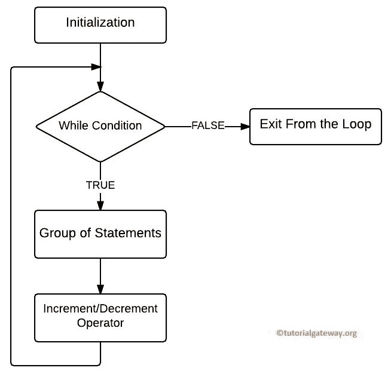
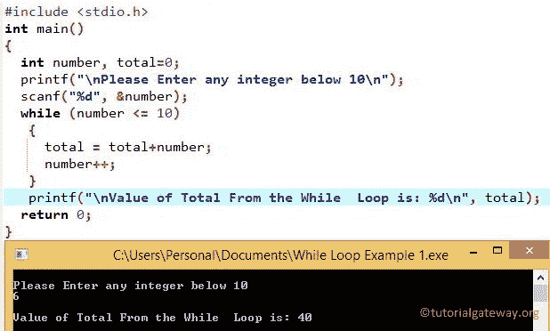

# C `while`循环

> 原文:[https://www.tutorialgateway.org/while-loop-in-c/](https://www.tutorialgateway.org/while-loop-in-c/)

C 语言中的`while`循环是将一个语句块重复给定的次数，直到给定的条件为 False。当 C 中的循环从条件开始时，如果条件为真，那么将执行其中的语句。如果给定的条件为假，则至少不会执行一次。这意味着 c 程序中的`while`循环可能运行零次或更多次，其语法为:

## `while`循环 C 语言语法

C 程序设计中`while`循环的语法如下:

```
While( Condition )
 {
   statement 1;
   statement 2;
    ………….
 }
This is the statement Outside the While Loop but inside the main() Function
```

首先，编译器将检查`while`循环内部的条件。如果条件为真，块下的语句或语句组将执行。如果条件为假，编译器将从其中出来，并在`while`循环之外执行其他语句。

对于 C 语言中`while`循环内的单个语句，不需要大括号。但是，如果我们为多个语句省略它们，编译器将只执行第一个语句。一直使用牙套总是好的做法。

### C 程序设计中`while`循环的流程图

下面的截图给大家展示了这个 C 语言的`while`循环的流程图。



开始时，C 中的`while`循环检查条件。

1.  如果条件为真，那么它将执行其中的语句。
2.  接下来，我们必须在其中使用递增和递减运算符来递增和递减该值。请参考 C 文章中的[递增和递减运算符了解功能](https://www.tutorialgateway.org/increment-and-decrement-operators-in-c/)
3.  在数值增加后，它将再次检查条件。只要条件为真，其中的语句就会执行。
4.  如果表达式的计算结果为假，编译器将退出`while`循环

让我们看看这个例子，以便更好地理解

## C 程序设计示例中的`while`循环

该程序允许用户输入一个小于 10 的整数值。通过使用这个值，编译器将把这些值加到 10。

1.  在这个 C`while`循环示例中，用户将输入任何低于 10 的值，并且总变量被初始化为 0。
2.  接下来，用户输入的值将分配给数字变量。然后，给定的数字将根据条件进行测试。
3.  如果条件结果为真，则该数字加到总数中。否则，它将退出迭代。
4.  在下一行中，我们使用++运算符来增加数值。递增后，该过程将重复，直到表达式结果为假。

```
#include <stdio.h >

int main()
{
  int number, total=0;

  printf("\n Please Enter any integer below 10 \n ");
  scanf("%d", &number);

  while (number <= 10)
   {
     total = total+number;
     number++;
   }

  printf("\n Value of Total From the While  Loop is: %d \n", total); 
  return 0;
}
```

我们将输入数字= 6。意思是，总计= 6+7+8+9+10 = 40



## C 程序设计中的无限`while`循环

如果您忘记在`while`循环中增加或减少值，那么它将执行无限次，也称为无限循环。例如:

```
#include<stdio.h> 

int main()
{
  int x = 1;

  while(x < 10)
   {
     printf("Value = %d\n", x);    

   }
 return 0;
}
```

```
Value = 1
Value = 1
Value = 1
Value = 1
Value = 1
...
```

这里 x 总是 1，x 总是小于 10。因此，该语句将执行无限次(无穷大)。现在，让我们在 C`while`循环中添加一个增量运算符(x++)到上面的例子中。

```
#include<stdio.h> 

int main()
{
  int x = 1;

  while(x < 10)
   {
     printf("Number = %d \n ", x); 
     x++;   
   }
  return 0;
}
```

现在，当它达到 10 时，表达式将失败。让我们看看 [C 语言](https://www.tutorialgateway.org/c-programming/)输出

```
Number = 1
Number = 2
Number = 3
Number = 4
Number = 5
Number = 6
Number = 7
Number = 8
Number = 9
```