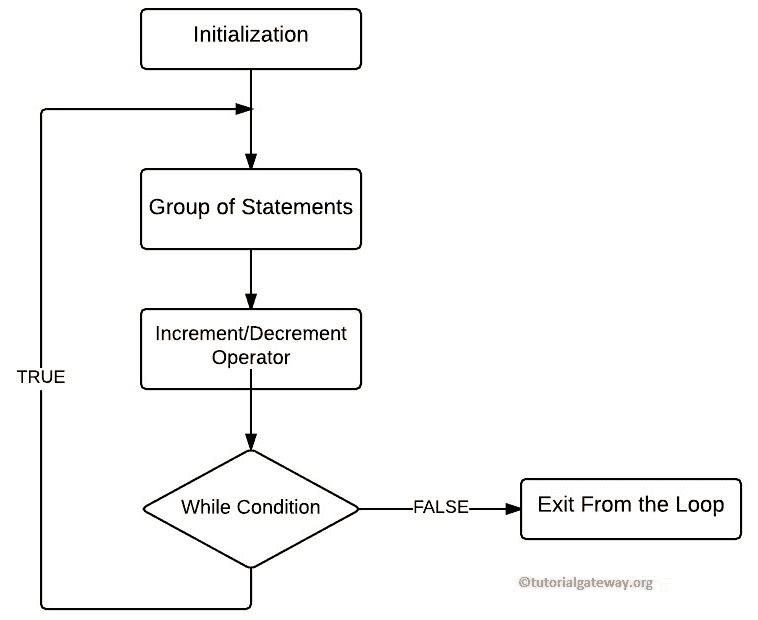

# C 语言`do-while`函数循环

> 原文：<https://www.tutorialgateway.org/do-while-loop-in-c/>

C 语言中的`do-while`循环测试循环结束时的条件。C 语言中的`do-while`循环至少执行一次代码块行，即使条件失败。

在前一篇文章中讨论的`while`循环在编译器进入代码块之前测试条件。如果条件结果为真，则只执行循环中的代码。否则，它至少不会运行一次。在某些情况下，需要先执行一些操作(执行一些语句)，然后检查条件。在这些情况下，我们可以在 c 语言中使用`do-while`循环。

## C 语言编程语法中的`do-while`循环

C 语言中`do-while`循环的语法如下所示:

```
do
{
  statement 1;
  statement 2;
    ………….
  statement n;
}
While (condition);
```

首先，它执行循环中的行，到达末尾后，编译器检查 while 条件。如果条件返回真，它将重复该过程，如果失败，循环终止。

注意:在 C`do-while`循环中，在 [While](https://www.tutorialgateway.org/while-loop-in-c/) 条件后加一个分号。

## 在 C 中循环时执行流程图



C 语言中边做边循环的流程图序列

1.  变量初始化，然后进入边做边循环。
2.  在[编程](https://www.tutorialgateway.org/c-programming/)循环中执行/运行一组语句。
3.  接下来，在循环中使用[递增和递减运算符](https://www.tutorialgateway.org/increment-and-decrement-operators-in-c/)来递增或递减值。
4.  接下来，它检查 while 条件。如果条件输出为真，循环中的代码将再次执行。该过程将持续到条件失败。
5.  如果为假，编译器将退出。

## C 语言编程示例中的`do-while`循环

这个 C 程序帮助你理解`do-while`循环

```
# include <stdio.h>

int main()
{
  int number, total=0;

  printf("\n Please Enter any integer below 10 \n");
  scanf("%d", &number);

  do
   {
     total = total + number;
     printf(" Number = %d\n", number);
     printf(" Total Value is: %d\n", total); 
     number++;
   }while (number< 10);

  printf(" Total Value from outside the Loop is: %d \n", total);
  return 0;
}
```

```
 Please Enter any integer below 10 
6
 Number = 6
 Total Value is: 6
 Number = 7
 Total Value is: 13
 Number = 8
 Total Value is: 21
 Number = 9
 Total Value is: 30
 Total Value from outside the Loop is: 30 
```

在 c 分析中`do-while`循环

1.  在这个 C`do-while`循环程序中，用户将输入任何低于 10 的值，并将总变量初始化为 0。
2.  用户输入的值将分配给数字变量，然后将数字加到总数中。
3.  在下一行中，我们使用++运算符来增加数值。
4.  在这一行之后，数字变量中的值根据 while 条件进行测试。如果条件结果为真，则重复该过程。否则，它将退出。
5.  在下一行中，我们又使用了一个 printf 语句来表明它来自`while`循环之外。

让我们输入一个大于 10 的值，看看会发生什么？

```
 Please Enter any integer below 10 
11
 Number = 11
 Total Value is: 11
 Total Value from outside the Loop is: 11 
```

如果您从上面的截图中观察，我们输入了值 11，它仍然显示总数为 11，因为在执行该代码后，它检查了 while 条件。失败了，所以退出。

## C 语言中`while`循环和 Do While 的区别？

虽然，Do While 和`while`循环看起来相似，但它们的执行方式不同。

*   对于[而](https://www.tutorialgateway.org/while-loop-in-c/)，在开始时测试条件，如果条件为真，则只执行其中的语句。这意味着只有当条件为真时，While 才会执行代码块。
*   对于 Do While，条件在最后测试。因此，即使条件失败，Do While 也会至少执行一次代码块中的语句。

当你看到这个例子时，我想你会更好地理解它，所以，让我们用 C 语言中的 While 和`do-while`循环编写相同的程序

### 而示例

在这个程序中，我们声明一个整数，然后检查 0 是否大于 10。如果条件为真，那么它将打印此语句，“X 大于 10”。while 之外还有一个 printf 语句，该语句将在 While 之后执行。

```
# include <stdio.h>

int main()
{
  int x=0;

  while(x > 10)
   {
     printf("\n X is Greater Than 10\n");
   }

  printf("\nStatement Outside of it\n");
  return 0;
}
```

```
Statement Outside of it
```

### C 语言编程示例中的边做边做

我们将使用 c 语言中的 do 编写相同的示例

```
# include <stdio.h>

int main()
{
 int x=0;

 do
  {
    printf("\n X is Greater Than 10 \n");
  }while(x > 10);

 printf("\n Statement Outside of it \n");
 return 0;
}
```

```
 X is Greater Than 10 

 Statement Outside of it
```

虽然条件失败了，但是 do 中的语句执行了一次，因为条件是在语句执行后测试的。