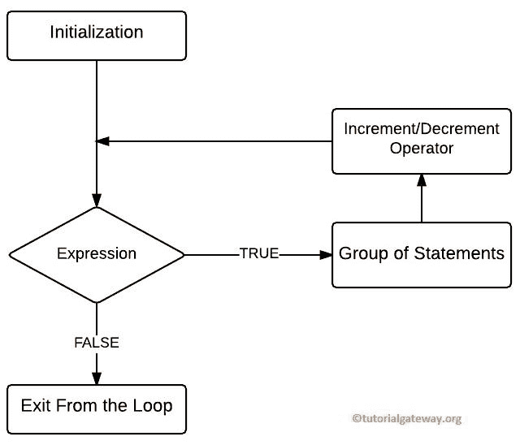

# C 语言中的`for`循环

> 原文:[https://www.tutorialgateway.org/for-loop-in-c-programming/](https://www.tutorialgateway.org/for-loop-in-c-programming/)

C 语言中的`for`循环用于在给定的次数内重复一个语句块，直到给定的条件为 False。C`for`循环是任何编程语言中最常用的循环之一。让我们看看 C 语言中`for`循环的语法:

## C 语法中的`for`循环

C 语言中`for`循环的语法如下:

```
for (initialization; test condition; increment/decrement operator)
 {
       //Statement 1
       //Statement 2
       ………
       //Statement n
 }
```

如果观察上面的语法，c 语言中的`for`循环有三个表达式，用分号(；)以及这些表达式的执行如下:

*   初始化:它从初始化语句开始，因此计数器变量的初始化首先完成(例如，计数器= 1 或 i = 1。).初始化部分在开始时只执行一次。
*   测试条件:根据测试条件测试的计数器变量值。如果条件评估为真，它将在 c 语言的`for`循环中执行语句。如果条件失败，编译器将终止。
*   递增&递减运算符:该表达式在每次迭代结束后执行。这个操作符根据我们的要求帮助增加或减少计数器变量。

## C 语言`for`循环的流程图

下面截图会给大家展示 C 语言



`for`循环的流程图

c 语言中`for`循环的执行过程是:

1.  初始化:我们在这里初始化计数器变量。例如，i=1。
2.  测试条件:它将根据计数器变量检查条件。如果条件为真，那么它将执行其中的语句。如果条件评估为假，那么 [C 语言](https://www.tutorialgateway.org/c-programming/)将退出
3.  迭代完成后，它将执行循环 C 内的[递增和递减运算符](https://www.tutorialgateway.org/increment-and-decrement-operators-in-c/)来递增或递减该值。
4.  在值增加后，它将再次检查条件。只要条件为真，其中的语句就会执行。

## C 语言中的`for`循环示例

`for`循环 C 程序允许用户输入任意整数值。然后它将计算自然数的总和，直到用户输入的数字。

1.  在这个循环的例子中，用户可以输入任何高于 1 的值(在这个例子中，我们输入 20)，总变量被初始化为 0。
2.  接下来，我们将用户输入的值分配给一个数字变量。然后我们要检查计数器变量(I)是否小于或等于这个数。
3.  如果条件结果为真，我把总数加起来。否则，它将退出。在循环开始时，i =1，n =20，因此条件为真，直到 I 值增加到 21。
4.  在下一节中，我们使用++运算符来增加 I 值。在递增过程之后，它将重复该过程，直到条件结果为假(直到 I =21)。

```
#include <stdio.h>

int main()
{
  int i, number, total= 0;

  printf("\n Please Enter any integer\n");
  scanf("%d", &number);

  for(i=1; i<= number; i++)
   {
     total = total + i;
   }

  printf("\nSum of n natural numbers is: %d\n", total); 
  return 0;
}
```

[C 程序](https://www.tutorialgateway.org/c-programming-examples/)输出

```
 Please Enter any integer
20

Sum of n natural numbers is: 210
```

## 对于循环中的特征

C 语言中的`for`循环可以灵活地从声明中省略一个或多个部分。虽然我们可以从中跳过一个或多个部分，但我们必须将分号(；)到位；否则，它将引发编译错误。以下示例向您展示了 C 语言中`for`循环的特性

初始化计数器变量可以跳过，如下所示:

```
int i=1;

for( ;i<=10;i++)
```

这里，在它之前声明的计数器变量。

像初始化一样，我们也可以跳过增量部分。

```
int i=1;

for( ;i<=20; )
 {
   //statements     
   i++;
 }
```

在正文中声明的递增部分。

循环允许我们用逗号分隔一次初始化多个计数器变量:

```
for(i=1,j=20;i<j; i++)
```

它还允许使用多个条件。我们不得不使用逻辑运算符来分隔这两个条件，而不是使用逗号

```
for(i=1,j=20;i<=10 && j>=20; i++)
 {
   //statements
   j++;
 }
```

与测试条件一样，它允许我们使用多个增量运算符，如下所示

```
for(i=1,j=1; i<=10&& j<=10; i++, j++)
```

注意:初始化、递增和递减运算符部分，我们可以用逗号来分隔多个声明。要分离测试条件，必须使用逻辑运算符来连接条件。

## C 语言中的嵌套`for`循环

在这个例子中，我们将向您展示如何将一个嵌套在另一个中，在 C 语言中也称为循环嵌套。

```
#include <stdio.h>

int main()
{
 int i, j;

 for (i=9; i<=10; i++)
  {
   for (j=1; j<=10; j++)
    {
      printf("%d * %d = %d\n",i ,j, i*j);
    }
  }
 return 0;
}
```

```
9 * 1 = 9
9 * 2 = 18
9 * 3 = 27
9 * 4 = 36
9 * 5 = 45
9 * 6 = 54
9 * 7 = 63
9 * 8 = 72
9 * 9 = 81
9 * 10 = 90
10 * 1 = 10
10 * 2 = 20
10 * 3 = 30
10 * 4 = 40
10 * 5 = 50
10 * 6 = 60
10 * 7 = 70
10 * 8 = 80
10 * 9 = 90
10 * 10 = 100
```

c 程序中的`for`循环打印 9 和 10 的乘法表。

在第一个`for`循环中，我初始化为值 9，然后它将检查我是否小于或等于 10。这个条件评估为真，直到我达到 11 岁。如果这个表达式结果为真，那么它将进入第二个`for`循环。否则，它将退出。

迭代 1:for(I = 9；i <= 10; i++)
条件(9 < = 10)为真。所以它将进入第二阶段。

嵌套循环第一次迭代:(j = 1；j <= 10; j++)
表达式(1 < =10)为真。所以里面的语句会被打印出来
9 * 1 = 9
接下来，j 的值会增加到 2

嵌套第二次迭代:(j = 2；2 <= 10; 2++)
表达式(2 < =10)为真
9 * 2 = 9

它将重复这个过程多达 10 次。下一个 j 值是 11，表达式(11 <= 10)失败。因此编译器从嵌套或内部`for`循环中退出。它只会从内部(第二个)退出，而不会从整个循环中退出。

迭代 2:(I = 10；10 <= 10; 10++)
表达式(10 < = 10)为真。所以它会进入第二个。

重复嵌套循环迭代。

迭代 3:(I = 11；i <= 10; i++)
i = 11，条件评估为假，终止，不需要检查第二个