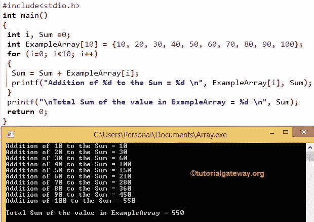

# 什么是 C 语言中的数组？

> 原文：<https://www.tutorialgateway.org/array-in-c/>

C 语言中的数组是相似类型元素的集合(类型可以是整数、浮点数和长整型等。).所以，在 C 语言中，我们不能在一个数组中存储多个数据类型值。

例如，C 语言中的整数数组将存储所有的整数元素。如果你试图在数组中插入一个浮点或字符值，那么 C 编译器会抛出一个错误。

在我们之前的文章中，我们看到了变量声明、初始化，它们非常适合常规用途。如果我们想存储 50 名员工的工资怎么办？。创建 50 个变量并赋值值得吗？如果是 100 个员联合怎么样？。C 语言在 C 中引入了数组的概念来处理这个问题。

## C 语言中数组的类型

C 语言中有三种类型的数组:

1.  一维的
2.  [二维](https://www.tutorialgateway.org/two-dimensional-array-in-c/ "Two Dimensional Array in C")
3.  [多维](https://www.tutorialgateway.org/multi-dimensional-array-in-c/ "Multi-Dimensional Array in C")
    *   立体的
    *   四维等

注:在 [C 语言](https://www.tutorialgateway.org/c-programming/)中，字符数组称为[字符串](https://www.tutorialgateway.org/c-string/)

### C 语言中数组的语法

C 语言中一维数组的语法如下:

```
Data_Type Array_Name [Array_Size];
```

*   Data_type:它将决定数组将接受的元素类型。例如，如果我们想要存储整数值，那么我们将数据类型声明为 int，如果我们想要存储 float 值，那么我们将数据类型声明为 Float，等等
*   Array_Name:这是您想要赋予数组的名称。例如学生、年龄、分数、员工等
*   数组大小:数组可以容纳或存储的元素数量。例如，Array_Size =10，那么它将保存 10 个值。

例如，

int Student _ Age[5]；

1.  这里，我们使用 int 作为数据类型来声明一个数组。所以，它只接受整数。如果您试图添加浮点值，那么它将抛出一个错误。
2.  学生 _ 年龄是名字
3.  数组的大小是 5。这意味着学生年龄将只接受 5 个整数值。
    *   如果我们试图存储 5 个以上，编译器会抛出一个错误。
    *   我们可以储存不到 5 个。例如，如果我们存储 3 个整数值，剩下的 2 个值将被分配给默认值(0)。

### 初始化中的数组

初始化数组有多种方法，第一种声明方法是

int Employees[5] = {1，2，3，4，5}

这里，我们只在声明时初始化了数组。

#### 初始化数组的第二种方法

int Employees[ ] = {1，2，3，4，5}

这里，我们没有提到尺寸。然而，编译器足够智能，可以通过检查元素的数量来计算 C 语言中数组的大小。

#### 用 C 语言初始化数组的第三种方法

int Employees[5] = {1，4，5}

在这里，我们声明了大小为 5 的员工，但我们只分配了 3 个变量。在这种情况下，剩余的值分配给默认值(本例中为 0)。

上面的 C 数组将是:

```
Employees[5] = {1, 4, 5, 0, 0}

//It means

Employees[0] = 1

Employees[1] = 4

Employees[2] = 5

Employees[3] = 0

Employees[4] = 0
```

#### C 语言初始化中数组的第四种方法

以上 3 种方法可以很好地在其中存储少量元素。如果我们想要存储 50、100 或更多的值，该怎么办。使用上面提到的任何一种方法添加所有这些将是一场噩梦。为了解决这个问题，我们可以在 C:

```
int i, Employees[100];

for (i =0; i < 100 ; i++)
 {
   Employees[i] = i*2;
 }
```

### C 语言中数组元素的访问

我们可以在 C 语言中使用索引来访问数组的元素。使用索引，我们可以分别访问或修改/更改其中的每个项目。索引值从 0 开始，到 n-1 结束，其中 n 是大小。

例如，如果 C 中的数组存储 5 个元素，则索引从 0 开始，以 4 结束。要访问或更改第一个值，请使用 array_name[0]，要访问或更改第五个值，请使用 array_name[4]。为了更好地理解，让我们看看 C 语言中的数组示例:

```
int Student_Age[5] = {5, 10, 15, 20, 25};

//To Access the values in the Student_Age[5]

Printf("%d", Student_Age[0]); - It will display the First element = 5

Printf("%d", Student_Age[3]); - It will display the Fourth element = 20

//To Alter the values in the Student_Age[5]

Student_Age[2] = 56; - It will change the value of Student_Age[2] from 15 to 56

Student_Age[4] = 92; - It will change the value of Student_Age[4] from 25 to 92
```

最终输出将是{5，10，56，20，92}

## C 语言编程示例中的数组

在这个[程序](https://www.tutorialgateway.org/c-programming-examples/)中，我们将在 C 中声明一个大小为 10 的整数数组，然后我们将这 10 个值相加并显示输出。

```
# include <stdio.h>

int main()
{
 int i, Sum =0;
 int ExampleArray[10] = {10, 20, 30, 40, 50, 60, 70, 80, 90, 100};

 for (i=0; i<10; i++)
 {
   Sum = Sum + ExampleArray[i];

   printf("Addition of %d to the Sum = %d \n", ExampleArray[i], Sum);
 }

 printf("\nTotal Sum of the value in ExampleArray = %d \n", Sum);

 return 0;
}
```



在这个 C 数组的例子中，我们声明了以下内容

```
ExampleArray[10] = {10, 20, 30, 40, 50, 60, 70, 80, 90, 100};
```

范例阵列[10]是大小为 10 的整数(索引值为 0 到 9)。我们在申报时指定了这 10 个值。

for(I = 0；i < 10i++)语句从 0 开始迭代，并执行迭代直到达到 9，因为我们的索引值在 9 结束。

sum = sum+example array[I]；语句用于添加 ExampleArray[10]中的每个元素

让我们看看 C 数组程序的迭代执行

第一次迭代:对于(I = 0；I< 10; i++)
Sum = Sum+example array[I]
这里，I 值为 0，sum= 0。因此，总和=总和+范例阵列[0]
总和= 0 + 10 = 10

第二次迭代:对于(I = 1；1 < 10; 1++)
总和=总和+范例数组[1]
总和= 10 + 20 = 30

第三次迭代:for(I = 2；2 < 10; 2++)
总和=总和+范例数组[2]
总和= 30 + 30 = 60

第四次迭代:for(I = 3；3 < 10;  3++)
总和=总和+范例数组[3]
总和= 60 + 40 = 100

第五次迭代:for(I = 4；4 < 10;  4++)
总和=总和+范例数组[4] = 100 + 50 = 150

第六次迭代:for(I = 5；5 < 10;  5++)
总和=总和+范例数组[5] = 150 + 60 = 210

第七次迭代:for(I = 6；6 < 10;  6++)
总和=总和+范例数组[6]
总和= 210 + 70 = 280

第八次迭代:for(I = 7；7 < 10;  7++)
总和=总和+范例数组[7]
总和= 280 + 80 = 360

9 <sup>次</sup>迭代:对于(I = 8；8<10；8++)
总和=总和+范例数组[8] = 360 + 90 = 450

第 10 <sup>次</sup>迭代:对于(I = 9；9<10；9++)
Sum = Sum+example array[9]= 450+100 = 550

对于下一次迭代，`for`循环中的条件(10 < 10)将失败。

### 要回忆的事情

1.  在声明时用 C 语言初始化数组始终是最佳实践。如果不知道值，那么初始化为 0 或 null。
2.  使用索引值可以访问其中的项目。
3.  索引值从 0 开始，到 n-1 结束，其中 n 是大小。