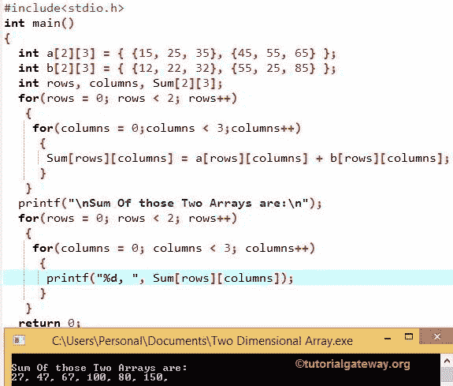

# C 语言中的二维数组

> 原文：<https://www.tutorialgateway.org/two-dimensional-array-in-c/>

C 语言中的二维数组只不过是数组的数组。如果数据是线性的，我们可以使用一维数组。然而，要处理多级数据，我们必须使用多维数组。

C 语言中的二维数组是多维的最简单形式。在二维数组中，数据以行和列的方式存储。我们可以使用行索引和列索引来访问记录(就像 Excel 文件一样)。

## C 语言中二维数组的声明

C 语言中二维数组的声明的基本语法如下:

```
Data_Type Array_Name[Row_Size][Column_Size]
```

*   数据类型:这将决定二维数组接受的元素类型。例如，如果我们想要存储整数值，那么我们将数据类型声明为 int，如果我们想要存储 float 值，那么我们将数据类型声明为 Float 等
*   Array_Name:这是你想给这个 C 二维数组取的名字。例如学生、年龄、分数、员工等
*   Row_Size:一个数组可以存储的行数。例如，Row_Size =10，那么数组将有 10 行。
*   列大小:数组可以存储的列元素的数量。例如，列大小= 8，它将有 8 列。

例如，

int Employees[4][3]；

1.  这里，我们使用 int 作为数据类型来声明一个数组。所以，C 上面的二维数组将只接受整数。如果你试图添加浮点值，它会通过一个错误。
2.  员工–C 语言中二维数组的名称
3.  它的行大小是 4。这意味着 Employees 数组将只接受四个整数值作为行。
    *   如果我们试图存储 4 个以上的值，那么它将抛出一个错误。
    *   我们可以储存不到 4 个。例如，如果我们存储两个整数值，那么剩下的两个值将被赋给默认值(0)。
4.  数组的列大小是 3。这意味着雇员数组将只接受 3 个整数值作为列。
    *   如果我们试图存储 3 个以上，它会抛出一个错误。
    *   我们能储存的不到 3 个。例如，如果我们存储 1 个整数值，剩下的 2 个值将被赋给默认值(即 0)。

## C 语言初始化中的二维数组

我们可以用多种方法初始化 C 二维数组。在此之前，请参考 [C 语言](https://www.tutorialgateway.org/c-programming/)中的[数组](https://www.tutorialgateway.org/array-in-c/)和[多维](https://www.tutorialgateway.org/multi-dimensional-array-in-c/)文章

**第一次进场**

int Employees[4][3] = { 10，20，30，15，25，35，22，44，66，33，55，77 }；

前三个元素是第一行，后三个元素是第二行，后三个元素是第三行，最后三个元素是第四行。这里我们把它们分成 3 个，因为我们的列大小= 3。

上面的 C 二维数组语句也可以写成

int Employees[4][3] = { {10，20，30}，{15，25，35}，{22，44，66}，{33，55，77 } }；

在这里，我们用大括号({})将每一行括起来。使用花括号来分隔行总是一种好的做法。

**C 二维阵列第二种方法**

int Employees[ ][ ] = { {10，20，30}，{15，25，35}，{22，44，66}，{33，55，77 } }；

这里，我们没有提到行大小和列大小。但是，编译器足够智能，可以通过检查行和列内的元素数量来计算大小。

我们也可以把这个二维数组写成

int Employees[ ][3] = { {10，20，30}，{15，25，35}，{22，44，66}，{33，55，77 } }；

**第三种方法**

```
int Employees[2][3] = { {4},
                        {6, 7} 
                      };
```

这里，我们声明了行大小=2、列大小= 3 的 Employees，但是我们只在第一行分配了 1 列，在第二行分配了 2 列。在这些情况下，剩余的值将分配给默认值(本例中为 0)。

上面一个将是:

```
Employees[2][3] = { {4, 0, 0},
                    {6, 7, 0} 
                  };  
//It means

Employees[0][0] = 4

Employees[0][1] = 0

Employees[0][2] = 0

Employees[1][0] = 6

Employees[1][1] = 7

Employees[1][2] = 0
```

**第四次进场**

以上三种在 C 语言中初始化二维数组的方式，都很好的将少量元素存储到数组中。如果我们想要存储 100 行或 50 列的值会怎么样。使用上面提到的任何一种方法添加所有这些将是一场噩梦。为了解决这个问题，我们可以在这里使用[用于 C 语言中的循环](https://www.tutorialgateway.org/for-loop-in-c-programming/)概念:

```
int rows, columns, Employees[100][50];

for (rows =0; rows < 100 ; rows++)
 {
   for (columns =0; columns < 50; columns++)
    {
      Employees[rows][columns] = rows + columns;
 }
```

说，

员工[3][4] = 3+4 = 7

## 访问二维数组元素

我们可以使用索引在 [C 语言](https://www.tutorialgateway.org/c-programming/)元素中访问二维数组。使用索引，我们可以分别访问或更改/改变数组中的每个元素。索引值从 0 开始，到 n-1 结束，其中 n 是行或列的大小。

例如，如果 Array_name[8][5]将存储 8 个行元素和 5 个列元素。要访问或更改 1 <sup>st</sup> 值，请使用 Array_name[0][0]，要访问或更改 2 <sup>nd</sup> 行 3 <sup>rd</sup> 列值，请使用 Array_name[1][2]，要访问 8 <sup>th</sup> 行 5 <sup>th</sup> 列，请使用 Array_name[7][4]。为了更好地理解，让我们看看二维数组的例子:

```
int Employees[4][3] = { {10, 20, 30},
                        {15, 25, 35},
                        {22, 44, 66},
                        {33, 55, 77}
                      };

//To Access the values in the Employees[4][3] array

Printf("%d", Employees[0][0]) = 10

Printf("%d", Employees[0][1]) = 20

Printf("%d", Employees[0][2]) = 30

Printf("%d", Employees[1][0]) = 15

Printf("%d", Employees[1][1]) = 25

Printf("%d", Employees[1][2]) = 35

Printf("%d", Employees[2][0]) = 22

Printf("%d", Employees[2][1]) = 44

Printf("%d", Employees[2][2]) = 66

Printf("%d", Employees[3][0]) = 33

Printf("%d", Employees[3][1]) = 55

Printf("%d", Employees[3][2]) = 77

//To Alter the values in the Employees[4][3] array

Employees[2][1] = 98; - It will change the value of Employees[2][1] from 44 to 98

```

对于大量的行和列，我们可以使用`for`循环来访问它们。让我们使用上面的数组 Employees[4][3]

```
int rows, columns;

for (rows = 0; rows < 4; rows++)
 {
  for (columns =0; columns < 3; columns++)
   {
     Printf("%d", Employees[rows][columns]);
   }
 }
```

## C 示例中的二维数组

在这个 C 二维数组程序中，我们将声明 2 个二维数组，并用一些值初始化它们。接下来，我们将再声明一个二维数组来存储这两个数组的和。

```
#include<stdio.h>

int main()
{
  int a[2][3] = { {15, 25, 35}, {45, 55, 65} };
  int b[2][3] = { {12, 22, 32}, {55, 25, 85} };
  int rows, columns, Sum[2][3];

  for(rows = 0; rows < 2; rows++)
   {
    for(columns = 0; columns < 3;columns++)
     {
      Sum[rows][columns] = a[rows][columns] + b[rows][columns];  
     }
   }

  printf("\n Sum Of those Two Arrays are:\n");
  for(rows = 0; rows < 2; rows++)
   {
    for(columns = 0; columns < 3; columns++)
     {
      printf("%d, ", Sum[rows][columns]);
     }
   }

  return 0;
}
```



让我们看看二维数组的迭代执行

二维数组行首迭代

该行的值将为 0，条件(行< 2)为真。因此，它将进入第二个`for`循环

列第一次迭代
列的值为 0，条件(列< 2)为真。因此，它将开始执行循环中的语句，直到条件失败。
Sum[row][columns]= a[row][columns]+b[row][columns]；
Sum[0][0]= a[0][0]+b[0][0]；
Sum[0][0]= 15+12；
Sum[0][0]= 27；

第二次迭代
列的值为 1，条件(列< 3)为真。因为我们没有退出内部循环(Columns 循环)，所以行值将是 0
Sum[0][1]= a[0][1]+b[0][1]；
Sum[0][1]= 25+22；
Sum[0][1]= 47；

第 3 列<sup>第 3 次</sup>迭代
列= 2，条件(2 < 3)为真。
Sum[0][2]= a[0][2]+b[0][2]；
Sum[0][2]= 35+32；
Sum[0][2]= 67；

递增后，列的值= 3，条件(列< 3)将失败。所以，它将从循环中退出。

现在，行的值将增加，并开始 c 中二维数组的第二次迭代

行第二次迭代
行的值= 1，条件(行< 2)为真。因此，它将进入第二个`for`循环

列第一次迭代
列的值= 0，条件(列< 3)为真。
Sum[1][0]= a[1][0]+b[1][0]；
Sum[1][0]= 45+55；
Sum[1][0]= 100；

第二次迭代
列= 1，条件(列< 3)为真。
Sum[0][1]= a[1][1]+b[1][1]；
Sum[0][1]= 55+25；
Sum[0][1]= 80；

第 3 列<sup>第</sup>次迭代
列= 2，条件(第< 3 列)为真。
Sum[1][2]= a[1][2]+b[1][2]；
Sum[1][2]= 65+85；
Sum[1][2]= 150；

递增后，列的值= 3，条件(列< 3)将失败。所以它会从循环中退出。

现在，行的值将增加，这意味着行= 2。条件(行< 2)将失败，因此它将退出循环。

二维数组程序中的下一个`for`循环将如我们上面解释的那样遍历。但是，它不会求和，而是使用 printf 语句用逗号分隔一个接一个地显示值。

Sum 的最终输出为:
Sum[2][3] = { {27，47，67}，{100，80，150 } }；