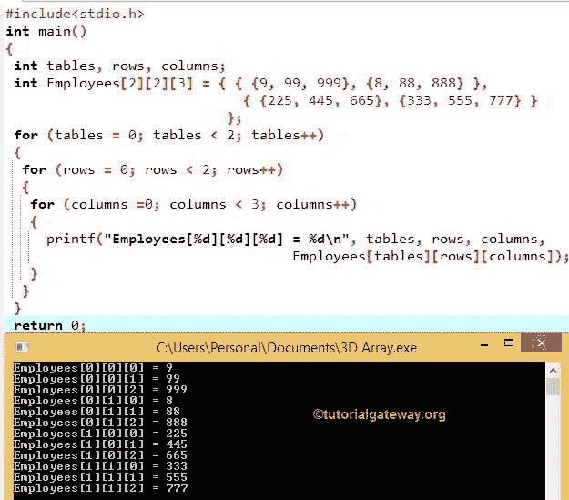

# C 语言多维数组

> 原文：<https://www.tutorialgateway.org/multi-dimensional-array-in-c/>

本节将解释 C 中的三维数组。有多个维度的数组称为 C 中的多维数组。在我们之前的文章中，我们讨论了二维数组，这是 C 多维数组的最简单形式。

在 C 语言中，通过放置 n 个括号[ ]，我们可以声明 n 维数组，其中 n 是维数。例如，

int a[2][3][4] =三维数组

int a[2][2][3][4] =四维数组

你可以自己试试 4D 阵。

## C 语言中多维数组的语法

C 语言中多维数组的基本语法是

```c
Data_Type Array_Name[Tables][Row_Size][Column_Size]
```

*   Data_type:它将决定它将接受的元素类型。例如，如果我们想要存储整数值，那么我们将数据类型声明为 int，如果我们想要存储浮点值，那么我们将数据类型声明为 Float 等等
*   Array_Name:这是你想给 c 中多维数组取的名字
*   表:它将决定数组可以接受的表的数量。二维数组始终是一个包含行和列的表。相比之下，C 语言中的多维数组是一个多行多列的表。
*   Row_Size:一个数组可以存储的行数。例如，Row_Size =10，数组将有 10 行。
*   列大小:数组可以存储的列元素的数量。例如，Column_Size = 8，数组将有 8 列。

我们可以使用[表格]*[行大小]*[列大小]来计算三维中元素的最大数量

例如

int Employees[2][4][3]；

1.  这里，我们使用 int 作为数据类型来声明一个数组。所以，上面的数组将只接受整数。如果您试图添加浮点值，它会抛出一个错误。
2.  员工是数组名称
3.  表的数量= 2。因此，这个数组最多可以保存 2 级数据(行和列)。
4.  数组的行大小是 4。这意味着 Employees 数组只接受 4 个整数值作为行。
    *   如果我们试图存储 4 个以上，它会抛出一个错误。
    *   我们可以储存不到 4 个。例如，如果我们存储 2 个整数值，剩下的两个将使用默认值(0)赋值。
5.  数组的列大小是 3。这意味着雇员数组将只接受 3 个整数值作为列。
    *   如果我们试图存储 3 个以上，它会抛出一个错误。
    *   我们能储存的不到 3 个。例如，如果我们存储 1 个整数值，剩下的 2 个值将使用默认值(0)赋值。
6.  最后，Employees 数组最多可以保存 24 个整数值(2 * 4 * 3 = 24)。

请参考 [C 语言](https://www.tutorialgateway.org/c-programming/)中的[阵](https://www.tutorialgateway.org/array-in-c/)和[二维阵](https://www.tutorialgateway.org/two-dimensional-array-in-c/)篇。

## 多维数组初始化

我们可以用多种方法初始化 C 多维数组

C 语言中多维数组的第一种方法

```c
int Employees[2][4][3] = { { {10, 20, 30}, {15, 25, 35}, {22, 44, 66}, {33, 55, 77} },

                           { {1, 2, 3}, {5, 6, 7}, {2, 4, 6}, {3, 5, 7} }

                         };
```

这里，我们有两个表，第一个<sup>表包含 4 行* 3 列，第二个<sup>表也包含 4 行* 3 列</sup></sup>

第一个表的前三个元素是第一行，后三个元素是第二行，后三个元素是第三行，最后三个元素是第四行。这里我们将它们分成 3 行，因为我们的列大小= 3，并且我们用花括号({})包围了每一行。使用花括号来分隔行总是一种好的做法。

第二张桌子也一样。

C 语言中多维数组的第二种方法

```c
int Employees[2][ ][3] = { { {10, 20, 30}, {15, 25, 35}, {22, 44, 66}, {33, 55, 77} },

                           { {1, 2, 3}, {5, 6, 7}, {2, 4, 6}, {3, 5, 7} }
                         };
```

这里，我们没有提到行的大小。但是，编译器足够智能，可以通过检查行内的元素数量来计算大小。

我们也可以写作

```c
int Employees[2][4][ ] = { { {10, 20, 30}, {15, 25, 35}, {22, 44, 66}, {33, 55, 77} },

                           { {1, 2, 3}, {5, 6, 7}, {2, 4, 6}, {3, 5, 7} }

                         };

```

C 语言多维数组的第三种方法

```c
int Employees[2][4][3] = { { { 10 }, {15, 25}, {22, 44, 66}, {33, 55, 77} },

                           { {1, 2, 3}, {5, 6, 7}, {2, 4, 6}, {3, 5, 7} }

                         };
```

这里，我们声明了行大小= 4、列大小= 3 的 Employees 数组。但是我们只在第一个表的第一行指定了 1 列，在第二行指定了 2 列。在这些情况下，剩余的值将分配给默认值(本例中为 0)。

以上 C 中的多维数组将是:

```c
int Employees[2][4][3] = { { {10, 0, 0}, {15, 25, 0}, {22, 44, 66}, {33, 55, 77} },
                           { {1, 2, 3}, {5, 6, 7}, {2, 4, 6}, {3, 5, 7} }
                         };
```

多维数组第四种方法

以上 3 种方法都是将少量元素存储到数组中的好方法。要在 20 个表中存储 100 行或 50 列值，我们可以使用循环概念，例如`for`循环和`while`循环

```c
int tables, rows, columns, Employees[20][100][100];

for (tables = 0; tables < 20; tables ++)
{
 for (rows = 0; rows < 100; rows++)
 {
  for (columns =0; columns < 100; columns++)
  {
    Employees[tables][rows][columns] = tables + rows + columns ;
  }
 }
}
```

## 用 C 语言访问多维数组

我们可以使用索引访问多维数组元素。索引从 0 开始，到 n-1 结束，其中 n 是行或列的大小。

例如，如果 Array_name[4][8][5]将在每个表中存储 8 行元素和 5 列元素，其中表大小= 4。若要访问第一个表的第一个值，请使用 Array_name[0][0][0]，若要访问第三个表的第二行第三列值，请使用 Array_name[2][1][2]，若要访问最后一个表(第四个表)的第八行第五列，请使用 Array_name[3][7][4]。让我们看看 C 多维数组的例子，以便更好地理解:

```c
int Employees[2][4][3] = { {10, 20, 30}, {15, 25, 35}, {22, 44, 66}, {33, 55, 77} },
                           { {1, 2, 3}, {5, 6, 7}, {2, 4, 6}, {3, 5, 7} }
                          };

//To Access the values in the Employees[2][4][3] array

//Accessing First Table Rows & Columns
Printf("%d", Employees[0][0][0]) = 10

Printf("%d", Employees[0][0][1]) = 20

Printf("%d", Employees[0][0][2]) = 30

Printf("%d", Employees[0][1][0]) = 15

Printf("%d", Employees[0][1][1]) = 25

Printf("%d", Employees[0][1][2]) = 35

Printf("%d", Employees[0][2][0]) = 22

Printf("%d", Employees[0][2][1]) = 44

Printf("%d", Employees[0][2][2]) = 66

Printf("%d", Employees[0][3][0]) = 33

Printf("%d", Employees[0][3][1]) = 55

Printf("%d", Employees[0][3][2]) = 77

//Accessing Second Table Rows & Columns
Printf("%d", Employees[1][0][0]) = 1

Printf("%d", Employees[1][0][1]) = 2

Printf("%d", Employees[1][0][2]) = 3

Printf("%d", Employees[1][1][0]) = 5

Printf("%d", Employees[1][1][1]) = 6

Printf("%d", Employees[1][1][2]) = 7

Printf("%d", Employees[1][2][0]) = 2

Printf("%d", Employees[1][2][1]) = 4

Printf("%d", Employees[1][2][2]) = 6

Printf("%d", Employees[1][3][0]) = 3

Printf("%d", Employees[1][3][1]) = 5

Printf("%d", Employees[1][3][2]) = 7

//To Alter the values in the Employees[4][3] array
Employees[0][2][1] = 98; // It will change the value of Employees[0][2][1] from 44 to 98

Employees[1][2][2] = 107; // It will change the value of Employees[1][2][2] from 6 to 107
```

对于大量的行和列，我们可以使用`for`循环来访问它们。例如，访问数组员工[10][25][60]

```c
int tables, rows, columns;

for (tables = 0; tables < 10; tables ++)
 {
  for (rows = 0; rows < 25; rows++)
  {
    for (columns =0; columns < 60; columns++)
    {
     Printf(“%d”, Employees[tables][rows][columns]);
    }
  }
 }
```

## C 示例中的多维数组

在这个 [C 程序](https://www.tutorialgateway.org/c-programming-examples/)中，我们将声明三维数组并用一些值初始化它。使用`for`循环，我们将根据索引显示数组中的每个值。

```c
/* Example for Multi Dimensional Array in C programming */
# include<stdio.h>

int main()
{
 int tables, rows, columns;
 int Employees[2][2][3] = { { {9, 99, 999}, {8, 88, 888} }, 
                             { {225, 445, 665}, {333, 555, 777} }
                           }; 

 for (tables = 0; tables < 2; tables++)
 {

  for (rows = 0; rows < 2; rows++) 
  {

   for (columns =0; columns < 3; columns++)
   {

     printf("Employees[%d][%d][%d] = %d\n", tables, rows, columns,
                                  Employees[tables][rows][columns]);
   }
  }
 }
 return 0;
} 

```



让我们看看 C 多维数组程序的迭代执行

表第一次迭代
表的值为 0，条件(表< 2)为真。因此，它将进入第二个循环(行迭代)

c 多维数组行第一次迭代
行的值为 0，条件(行< 2)为真。因此，它将进入第三个循环(列迭代)

列第一次迭代
列的值为 0，条件(列< 2)为真。因此，它将开始执行循环中的语句，直到条件失败。

```c
printf("Employees[%d][%d][%d] = %d\n", tables, rows, columns, Employees[tables][rows][columns]);
```

雇员[表][行][列] =雇员[0][0][0] = 9

列第二次迭代
列的值为 1，条件(列< 3)为真。因为我们没有退出列循环，所以行值将是 0
雇员[表][行][列] =雇员[0][0][1] = 99

第 3 列<sup>第 3 次</sup>迭代
列的值为 2，条件(第 3 列<为真)。
员工[表格][行][列] =员工[0][0][2] = 999

递增后，列的值为 3，循环的条件(列< 3) will fail. So, it will exit from the 3 <sup>rd</sup> )。

现在，行的值将增加，并开始第二次行迭代

行第二次迭代
该行的值为 1，条件(行< 2)为真。因此，它将进入第二个`for`循环

列第一次迭代
列的值为 0，条件(列< 3)为真。

雇员[表][行][列] =雇员[0][1][0] = 8

列二次迭代
列= 1，条件(列< 3)为真。尽管如此，表值将为 0
雇员[表][行][列] =雇员[0][1][1] = 88

第 3 列<sup>第 3 次</sup>迭代
列= 2，条件(2 < 3)为真。
员工[表格][行][列] =员工[0][1][1] = 888

递增后，列的值为 3，条件(3 < 3) will fail. So, it will exit from the 3 <sup>rd</sup> 为循环。

接下来，该行的值递增。表示行数= 2，条件(2 < 2) will fail. So, it will exit from the 2<sup>和</sup>为循环。

现在，表的值将增加到 1，这意味着(表= 1；表<2；表格++)

条件为真。因此，它将使用表值 1 重复上述迭代。一旦完成，表的值将增加。

接下来，tables = 2，条件(tables < 2)将失败。因此，它将从第一个`for`循环中退出。