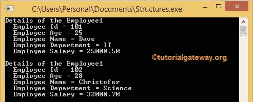

# C 程序设计中的结构

> 原文:[https://www.tutorialgateway.org/structures-in-c/](https://www.tutorialgateway.org/structures-in-c/)

C 语言中的结构:在 C 语言编程中，数组有助于存储一组相似的数据类型元素。但是，在某些情况下，我们必须对不相似的数据类型(int、float、char 等)进行分组。).为了处理这些类型的情况，C 语言引入了结构的概念。

Struct 关键字用于在 C 语言中创建结构。C 语言中的结构用于对不同的数据类型进行分组，以结构化的方式组织数据。

例如，我们存储员工的详细信息，如姓名、id、年龄、地址和工资。从名称中，您可以理解它们不是相同的数据类型。通常我们为姓名、id、地址、年龄和工资创建一个单独的变量，但是为 5 名员工存储相同的变量怎么样？开发人员很难给每个变量分配名称。因此，我们使用 struct 关键字创建一个 C 结构，并将该名称指定为雇员。

## C 语法中的结构

使用 struct 的 C 结构的基本语法如下所示

```
struct Structure_Name
{
  Data_Type Variable_Name;

  Data_Type Variable_Name;

  ………….
};
```

C 程序设计中结构中可用的项目

*   struct 是用于创建和访问结构的系统保留关键字。
*   结构名:你想给的名字。对于前任、员工、个人、学生
*   数据类型:声明变量的数据类型。例如，int、float、char。
*   变量名称–例如，身份证、姓名、年龄、工资。

结构示例

```
struct Employee // Name = Employee

{
  int age; //Data_Type = int; Variable Name = age

  char name[50]; //Data Type = char Array; Variable_Name = name

  float salary; //Data Type = float; Variable Name = salary
};
```

### C 程序设计中的结构声明

C 结构中的成员在与变量相关联之前不会存储任何内存位置。因此，我们必须在使用它之前创建结构变量。我们可以用多种方式声明结构变量

**第一次进场**

首先声明结构，然后在创建结构变量的主函数中声明

```
struct Employee
{
  int age;

  char name[50];

  float salary;
};

//Creating the Struct variable in main() function
struct Employee emp1, emp2;

emp1 = {25, “Dave”, 25000};
```

EMP 1 和 emp2 =结构数据类型的变量。

**第二次进场**

我们在 C 结构声明的时候创建了结构变量。

```
struct Employee
{
  int age;

  char name[50];

  float salary;

} emp1, emp2;
```

### 访问成员

我们可以使用点()来定位结构成员。)运算符或成员运算符。让我们使用上面的结构示例。

```
//Assigning the values

 emp2.age = 26;

 strcpy (emp2.name, “Michel”);

 emp2.salary = 46000.50;
```

## C 程序设计示例中的结构

在这个示例程序中，我们声明了具有 5 个数据成员的结构。接下来，我们将每个项目显示为输出。

```
#include <stdio.h> 
#include <string.h> 

struct Employee 
{
  int Empolyee_ID;
  int age;  
  char Name[50];
  char Department[20];
  float Salary;
};

int main() 
{
  struct Employee emp1 = { 101, 25, "Dave", "IT", 25000.50 };
  struct Employee emp2;

     emp2.Empolyee_ID = 102;
     emp2.age = 28;
     strcpy(emp2.Name, "Christofer");
     strcpy(emp2.Department, "Science");
     emp2.Salary = 32000.70;

  printf(" Details of the Employee1 \n " );
  printf(" Employee Id = %d \n ", emp1.Empolyee_ID );
  printf(" Employee Age = %d \n ", emp1.age );
  printf(" Employee Name = %s \n ", emp1.Name );
  printf(" Employee Department = %s \n ", emp1.Department );
  printf(" Employee Salary = %.2f \n\n ", emp1.Salary );

  printf(" Details of the Employee1 \n " );
  printf(" Employee Id = %d \n ", emp2.Empolyee_ID );
  printf(" Employee Age = %d \n ", emp2.age );
  printf(" Employee Name = %s \n ", emp2.Name );
  printf(" Employee Department = %s \n ", emp2.Department );
  printf(" Employee Salary = %.2f \n ", emp2.Salary );

  return 0;
}
```



在这个 C 结构的例子中，我们用适当的数据类型声明了一个拥有 Empolyee_ID、年龄、姓名、部门和薪金成员的雇员。请参考 [C 语言](https://www.tutorialgateway.org/c-programming/)中的[数组](https://www.tutorialgateway.org/array-in-c/)一文

在 main()函数中，我们创建了 Employee 结构变量 emp1，并为其赋值。

```
struct Employee emp1 = {101, 25, "Dave", "I T", 25000.50};
```

这意味着 emp1 结构的值如下

```
Empolyee_ID = 103

age = 25

Name = Dave

Department = I T

Salary = 25000.50
```

我们又创建了一个雇员 C 结构变量 emp2。这一次，我们使用了成员的或点运算符(。)根据数据类型指定值。printf 语句输出结构变量中的每个成员。

注意:使用成员的操作符，我们可以给整型和浮点型变量赋值。但是对于字符串，我们只能使用字符串 [strcpy()](https://www.tutorialgateway.org/strcpy-in-c-programming/) 函数。