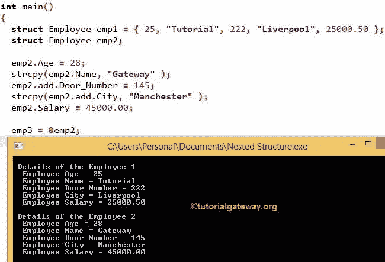

# C 语言中的嵌套结构

> 原文：<https://www.tutorialgateway.org/nested-structures-in-c/>

C 语言中的嵌套结构:在我们之前的文章中，我们讨论了结构，它们非常适合对不同的数据类型成员进行分组。但是，也存在一些问题，比如在结构中列出更多的变量，代码重复。

C 示例中的嵌套结构:假设我们正在处理员工、学生和人员数据。因此，我们要声明 3 个结构，即员工、学生和人员。每个结构可能有不同的成员(例如:学生:卷号、班级号、分数等。).但是可能会有一些常见的成员，如年龄、门牌号、街道名称、城市。一般来说，将门牌号、街道名称、城市成员添加到所有三个结构中意味着重复的工作！。

为了解决这些情况，我们使用 C 嵌套结构。像循环一样，C 语言中的嵌套结构是结构中的结构。使用这个，我们可以创建一个名为地址的结构，并在它下面添加门牌号、街道名称、城市成员。现在，我们可以从员工、学生和人员结构中调用这个地址结构。我们可以用多种方式声明 C 嵌套结构:

## C 语言中嵌套结构的第一种方法

首先，声明地址结构，然后在 Employee 结构中创建地址变量。请参考[结构](https://www.tutorialgateway.org/structures-in-c/)和[循环](https://www.tutorialgateway.org/for-loop-in-c-programming/)文章。

声明地址结构

```
struct address
{
  int Door_Number;

  char Street_Name[20];

  char City[20];

  int Postcode;

} ;

```

这里，声明雇员结构

```
struct Employee
{
  int age;

  char Name[50];

  char Department[20];

  struct address add; // creating the address variable = add

  float salary;

} ;
```

## C 语言中嵌套结构的第二种方法

我声明地址结构，其成员直接在雇员结构中。

```
struct Employee
{
  int age;
  char Name[50];
  char Department[20];
  float salary;

  struct address // Declaring the address structure
   {
     int Door_Number;
     char Street_Name[20];
     char City[20];
     int Postcode;
   } add; // creating the address variable = add
};
```

## C 语言中显示嵌套结构的程序

在这个 C 程序中，我们将声明嵌套结构(另一个内部的结构)。然后我们将以两种方式显示它们:

1.  创建结构变量并为其分配相应的值(普通变量)
2.  创建结构指针变量并为其分配相应的值(指针变量)

在这个 C 嵌套结构的例子中，我们用 Door_Number(整数数据类型)和 City(20 字节的字符数组或字符串)声明了地址结构

接下来，用地址的年龄、姓名、工资和结构变量声明雇员结构，用适当的数据类型添加成员。从下面的 [C 语言](https://www.tutorialgateway.org/c-programming/)代码中，可以观察到我们只在结构声明的时候创建了指针变量(即*emp3)。

```
# include<stdio.h>
# include<string.h>

struct address
{
  int Door_Number;
  char City[20];
};

struct Employee
{
  int Age;
  char Name[50];
  struct address add;
  float Salary;  
}*emp3;

int main() 
{
  struct Employee emp1 = { 25, "Tutorial", 222, "Liverpool", 25000.50 };
  struct Employee emp2;

  emp2.Age = 28;
  strcpy(emp2.Name, "Gateway" );

  emp2.add.Door_Number = 145;
  strcpy(emp2.add.City, "Manchester" );

  emp2.Salary = 45000.00; 

  emp3 = &emp2;

  printf("\n Details of the Employee 1 \n " );
  printf(" Employee Age = %d \n ", emp1.Age );
  printf(" Employee Name = %s \n ", emp1.Name );
  printf(" Employee Door Number = %d \n ", emp1.add.Door_Number );
  printf(" Employee City = %s \n ", emp1.add.City );
  printf(" Employee Salary = %.2f \n\n ", emp1.Salary );

  printf(" Details of the Employee 2 \n " );
  printf(" Employee Age = %d \n ", emp3->Age );
  printf(" Employee Name = %s \n ", emp3->Name );
  printf(" Employee Door Number = %d \n ", emp3->add.Door_Number );
  printf(" Employee City = %s \n ", emp3->add.City );
  printf(" Employee Salary = %.2f \n ", emp3->Salary );

  return 0;
}
```



在 main()函数中，我们创建了 Employee 结构变量 emp1，然后给它们赋值。

```
struct Employee emp1 = { 25, "Tutorial", 222, "Liverpool",25000.50 };
```

这意味着 emp1 的值如下

```
Age = 25

Name = Tutorial

Door Number = 222 //address variable

City = Liverpool //address variable

Salary = 25000.50
```

又创建了一个变量 emp2。这次，我们使用了成员的运算符或点运算符(。)根据数据类型分配值。

```
struct Employee emp2;

emp2.Age = 28;
```

为了给字符串赋值，我们必须使用 strcpy()内置函数。

```
strcpy(emp2.Name, "Gateway");

emp2.Salary = 45000.00;
```

门牌号和城市是地址结构的成员。因此，要访问它们，我们必须使用以下格式:

结构变量。嵌套结构变量。结构 _ 成员

这里，结构变量是 emp2，嵌套结构变量是这样添加的，

```
emp2.add.Door_Number = 145;

strcpy(emp2.add.City, "Manchester");
```

使用下面的语句将 emp2 的地址分配给变量 emp3

```
emp3 = &emp2;
```

Printf 语句用于输出结构变量中的每个成员。

### 嵌套结构中需要记住的点

1.  要打印结构变量，我们必须使用点运算符(。)
2.  要打印 C 嵌套结构变量，我们必须使用两个点运算符，如(Structure_Variable。嵌套结构变量。结构 _ 成员)
3.  打印结构指针变量时，我们必须使用箭头运算符而不是点运算符。(结构变量->结构成员)
4.  要使用指针打印嵌套变量，我们必须使用箭头运算符和点运算符的组合。(结构变量->嵌套结构变量。结构 _ 成员)