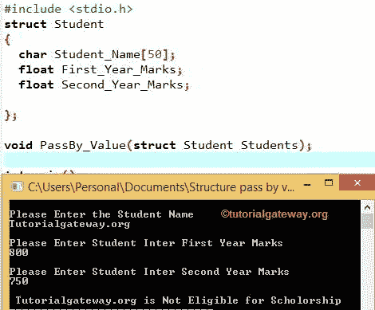

# C 语言结构和函数

> 原文：<https://www.tutorialgateway.org/structures-and-functions-in-c/>

C 语言中的结构和函数:C 语言允许我们将结构作为函数参数传递。在阅读这篇文章之前，请参考 C 文章中的函数。它将帮助你理解函数的概念。我们可以通过 3 种方式将 C 结构传递给函数:

1.  将结构的每一项作为函数参数传递。这类似于将正常值作为参数传递。虽然很容易实现，但我们不会使用这种方法，因为如果一个结构的大小稍微大一点，那么我们的生活就会变得悲惨。
2.  将整个结构作为值传递。
3.  我们也可以传递结构的地址(通过引用传递)。

## C 语言示例中的结构和函数

下面的例子将向你解释，如何通过值和引用将结构传递给 C 语言中的函数

### 通过 C 语言中的值将结构传递给函数

如果结构通过值传递给函数，那么对函数中的结构变量成员所做的更改将不会反映原始结构成员。

这个程序的结构和函数在 C，用户被要求输入，学生姓名，一年级成绩，二年级成绩。通过使用这些值，这个程序将检查学生是否有资格获得奖学金。

请参考[函数](https://www.tutorialgateway.org/functions-in-c/)帖子中的[按值调用和按引用调用](https://www.tutorialgateway.org/call-by-value-and-call-by-reference-in-c/ "Call By Value and Call By Reference in C")，了解按值传递和按引用传递的区别。在这里，我们将讨论第二种和第三种方法

```c
# include <stdio.h> 

struct Student
{
  char Student_Name[50];
  float First_Year_Marks;
  float Second_Year_Marks;

};

void PassBy_Value(struct Student Students);

int main()
{
  struct Student Student1;

  printf("\nPlease Enter the Student Name \n");
  scanf("%s",&Student1.Student_Name);

  printf("\nPlease Enter Student Inter First Year Marks \n");
  scanf("%f",&Student1.First_Year_Marks);

  printf("\nPlease Enter Student Inter Second Year Marks \n");
  scanf("%f",&Student1.Second_Year_Marks);

  PassBy_Value(Student1);   
  return 0;
}

void PassBy_Value(struct Student Students)
{
  float Sum, Average;

  Sum = Students.First_Year_Marks + Students.Second_Year_Marks;
  Average = Sum/2;

  if(Average > 900)
  {
    printf("\n %s is Eligible for Scholorship",Students.Student_Name); 
  }
  else
  {
    printf("\n %s is Not Eligible for Scholorship",Students.Student_Name); 
  }

}
```



在 C 示例的这些结构和函数中，用适当的数据类型声明了具有学生姓名、一年级成绩、二年级成绩成员的学生结构。

在 [C 语言](https://www.tutorialgateway.org/c-programming/)主()中，我们创建了学生结构变量 Student1

```c
struct Student Student1;
```

下一行中的 Printf 和 scanf 语句用于要求用户输入学生姓名、一年级成绩、二年级成绩。

根据我们的示例，学生 1 的值如下

```c
Student Name = Tutorialgateway.org;

First Year Marks = 800;

Second Year Marks = 750;
```

在下一行中，我们调用了用户定义的函数

```c
PassBy_Value(Student1);
```

当编译器到达这一点时，它将遍历到顶部。并检查函数定义或 PassBy_Value(结构)的声明。如果函数无法识别具有 PassBy_Value 名称的函数，那么它将抛出一个错误。

我们声明了两个浮点局部变量 Sum 和 average 来计算每个学生一年级和二年级成绩的 Sum 和 Average。根据结果，这个项目将发现学生是否有资格获得奖学金。

```c
Sum = Students.First_Year_Marks + Students.Second_Year_Marks;

Sum = 800 + 750 = 1550

Average = Sum/2;

Average = 1550/2 = 775
```

在下一行，我们使用 [`if`语句](https://www.tutorialgateway.org/if-statement-in-c/ "If Statement in C")检查计算的平均值是否大于 900

*   如果计算出的平均值大于 900，那么他有资格获得奖学金
*   如果计算出的平均值小于或等于 900，则他没有资格获得奖学金

注:点运算符(。)用于分配或访问结构变量的值

### 通过引用将结构传递给函数

在这个 C 程序的结构和函数中，用户要求输入讲师姓名、在这个特定学院的总经验年数和总经验年数。

```c
# include <stdio.h> 
# include <string.h> 

struct Lecturer
{
  char Lecturer_Name[50];
  int Total_Experience;
  int Experience_In_This_College;
};

void PassBy_Reference(struct Lecturer *Lecturers);

int main() 
{
  struct Lecturer Lecturer1;

  printf("\nPlease Enter the Lecturer Name \n");
  scanf("%s",&Lecturer1.Lecturer_Name);

  printf("Please Enter Lecturers Total Years of Experience\n");
  scanf("%d",&Lecturer1.Total_Experience);

  printf("Enter Lecturers Total Years of Experience in this College\n");
  scanf("%d",&Lecturer1.Experience_In_This_College);

  PassBy_Reference(&Lecturer1);   

  printf("\n Lecturer Name = %s", Lecturer1.Lecturer_Name); 
  printf("\n Lecturers Total Years of Experience = %d", Lecturer1.Total_Experience); 
  printf("\n Years of Experience in this College = %d", Lecturer1.Experience_In_This_College); 

  return 0;
}

void PassBy_Reference(struct Lecturer *Lecturers)
{
  strcpy(Lecturers->Lecturer_Name, "Tutorial Gateway");
  Lecturers->Total_Experience = 5;
  Lecturers->Experience_In_This_College = 3;
}
```

```c
Please Enter the Lecturer Name 
Suresh
Please Enter Lecturers Total Years of Experience
10
Enter Lecturers Total Years of Experience in this College
6

 Lecturer Name = Tutorial Gateway
 Lecturers Total Years of Experience = 5
 Years of Experience in this College = 3
```

在 C 示例的结构和函数中，用适当的数据类型声明了讲师结构，包括讲师姓名、讲师总经验年数和该学院成员的讲师总经验年数。

在 main()中，我们创建了讲师结构变量讲师 1

```c
struct Lecturer Lecturer1;
```

下一行中的 Printf 和 scanf 语句用于要求用户输入讲师姓名、讲师总经验年数和讲师在该学院的总经验年数。根据我们的示例，讲师 1 的值如下

```c
Lecturer Name = Suresh

Lecturers Total Years of Experience = 10

Lecturers Total Years of Experience = 6
```

在下一行中，我们调用了用户定义的函数声明

```c
PassBy_Reference(&Lecturer1);
```

这里，我们将讲师 1 结构的地址传递给函数，而不是它的克隆。这意味着对函数中的结构成员所做的任何更改都将反映原始值。

在函数定义中，我们没有做任何特别的事情，只是给讲师结构分配了新的值。

```c
strcpy(Lecturers->Lecturer_Name, "Tutorial Gateway");

Lecturers->Total_Experience = 5;

Lecturers->Experience_In_This_College = 3;
```

这意味着

```c
Lecturer Name = Tutorial Gateway

Lecturers Total Years of Experience = 5

Lecturers Total Years of Experience = 3
```

由于我们将讲师 1 的地址传递给了 PassBy_Reference()，这些新值将替换用户输入的值。>运算符用于分配或访问指针变量值