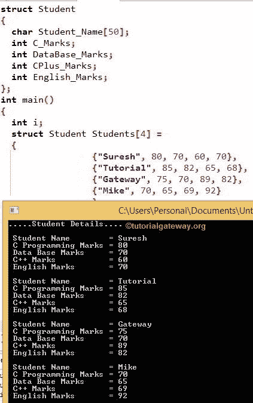

# C 语言中的结构数组

> 原文:[https://www.tutorialgateway.org/array-of-structures-in-c/](https://www.tutorialgateway.org/array-of-structures-in-c/)

C 语言中的结构数组:在 C 语言编程中，结构对于分组不同的数据类型以结构化的方式组织数据非常有用。和数组用于对相同的数据类型值进行分组。在本文中，我们将通过一个实际例子向您展示 C 语言中的结构数组概念。

在 C 示例中，我们存储了员工的详细信息，如姓名、身份证、年龄、地址和工资。我们通常将他们与上面提到的成员归为雇员结构。我们可以创建结构变量来访问或修改它的成员。一家公司可能有 10 到 100 名员工，为 100 名员工存储相同的数据怎么样？

在 C 程序设计中，我们可以很容易地通过结合两个强大的概念来解决上面提到的问题。我们可以创建员工结构。然后，我们不是创建结构变量，而是创建结构变量的数组。

## 在结构初始化时声明 C 结构数组

让我在初始化结构时用 C 语言声明一个结构数组

```
struct Employee
{
  int age;
  char name[50];
  int salary;
} Employees[4] = {
                 {25, "Suresh", 25000},
                 {24, "Tutorial", 28000},
                 {22, "Gateway", 35000},
                 {27, "Mike", 20000}
                 };

```

这里，员工结构用于存储员工的详细信息，如年龄、姓名和工资。我们仅在声明时创建了结构变量 Employees [4](大小为 4)的数组。我们还为所有 4 名员工初始化了每个结构成员的值。

从上面的 [C 编程](https://www.tutorialgateway.org/c-programming/)代码，

```
Employees[0] = {25, "Suresh", 25000}

Employees[1] = {24, "Tutorial", 28000}

Employees[2] = {22, "Gateway", 35000}

Employees[3] = {27, "Mike", 20000}

```

### 在 C main()函数中声明结构数组

```
struct Employee
{
  int age;
  char name[50];
  int salary;
};
```

在 main()函数中，创建员工结构变量

```
struct Employee  Employees[4];
Employees[4] = {
                 {25, "Suresh", 25000},
                 {24, "Tutorial", 28000},
                 {22, "Gateway", 35000},
                 {27, "Mike", 20000}
                 };

```

## C 示例中的结构数组

这个 C 语言的结构数组程序将声明学生结构并显示 N 个学生的信息。

```
#include <stdio.h>

struct Student
{
  char Student_Name[50];
  int C_Marks;
  int DataBase_Marks;
  int CPlus_Marks;
  int English_Marks;
};

int main()
{
  int i;
  struct Student Students[4] = 
                {
                 {"Suresh", 80, 70, 60, 70},
                 {"Tutorial", 85, 82, 65, 68},
                 {"Gateway", 75, 70, 89, 82},
                 {"Mike", 70, 65, 69, 92}
                 };

  printf(".....Student Details....");
  for(i=0; i<4; i++)
  {
    printf("\n Student Name = %s", Students[i].Student_Name);
    printf("\n First Year Marks = %d", Students[i].C_Marks);
    printf("\n Second Year Marks = %d", Students[i].DataBase_Marks);
    printf("\n First Year Marks = %d", Students[i].CPlus_Marks);
    printf("\n Second Year Marks = %d", Students[i].English_Marks);
  }    

 return 0;
}
```



在这个 C 语言的结构数组例子中，我们用不同数据类型的学生名、C、数据库、C++、英语标记成员声明了学生结构。

在 main()函数中，我们创建了结构学生变量的[数组](https://www.tutorialgateway.org/array-in-c/)。接下来，我们将适当的值初始化为[结构](https://www.tutorialgateway.org/structures-in-c/)成员

在下一行中，我们在 For 循环中有 [For 循环。它将控制编译器不超过数组限制。内部 printf 语句将打印学生结构数组中的值。](https://www.tutorialgateway.org/for-loop-in-c-programming/)

让我们以迭代的方式探索 C 程序中的结构数组

第一次迭代

学生姓名=学生[i]。学生 _ 姓名
C 编程成绩=学生[i]。C_Marks
数据库分数=学生[i]。数据库标记
C++标记=学生[i]。CPlus_Marks
英语成绩=学生[i]。英语标志

i = 0，条件 0 < 4 为真，因此

学生名称=学生[0]。学生名=苏雷什
C 编程分数=学生[0]。C_Marks = 80
数据库标记=学生[0]。数据库分数= 70
C++分数=学生[0]。CPlus_Marks = 60
英语成绩=学生[0]。英语 _ 分数= 70

使用 i++ [增量运算符](https://www.tutorialgateway.org/increment-and-decrement-operators-in-c/ "C Increment & Decrement Operators")将 I 值增加 1。所以我变成了 1

C 语言中结构数组的二次迭代

i = 1，条件 1 < 4 为真

学生姓名=学生[1]。学生 _ 姓名=教程
C 编程成绩=学生[1]。C_Marks = 85
数据库标记=学生[1]。DataBase_Marks = 82
C++ Marks =学生[1]。CPlus_Marks = 65
英语成绩=学生[1]。英语 _ 分数= 68

I 值增加 1。所以我变成了 2

第三次迭代

i = 2，条件 2 < 4 为真

学生姓名=学生[2]。学生名=网关
C 编程成绩=学生[2]。c _ mark = 75
数据库 mark =学生[2]。数据库分数= 70
C++分数=学生[2]。CPlus_Marks = 89
英语成绩=学生[2]。英语 _ 分数= 82

I 值增加 1。所以我变成了 3

C 语言中结构数组的第四次迭代

i = 3，条件 3 < 4 为真，所以，

学生名称=学生[0]。学生名=迈克
C 编程成绩=学生【0】。C_Marks = 70
数据库标记=学生[0]。数据库分数= 65
C++分数=学生[0]。CPlus_Marks = 69
英语成绩=学生[0]。英语 _ 分数= 92

I 值使用 i++递增运算符递增 1。所以，I 变成 4，i<4 的条件失败。因此，编译器将退出循环。