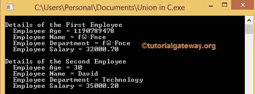

# 联合

> 原文：<https://www.tutorialgateway.org/union-in-c/>

像结构一样，C 语言中的联合也用于对不同的数据类型进行分组，以结构化的方式组织数据。用于创建它的系统保留关键字 union。

与结构不同，C 联合变量将为其所有成员分配公共内存(即年龄、姓名、地址等)。).分配的公共内存的大小等于最大联合成员的大小。由于这一点，我们可以节省很多内存。

由于这种共同的记忆，我们无法同时访问所有联合成员。因为 C union 变量一次保存一个成员，所以我们一次可以访问一个成员。

## 联合语法

C 语言中 Union 的基本语法如下所示

```
union Union_Name
{
  Data_Type Variable_Name; //Member

  Data_Type Variable_Name; //Member

  ………….
};
```

union 是用于创建和访问其成员的系统保留关键字。联合名称是您要为联合指定的名称。例如，员工、人员、学生。

数据类型是指要声明的变量的数据类型。例如，int、float、char 等。变量名称是变量的名称。比如身份证，年龄，姓名，工资。例如

```
union Student //Name = Employee

{

  //Members
  int Roll_No; //Data Type = int; Variable Name = Roll_No

  char name[50]; //Data Type = char Array; Variable Name = name

  char address[100]; //Data Type = Char Array; Variable Name = address

};
```

### C 语言中的并集声明

在访问联合内部的成员之前，我们必须创建变量。我们可以用多种方式声明 C 联合变量。第一种方法是首先声明 Union，然后在主函数中创建变量。

```
union Employee

{

  int age;

  char name[50];

  float salary;

};

//Creating the Structure variable

 union Employee emp1, emp2;

 emp1 = {25, "Dave", 25000}
```

这里，emp1 和 emp2 是数据类型联合的变量。第二种方法是在 C 联合声明时创建变量

```
union Employee

{

  int age;

  char name[50];

  float salary;

} emp1, emp2;
```

### C 语言中访问联盟成员

我们可以使用点运算符()访问 C 联合成员。)或成员运算符。例如，让我们使用上面的例子。

```
//Assigning the values

 emp1.age = 26;

 strcopy (emp1.name, "Michel");

 emp1.salary = 46000.50;
```

## C 语言编程中的并集示例

在这个 C 程序中，我们将宣布与四个成员联合。然后我们将以两种不同的方式将每个成员显示为输出。请参考 [C 语言](https://www.tutorialgateway.org/c-programming/)中的[结构](https://www.tutorialgateway.org/structures-in-c/)一文了解结构。

```
#include <stdio.h> 
#include <string.h> 

union Employee 
{
  int age;  
  char Name[50];
  char Department[20];
  float Salary;
};

int main() 
{
  union Employee emp1;
  union Employee emp2;

    emp1.age = 28;
    strcpy(emp1.Name, "Chris");
    strcpy(emp1.Department, "Science");
    emp1.Salary = 32000.70;

  printf("\nDetails of the First Employee \n");

  printf("  Employee Age = %d \n", emp1.age);
  printf("  Employee Name = %s \n", emp1.Name);
  printf("  Employee Department = %s \n", emp1.Department);
  printf("  Employee Salary = %.2f \n\n", emp1.Salary);

  printf("Details of the Second Employee \n" );

  emp2.age = 30;
  printf("  Employee Age = %d \n", emp2.age );

  strcpy(emp2.Name, "David");
  printf("  Employee Name = %s \n", emp2.Name );

  strcpy(emp2.Department, "Technology" );
  printf("  Employee Department = %s \n ", emp2.Department );

  emp2.Salary = 35000.20;
  printf("  Employee Salary = %.2f \n ", emp2.Salary );

  return 0;
}
```



在这个 C 联合示例程序中，我们用适当的数据类型声明了具有年龄、姓名、部门和薪金成员的员工。在 main()函数中，我们为员工联合创建了两个变量 emp1 和 emp2。

第一次雇佣的详细信息

从下面的语句中，您可以看到 C Union 变量将为年龄成员分配内存。这意味着存储在存储单元中的年龄值为 28(年龄= 28)。

```
emp1.age = 28;
```

从下面的语句中，您可以观察到 C Union 变量必须为 Name 成员分配内存。因此，它将删除以前条目的数据，即年龄。然后，它将为名称成员分配相同的内存。这意味着克里斯被存储在一个存储位置(这里替换了年龄)。

```
strcpy(emp1.Name, "Chris");
```

现在 C Union 变量必须为部门成员分配内存。因此，它将删除以前条目的数据，即名称。那么它将分配相同的内存给部门成员。它意味着科学存储在一个记忆位置(这里替换了克里斯)。

```
strcpy(emp1.Department, "Science");
```

接下来，C Union 变量必须为 Salary 成员分配内存。因此，它将删除以前条目的数据，即部门，并将相同的内存分配给薪资成员。表示存储在内存位置的 32000.70(此处替换为科学)。

```
emp1.Salary = 32000.70;
```

下面的 printf 语句用于输出我们为成员分配的值。以下语句将显示错误或奇怪的值，因为其他值已经取代了年龄值

```
printf(" Employee Age = %d \n", emp1.age);
```

以下语句将显示错误或奇怪的值，因为其他值已经替换了“名称”值

```
printf(" Employee Name = %s \n", emp1.Name);
```

以下联合声明显示奇怪或错误的值，因为部门值已被薪资取代。

```
printf(" Employee Department = %s \n", emp1.Department);
```

以下语句打印正确的薪资值。因为在此之后，我们没有将内存位置分配给其他值。

```
printf(" Employee Salary = %.2f \n", emp1.Salary);
```

第二名员工的详细信息。C Union 允许我们一次访问一个数据成员。因此，在这个变量中，我们将在为该数据成员赋值后立即显示输出。

```
emp2.age = 30;

printf(" Employee Age = %d \n", emp2.age);
```

Union 变量将为年龄成员分配内存。这意味着年龄(年龄= 28)存储在存储单元中的值为 28。赋值后，它会立即打印年龄输出。

现在 C Union 变量必须为 Name 成员分配内存。因此，它删除了以前条目的数据，即年龄。然后，它将为名称成员分配相同的内存。意思是大卫存储在一个记忆位置(这里替换了年龄)。

```
strcpy(emp2.Name, "David");

printf(" Employee Name = %s \n", emp2.Name);
```

提示:如果忘记立即打印语句，数据将被删除，并分配给下一个成员。

以下语句的过程也是相同的

```
strcpy(emp2.Department, "Technology");
printf(" Employee Department = %s \n", emp2.Department);

emp2.Salary = 35000.20;
printf(" Employee Salary = %.2f \n\n", emp2.Salary);
```