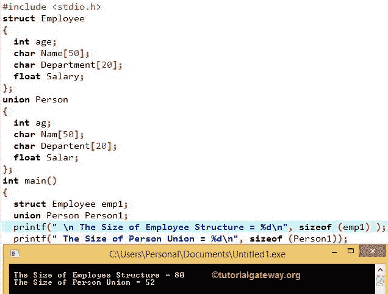

# C 语言中结构与并集的区别

> 原文:[https://www . tutorialgateway . org/c 结构与联合的区别/](https://www.tutorialgateway.org/difference-between-structure-and-union-in-c/)

在前一篇文章中，我们已经解释了结构和联盟。在讨论差异之前，请参考结构和工会职位。

*   两者都用于对不同的数据类型进行分组，以便在结构上组织数据。
*   结构和联合在语法上相似，但关键字不同。
*   创建结构和联合变量来访问它们各自的成员是相同的，只是关键字不同。

在本文中，我们用例子向您展示了 C 编程中结构和联合的区别。在进入实际例子之前，让我们看看结构和联合之间的区别。

| 结构 | 联盟 |
| Struct 关键字用于声明结构 | Union 关键字用于声明它 |
| 结构变量将分别为所有结构成员分配内存。 | 联合变量将为所有联合成员分配公共内存。 |
| 示例:
结构员工{ int age 字符名称[50]；浮动工资；}; | 示例:
工会员工{ int age 字符名称[50]；浮动工资；}; |
| 结构将占用更多的内存空间。
Memory_Size =所有结构成员尺寸的相加。
内存大小= int +字符数组[50] +浮点
内存大小= 2 + 50 + 4 字节
内存大小= 56 字节 | 与结构相比，联合将占用更少的内存空间。内存大小=最大联合成员的大小。从上面的例子来看，最大的成员是 char 数组。所以，内存大小= 50 字节 |
| 它允许我们随时访问任何或所有成员。 | 它允许我们一次只能访问一个工会成员。 |

## 寻找结构和联合区别的 c 程序

在这个 C 程序中，我们将声明具有相同数据类型成员的结构和联合。然后我们将使用函数的[大小来计算并集和结构的大小。建议大家参考](https://www.tutorialgateway.org/c-sizeof-operator/) [C 编程](https://www.tutorialgateway.org/c-programming/)中的[结构](https://www.tutorialgateway.org/structures-in-c/)和[联盟](https://www.tutorialgateway.org/union-in-c/)文章。

```
/* C Program to find difference between Structure and Union */
#include <stdio.h> 

struct Employee 
{
  int age;  
  char Name[50];
  char Department[20];
  float Salary;
};

union Person 
{
  int ag;  
  char Nam[50];
  char Departent[20];
  float Salar;
};

int main() 
{
  struct Employee emp1;
  union Person Person1;

  printf(" The Size of Employee Structure = %d\n", sizeof (emp1) );
  printf(" The Size of Person Union = %d\n", sizeof (Person1));

  return 0;
}
```



如果您观察以上内容，员工结构和人员工会都具有相同的数据类型和大小。在 main()函数中，我们使用下面的语句创建了雇员结构变量 emp1

```
struct Employee emp1;
```

接下来，我们使用下面的语句创建了人员联合变量 Person1

```
union Person Person1;
```

接下来，在 printf 语句中，我们使用`sizeof`运算符来计算员工结构和人员工会的大小。

sizeof (emp1) = 80

```
int Age; - It will take 4 bytes of space in the memory

char Name[50]; - It will take 50 bytes of space in the memory

char Department[20]; - It will take 20 bytes of space in the memory

float Salary; - It will take 4 bytes of space in the memory
```

结构的内存大小= 4 + 50 + 20 + 4 => 78 字节

如果观察输出，它给出了 80 个字节。由于结构填充，它需要额外的 2 字节。我们将在接下来的帖子中讨论结构填充。

sizeof (Person1) = 52 字节

上面最大的成员是名字[50]，众所周知

内存大小=最大联合数大小= 50 字节

又是 2 个额外的字节用于填充