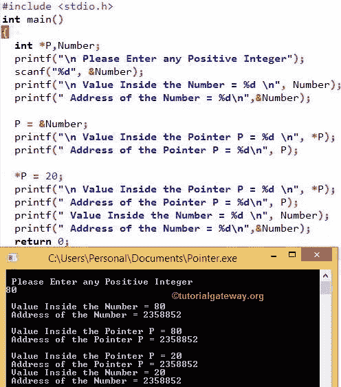

# C 语言中的指针

> 原文：<https://www.tutorialgateway.org/pointers-in-c/>

C 语言中的指针是最强大的概念，因为 C 中的指针变量包含或持有另一个变量的地址。C 语言中的指针有利于保存变量的地址。使用地址，我们可以访问关联变量中的值。或者我们可以操纵存储在该地址中的值。因此，指针中所做的任何更改都将反映原始值。

在计算机世界中，系统会根据我们存储的每个变量的要求来分配内存(以字节为单位)。意思是，每个变量都有价值和记忆。c 示例中的指针，

```
int x = 10;

int *p;
```

x 是变量名。

10 是关联或分配给 x 的值。

10 存储在某个存储位置。比如 1042

因此，C Pointer *p 将赋给 1042，并访问 x 内部的值，即 10。

## C 语言中指针的语法

```
Data_Type *Pointer_Name;
```

指针名称:它的名称。

(*):它告诉变量是指针。

数据类型:C 指针变量包含其他人的地址。所以，声明它的类型是没有用的。语法中的数据类型不属于指针。它属于指针关联的变量。例如，

int * x；

这意味着 C 指针变量 x 只分配给整数。如果你把指针 x 赋给浮点或字符数据类型，那么它会给出一个奇怪的结果。说

```
int a;

float b;

x = &a; // Correct because we are assigning integer variable

x = &b; //Wrong because we are assigning float variable
```

众所周知，&a 是 a 的地址，x 是*x 的加法。

x = &a;表示我们实际上是在把 a 的地址分配给 x。

要访问 C 指针变量内部的值，我们可以简单地使用*x。

```
int *x;

*x = 20;

printf("%d",*x)
```

要访问 [C 语言](https://www.tutorialgateway.org/c-programming/)中指针的地址

```
printf("%d", x)
```

## c 指针示例

这个 C 指针程序允许用户输入任意正整数。使用变量的地址，访问用户输入的值。接下来，使用指针变量，更改用户输入的值。

```
# include <stdio.h>

int main()
{
  int *P,Number;

  printf("\n Please Enter any Positive Integer");
  scanf("%d", &Number);

  printf("\n Value Inside the Number = %d \n", Number);
  printf(" Address of the Number = %d\n",&Number);

  P = &Number;
  printf("\n Value Inside the Pointer P = %d \n", *P);
  printf(" Address of the Pointer P = %d\n", P);

  *P = 20;
  printf("\n Value Inside the Pointer P = %d \n", *P);
  printf(" Address of the Pointer P = %d\n", P);
  printf(" Value Inside the Number = %d \n", Number);
  printf(" Address of the Number = %d\n",&Number);

  return 0;
}
```



在这个例子中，我们声明了一个整数 Number 和一个整数类型的指针 P。

printf 语句要求用户输入任意正整数。scanf 语句将用户输入的值赋给我们已经声明的数字。

第一个语句将打印数字中的值(用户输入的值)，下一个语句打印声明的数字的地址。

在下一行中，我们将数字的地址分配给 C 指针的地址。这里，P 是我们已经声明的指针的地址(*P)，而&Number 是 Number 的地址。

```
P = &Number;
```

它打印 P 中的值。这里 P 的地址被分配给数字的地址，所以，我们实际上打印的是用户输入的值，即数字

```
printf("\n Value Inside the Pointer P = %d \n", *P);
```

打印指针的地址，这显然与数字的地址相同

```
printf(" Address of the Pointer P = %d\n", P);
```

在下一行中，我们将 20 分配给*P

* P = 20

意思是，

*   *P = 20 内的值
*   由上可知(P = &Number)，C 指针变量和 Number var 的地址是相同的。这意味着我们不仅改变了*p 的值，而且实际上也改变了数字变量(Number)中的数据
*   这意味着，用户在数字中输入的值将更改为 20。

最后四个 printf 语句将打印数字和指针变量的值和地址。