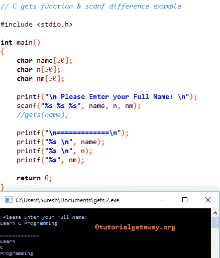

# C 语言`gets()`函数

> 原文：<https://www.tutorialgateway.org/gets-in-c-programming/>

C`gets()`函数用于扫描或读取标准输入(stdin)设备中的一行文本，并将其存储在 String 变量中。当它读取换行符时，C`gets()`函数将终止。

C 语言中如何用 get 从控制台读取字符串数据，并举例说明 scanf 和 get 的区别。C 语言中 get 背后的基本语法如下所示。

```c
char *gets(char *str)
```

或者我们可以简单地写为:

```c
gets(<variable name>)
```

## 获取 C 语言示例

`get()`函数用于从控制台读取完整的字符集。这个程序将帮助你实际理解这个`get()`函数。

提示:在使用这个`get()`函数之前，你必须包含#include <stdio.h>头。</stdio.h>

```c
// C gets function example
#include <stdio.h> 

int main()
{
	char name[50];

	printf("\n Please Enter your Full Name: \n");
	gets(name);

	printf("=============\n");
	printf("%s", name);

	return 0;
}
```

```c
 Please Enter your Full Name: 
Tutorial Gateway
=============
Tutorial Gateway
```

第一个 printf 语句将要求用户输入任何名称或字符串，以及分配给字符数组名称的用户指定的字符串[50]。

```c
printf("\n Please Enter your Full Name: \n");
gets(name);
```

接下来，我们使用 [C 语言](https://www.tutorialgateway.org/c-programming/) printf 语句打印输出。

```c
printf("%s", name);
```

## C 语言中扫描和获取的区别

这个[程序](https://www.tutorialgateway.org/c-programming-examples/)将帮助你理解 C 语言中 scanf 语句和`get()`函数的区别。当我们处理字符串数据时，为什么我们通常更喜欢 get 而不是 scanf。

```c
// C gets function & scanf difference example

#include <stdio.h> 

int main()
{
	char name[50];

	printf("\n Please Enter your Full Name: \n");
	scanf("%s", name);
	//gets(name);

	printf("\n=============\n");
	printf("%s", name);

	return 0;
}
```

```c
 Please Enter your Full Name: 
Learn C Programming

=============
Learn
```

你可以观察到，以为我们输入了学习 C 语言作为文本，我们得到的输出是学习。因为，`scanf()`函数会把学习当成一个值，c 当成另一个值，编程当成第三个值。下面的截图会证明你是一样的



让我评论一下 scanf("%s "，名称)；语句，并使用`get()`函数从控制台读取文本。

```c
// C gets function & scanf difference example

#include <stdio.h> 

int main()
{
	char name[50];

	printf("\n Please Enter your Full Name: \n");
	//scanf("%s", name);
	gets(name);

	printf("\n=============\n");
	printf("%s", name);

	return 0;
}
```

```c
 Please Enter your Full Name: 
Learn C Programming

=============
Learn C Programming
```

从上面的截图中，你可以观察到我们得到了完整的文本，没有任何缺失的字母。