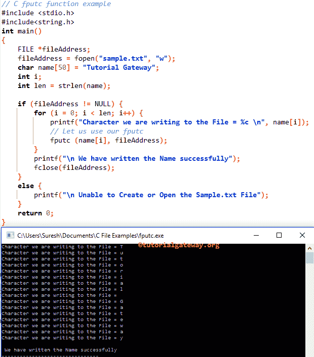
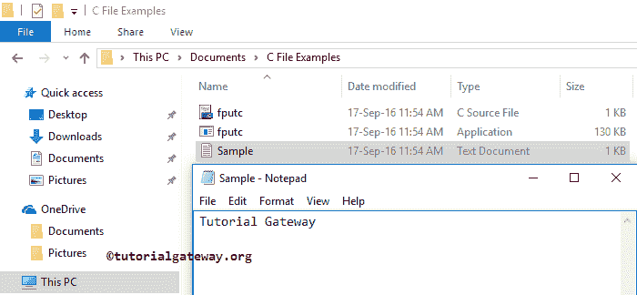

# C 语言程序设计

> 原文:[https://www.tutorialgateway.org/fputc-in-c/](https://www.tutorialgateway.org/fputc-in-c/)

C fputc 函数可用于将字符写入文件中当前位置的指定流，然后将指针位置前移。

如何在 C 编程中用 fputc 将字符、字符数组(字符串)或字符串数据写入文件，并举例说明？。使用 fputs 函数写入完整的字符串。其语法是

```
int fputc(int char, FILE *stream)
or 
int fputc(int char, <File Pointer>)
```

我们使用空文件来演示 fputc 函数。在使用此 fputc 函数之前，您必须包含#include <stdio.h>标题。</stdio.h>

## C 语言编程示例

fputc 函数，用于将字符写入用户指定的文件。这个 [C](https://www.tutorialgateway.org/c-programming/) 程序会帮助你理解同样的道理。

```
// C fputc function example

#include <stdio.h> 
#include<string.h>

int main()
{
   FILE *fileAddress;
   fileAddress = fopen("sample.txt", "w");
   char name[50] = "Tutorial Gateway";
   int i;
   int len = strlen(name);

   if (fileAddress != NULL) {
	for (i = 0; i < len; i++) {
           printf("Character we ar writing to the File = %c \n", name[i]);
	   // Let us use
	   fputc (name[i], fileAddress);
	}
	printf("\n We have written the Name successfully");
	fclose(fileAddress);		
   }
   else {
  	  printf("\n Unable to Create or Open the Sample.txt File");
   }
   return 0;
}
```



让我们打开文件，看看它是否返回了字符。

