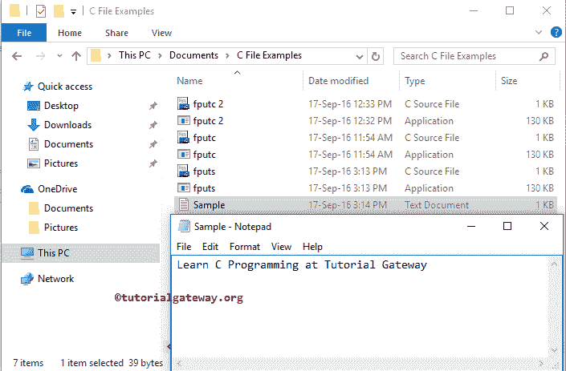

# C `fputs()`

> 原文：<https://www.tutorialgateway.org/c-fputs/>

如何在 C 语言中用 fputs 将字符数组或字符串数据写入文件，并举例说明？。C fputs 函数用于将字符数组写入指定的流。使用 fputc 函数逐字符书写。

C 语言中 fputs 背后的语法如下所示。

```
int fputs(const char *str, FILE *stream)
```

或者我们可以简单地写为:

```
int fputs(string, <File Pointer>)
```

从上面的 fputs 函数代码片段中，

*   字符:请指定要写入文件的字符数组
*   流:请指定指向文件对象的指针。或者说，保存地址和操作模式的文件指针

我们将使用下面指定的文件来演示这个 C fputs 函数。


从上面的截图中，您可以观察到 sample.txt 在我们的 Documents 文件夹中，并且是空的。

## C fputs 示例

C fputs 函数用于将字符数组写入用户指定的文件。这个 C 程序会帮助你理解同样的事情。

提示:在使用此 fputs 功能之前，您必须包含#include <stdio.h>标题。</stdio.h>

```
// C fputs function example
#include <stdio.h> 

int main()
{
   FILE *fileAddress;
   fileAddress = fopen("sample.txt", "w");
   char name[50];

   if (fileAddress != NULL) {
	printf("\n please neter the String that you want to write to the File :\n");
	gets(name);

	// Let us use our fputs
	fputs (name, fileAddress);
	printf("\n We have written the Name successfully");
	fclose(fileAddress);		
   }
   else {
     	printf("\n Unable to Create or Open the Sample.txt File");
   }
   return 0;
}
```


在这个 C fputs 函数示例中，首先，我们创建了文件指针，然后在写入模式下分配文件。请参考 [fputc 功能](https://www.tutorialgateway.org/fputc-in-c/)一文。

提示:在这个 [C 程序](https://www.tutorialgateway.org/c-programming-examples/)中，我们没有提到文件名的完整路径，因为我的应用程序和 txt 驻留在同一个位置。如果您的情况不同，请提供完整路径。

```
FILE *fileAddress;
fileAddress = fopen("sample.txt", "w");
```

下面的 [`if`语句](https://www.tutorialgateway.org/if-statement-in-c/)检查我们是否成功打开了 sample.txt。

```
if (fileAddress != NULL) {
```

以下语句要求用户输入他想要写入 sample.txt 的字符串，我们正在使用[get](https://www.tutorialgateway.org/gets-in-c-programming/)函数读取用户输入

```
printf("\n please neter the String that you want to write to the File :\n");
gets(name);
```

接下来，我们使用 C fputs 函数将用户指定的字符串写入 sample.txt

```
fputs (name, fileAddress);
```

接下来，我们关闭 [C 语言](https://www.tutorialgateway.org/c-programming/)文件指针。

```
fclose(fileAddress);
```

让我们打开文本，看看我们是否成功返回了字符

