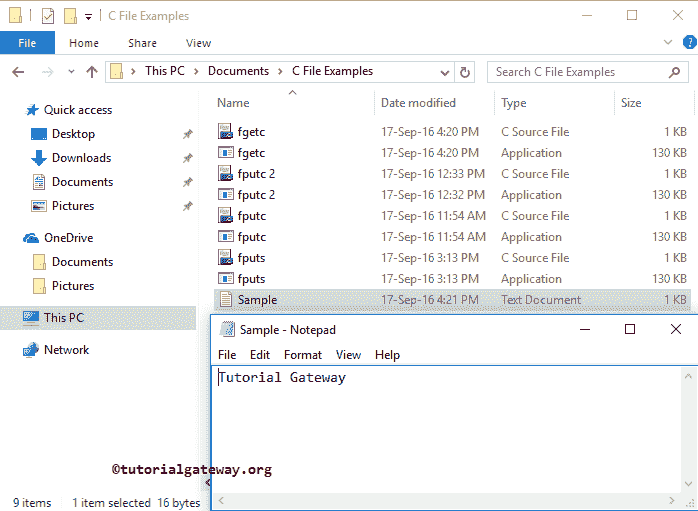
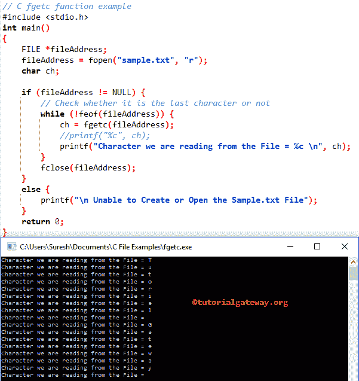

# C 语言中的`fgetc()`

> 原文：<https://www.tutorialgateway.org/fgetc-in-c-programming/>

函数的作用是:从文件当前位置的指定流中读取/返回字符，然后增加指针位置。

如何在 C 语言中用 fgetc 从文件中读取字符、字符数组或字符串数据，并举例说明？。这个函数一个字符一个字符地读取，但是你可以使用函数一次读取完整的字符串。

## C 语言中 fgetc 的语法

C 语言中 fgetc 背后的语法如下所示。

```
int fgetc(FILE *stream)
```

或者我们可以这样写:

```
int getc(<File Pointer>)
```

从上面的`fgetc()`函数代码片段中，

*   流:请指定指向文件对象的指针，或者说，保存地址和操作模式的文件指针

我们将使用下面指定的文件来演示这个 C`fgetc()`函数。



从上面的截图中，您可以观察到示例. txt 文件在我们的 C 文件示例文件夹中。它包含文本作为教程网关。

## C 语言示例中的 fgetc

fgetc 方法用于从用户指定的文件中读取字符并返回输出。这个 c 语言的 fgetc 程序将帮助你理解同样的内容。

提示:在使用这个 c`fgetc()`函数之前，你必须包含# include <stdio.h>头。</stdio.h>

```
// C fgetc function example
# include <stdio.h> 

int main()
{
   FILE *fileAddress;
   fileAddress = fopen("sample.txt", "r");
   char ch;

   if (fileAddress != NULL) {
	// Check whether it is the last character or not
	while (!feof(fileAddress)) {
		ch = fgetc(fileAddress);
		//printf("%c", ch);
		printf("Character we are reading from the File = %c \n", ch);
	}
	fclose(fileAddress);		
   }
   else {
	printf("\n Unable to Create or Open the Sample.txt File");
   }
   return 0;
}
```



在 c 示例中的 fgetc 中，首先，我们创建了文件指针，然后在读取模式下分配文件，因为我们想要读取 sample.txt 中存在的字符。请参考 [`fgets()`函数](https://www.tutorialgateway.org/c-fgets-function/)一文。

在这个 [C 程序](https://www.tutorialgateway.org/c-programming-examples/)中，我们没有提到名字的完整路径，因为我的。应用程序和文本文件位于同一位置。如果您的情况不同，请提供完整路径。

```
FILE *fileAddress;
fileAddress = fopen("sample.txt", "r");
```

以下 [`if`语句](https://www.tutorialgateway.org/if-statement-in-c/)检查我们是否成功打开了 sample.txt。

```
if (fileAddress != NULL) {
```

接下来，我们使用 [`while`循环](https://www.tutorialgateway.org/while-loop-in-c/)遍历示例. txt 中的每个字符。在`while`循环中，我们使用条件来检查编译器是否到达了末尾。

```
while (!feof(fileAddress)) {
```

接下来，我们使用`fgetc()`函数读取 sample.txt 中的每个字符，并将其分配给之前初始化的 ch 字符。

```
ch = fgetc(fileAddress);
```

这里，我们正在关闭 [C 语言](https://www.tutorialgateway.org/c-programming/)文件指针。

```
fclose(fileAddress);
```