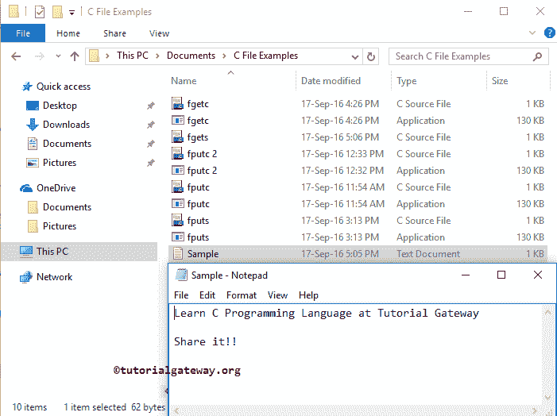
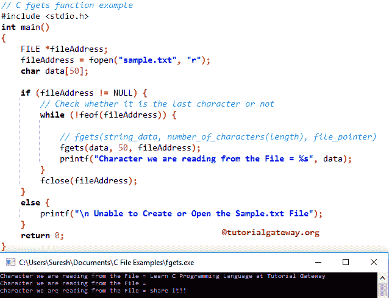

# 函数

> 原文:[https://www.tutorialgateway.org/c-fgets-function/](https://www.tutorialgateway.org/c-fgets-function/)

C fgets 函数用于从指定流中读取字符数组。如何在 C 语言中用 fgets 从 File 中读取字符数组或字符串数据并返回输出，并举例说明？。使用 fgetc 函数从流中逐个字符地读取。

## C 程序设计中函数集的语法

C 语言中函数背后的语法如下所示。

```
char *fgets(char *str, int n, FILE *stream)
```

从上面的 C fgets 函数代码片段中，

*   字符串:请指定要从文件中读取的字符数组
*   fgets 函数可以读取的最大长度。
*   流:请指定指向文件对象的指针，或者简单地说，保存文件地址和操作模式的文件指针

我们将使用下面指定的文件来演示这个 fgets 函数。



从上面的截图中，您可以观察到 sample.txt 在我们的 Examples 文件夹中。它包含了在教程网关学习 C 语言的文本。

## C fgets 示例

fgets 方法用于从用户指定的文件中读取字符数组并返回输出。这个 C 程序会帮助你理解同样的事情。

提示:在使用这个函数之前，你必须包含#include <stdio.h>头。</stdio.h>

```
#include <stdio.h> 
int main()
{
   FILE *fileAddress;
   fileAddress = fopen("sample.txt", "r");
   char data[50];

   if (fileAddress != NULL) {
	// Check whether it is the last character or not
	while (!feof(fileAddress)) {

		// fgets(string_data, number_of_characters(length), file_pointer)
		fgets(data, 50, fileAddress);
		printf("Character we are reading from the File = %s \n", data);
	}
	fclose(fileAddress);		
   }
   else {
	printf("\n Unable to Create or Open the Sample.txt File");
   }
   return 0;
}
```



在这个 C fgets 函数示例中，首先，我们创建了文件指针，然后在读取模式下分配了 txt，因为我们想要读取示例. txt 中存在的字符。请参考 [fgetc 函数](https://www.tutorialgateway.org/fgetc-in-c-programming/)和[读取输入](https://www.tutorialgateway.org/c-program-to-read-input-and-print-string/)一文。

在这个 [C 程序](https://www.tutorialgateway.org/c-programming-examples/)中，我们没有提到文件名的完整路径，因为我的。应用程序和文本位于同一位置。如果您的情况不同，请提供完整的路径。

下面的 [`if`语句](https://www.tutorialgateway.org/if-statement-in-c/)将检查我们是否成功打开了 sample.txt。

```
if (fileAddress != NULL) {
```

接下来，我们使用 [`while`循环](https://www.tutorialgateway.org/while-loop-in-c/)遍历示例. txt 中的每个字符。在`while`循环中，我们使用条件来检查编译器是否到达了末尾。

```
while (!feof(fileAddress)) {
```

接下来，我们使用 C fgets 函数来读取示例. txt 中的字符串或字符数组

```
fgets(data, 50, fileAddress);
```

接下来，我们关闭 [C 语言](https://www.tutorialgateway.org/c-programming/)指针。

```
fclose(fileAddress);
```