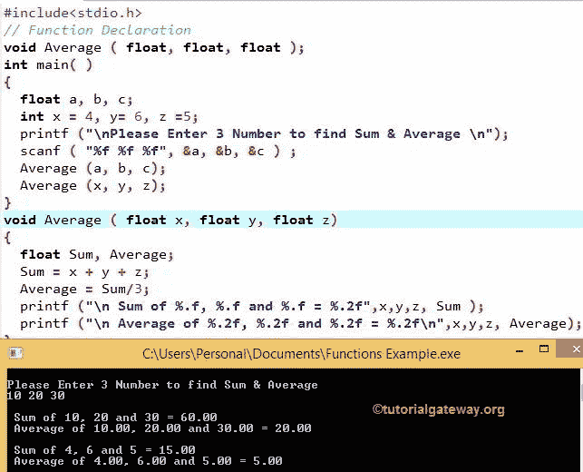

# C 语言中的函数

> 原文：<https://www.tutorialgateway.org/functions-in-c/>

C 语言中的函数:包装在花括号({ })中执行特定操作的代码块或一些逻辑。我们已经看到了一些 C 函数，你可能没有注意到。

例如 printf()、scanf()、strcpy()等。是 C 语言中的一些内置函数。以下是 C 语言中函数的优点

1.  这将有助于我们把大项目分成小组。因此，我们可以更快更好地理解和调试程序。
2.  通过给每个人分配不同的功能，多人可以在同一个程序上工作。
3.  C 语言中的函数阻止我们多次编写同一个逻辑。
4.  它帮助我们反复调用同一个函数。

## C 语言中函数的语法

C 语言中函数的基本语法如下所示:

```
Return_Type Function_Name (Parameters)
{
  Local Variable Declaration;

  Logic;

  Executable Statement 1;

   ……
}
```

*   Return_Type:函数被调用时，可能返回值，也可能不返回值。
    1.  如果 C 中的函数返回任何值，那么我们必须用适当的数据类型替换 Return_Type。例如，int、float、char 等。，并在调用 return 关键字时使用该关键字返回值。
    2.  如果它没有返回任何值，那么我们必须用 void 关键字替换 Return_Type。不需要 return 关键字。
*   Function_Name:除了系统保留的关键字之外，它可以是您希望给出的任何名称。
*   参数:每个方法接受 0 个或更多的参数；这完全取决于用户需求。在声明参数时，不要忘记适当的数据类型。例如(int a，int b)
*   局部变量声明:有时，我们可能需要一些临时变量，这只是这个特定方法所需要的，然后我们可以在其中声明它们。它不是强制性的，纯粹取决于用户要求。请记住，这些变量仅适用于该特定方法；我们不能在外面接近他们。
*   逻辑:你想要实现的任何数学或任何代码或计算。
*   可执行语句:任何打印一些数据的语句。

## C 语言中的函数类型

C 语言中有两种类型的函数:

*   C 语言支持的所有内置函数称为库函数。我们不必担心 C 语言中库函数内部的逻辑，因为它们存储在头文件中。在我们之前的文章中，我们使用了许多库方法，如 printf()、scanf()、sqrt()、strcpy()等。
*   用户定义函数:C 语言不仅仅依赖于内置函数，它允许我们创建自己的被称为用户定义函数的函数。例如，如果我们想计算标准差或一些数学计算，那么我们可以将它们放在具有适当名称的单独方法中。然后我们可以多次调用该方法。

## 用户定义函数的实现

为了在 C 程序中实现用户定义的函数，我们必须遵循一些规则，例如:

### 函数声明

它将通知编译器返回类型、函数名、参数数量以及数据类型。

返回类型函数名(参数)

例如，

```
int Add(int, int)
```

函数声明是可选的。众所周知，C 语言从 main()开始执行。因此，当编译器到达方法调用时，它将向上运行以检查定义。意思是，

*   如果我们将定义放在 main()之前，那么就不需要在 c 中声明函数
*   如果我们将定义放在 main()之后，那么必须声明该方法，因为它会通知编译器

### C 语言中的函数调用

除了用有效数量的参数和有效的数据类型调用原始函数之外什么都没有。例如，添加(2，3)

注意:用户定义的函数名应与 [C 语言](https://www.tutorialgateway.org/c-programming/)中的调用名完全匹配。

### 函数定义

这是我们将放置所有逻辑、计算等的地方。我们可以将定义放在 main()之前或 main()之后。

例如，

```
int Add (int a, int b)
{
  int Sum;
  Sum = a + b;
  return sum;
}
```

注意:如果您定义了除了 void 返回类型之外的<font color="# 000000">方法</font> d，请不要忘记 return 关键字。

## 用 C 语言中的函数求 3 个数的和与平均

在这个程序中，用户要求输入三个数字。然后通过调用函数，我们将计算这三个数字的和与平均值。

```
# include <stdio.h>

// Declaration
void Average ( float, float, float );                               

int main( )               
{
  float a, b, c;
  int x = 4, y= 6, z =5;

  printf ("\nPlease Enter 3 Number to find Sum & Average \n");
  scanf ( "%f %f %f", &a, &b, &c ) ;

  Average (a, b, c);  
  Average (x, y, z);                     
}

void Average ( float x, float y, float z)   
{
  float Sum, Average;

  Sum = x + y + z;
  Average = Sum/3;

  printf ("\n Sum of %.2f, %.2f and %.2f = %.2f", x, y, z, Sum );
  printf ("\n Average of %.2f, %.2f and %.2f = %.2f \n", x, y, z, Average);

}
```



它是一个 C 函数声明。如果您忘记了这个 void Average ( float，float，float)声明，编译器将会抛出一个错误。

第一个 printf 语句将要求用户输入 3 个数字。下面的语句将用户输入值存储在 a、b、c 变量中。

在下一行，我们称之为平均值(a，b，c)。当编译器到达这一点时，它将遍历顶部来检查 Average()声明。如果编译器无法识别具有平均值名称的方法，那么它将抛出一个错误。

在这种情况下，当向上移动时，它将停止在

```
void Average ( float, float, float );
```

上面的声明将把编译器带到下面的方法

```
void Average ( float x, float y, float z );
```

首先，此方法将检查参数，并且仅在以下情况下执行

*   传递给函数的参数数量等于声明的参数数量
*   传递到此的参数的数据类型等于声明的参数

在 C 函数中，我们声明了两个局部变量 Sum 和 Average。在下一行中，我们使用赋值运算符计算了三个数字的总和和平均值

sum = x+y+z；

总和= 10 + 20 + 30 = 60

平均值=总和/3；

平均值= 60/3 = 20；

下面的 printf 语句用于打印输出的总和和平均值

```
printf ("\n Sum of %.f, %.f and %.f = %.2f", x, y, z, Sum );

printf ("\n Average of %.2f, %.2f and %.2f = %.2f\n", x, y, z, Average);
```

在下一行中，我们再次调用 Average()，这一次，我们将局部变量作为<font color="# 000000">方法</font>参数传递。我们调用了 2 次，因为这将帮助您理解我们可以从其他调用方法 n 次。