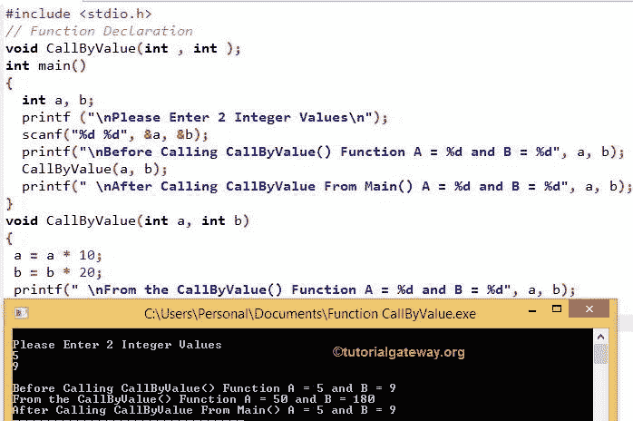

# C 语言中的按值调用和按引用调用

> 原文:[https://www . tutorialgateway . org/按值调用和按引用调用-in-c/](https://www.tutorialgateway.org/call-by-value-and-call-by-reference-in-c/)

在 C 语言中调用函数时，我们可以通过两种方式传递函数参数:

*   按值调用
*   按引用调用

本文将通过示例向您解释 C 语言中按值调用和按引用调用的区别。

## 按值调用

C 语言中的按值调用是调用函数最安全的方式。在此方法中，已声明变量的值作为参数传递给函数。当我们将它们传递给函数时，

*   编译器实际上是对原始值进行克隆或复制，然后将克隆值传递给函数，而不是原始值。
*   因此，对函数内部变量所做的任何更改都不会反映原始值。

让我们看一个例子来更好地理解 C 调用的价值

### 在 C 语言中使用按值调用将参数传递给函数

这个程序允许用户输入 2 个整数。接下来，我们将这些数字传递给另一个函数，使用 C Call by value 方法进行一些计算。请参考 [C 语言](https://www.tutorialgateway.org/c-programming/ "C PROGRAMMING")中的[功能](https://www.tutorialgateway.org/functions-in-c/)。

```
/* Call By Value in C Example */

#include <stdio.h>

// Function Declaration
void CallByValue(int , int );          

int main()
{
  int a, b;

  printf ("\nPlease Enter 2 Integer Values\n");
  scanf("%d %d", &a, &b);

  printf("\nBefore Calling CallByValue() Function A = %d and B = %d", a, b);

  CallByValue(a, b);   

  printf(" \nAfter Calling CallByValue From Main() A = %d and B = %d", a, b);                      
}

void CallByValue(int a, int b)  
{
  a = a * 10;
  b = b * 20;

  printf(" \nFrom the CallByValue() Function A = %d and B = %d", a, b);    
}

```



在这个 C 按值调用的例子中，void CallByValue(int，int)代码被称为函数声明。如果您忘记了这个函数声明，那么编译器会抛出一个错误。printf 语句将要求用户输入 2 个数字。下一条语句将用户输入值存储在 a、b 变量中

下一条语句将打印用户输入 a 和 b，以便以后进行比较

```
printf("\n Before Calling CallByValue() Function A = %d and B = %d", a, b);
```

在下一行中，我们调用了方法

```
CallByValue(5 , 9 );
```

当编译器到达这个函数时，它将遍历顶部来检查函数定义或者 CallByValue()的声明。如果它不能识别 CallByValue 名称，那么它将抛出一个错误。

在这种情况下，当向上移动时，它将停止在

```
void CallByValue(int , int );
```

因为它和我们称之为

```
CallByValue(5 , 9 );
```

上面的声明将把编译器带到下面的方法。

```
void CallByValue(int a, int b)
```

在这个函数中，我们通过将 a 乘以 10，将 b 乘以 20 来改变 a 和 b 的数量。

```
CallByValue(int a, int b)

 a = a * 10;

 b = b * 20;
```

这意味着，CallByValue(5，9)将变成

a = 5 * 10 = 50

b = 9 * 20 = 180

下面的 printf 语句用于打印 a 和 b

```
printf(" \nFrom the CallByValue() Function A = %d and B = %d", a, b); = 50, 180

```

CallByValue()结束

让我们再次看看我们的主()

```
printf(" \nAfter Calling CallByValue From Main() A = %d and B = %d", a, b);
```

它将打印 a = 5 和 b = 9

虽然我们更改了 CallByValue()中的 a 和 b 数字，但它不会反映原始值，因为 CallByValue()使用了原始值的副本。

## C 语言中的按引用调用

在这个 C 语言的按引用调用方法中，声明变量的地址作为参数传递给函数。当我们将变量的地址传递给函数时，

*   该函数实际上是访问原始值的地址(引用地址)。
*   所以，对函数内部变量的任何改变都意味着我们实际上在改变初始值。

使用这种方法时请小心。如果任何计算依赖于原始值，那么你可能会得到错误的值。

### 在 C 语言中使用按引用调用将参数传递给函数

该程序允许用户输入 2 个整数值。然后我们将它们传递给交换函数，通过引用方法使用 C Call 交换这两个整数。

```
/* Call By Reference in C Example */

#include <stdio.h>

// Function Declaration
void Swap(int *, int *);          

int main()
{
  int a, b;

  printf ("Please Enter 2 Integers");
  scanf("%d %d", &a, &b);

  printf("\nBefore Swap  A= %d and B= %d", a, b);

  Swap(&a, &b);   

  printf(" \nAfter Swapping From Main() A= %d and B= %d", a, b);                      
}

void Swap(int *x, int *y)
{ 
  int Temp;
  Temp = *x;
  *x = *y;
  *y = Temp;

  /*

  *x = 20;
  *y = 40;

  */

  printf(" \nAfter Swapping From UDF A= %d and B= %d", *x, *y);
}
```

```
Please Enter 2 Integers
10
25

Before Swap  A= 10 and B= 25 
After Swapping From UDF A= 25 and B= 10 
After Swapping From Main() A= 25 and B= 10
```

在这个 C 内通过按引用调用程序，也称为函数声明。如果您忘记了这个声明，编译器将会抛出一个错误。

```
void Swap(int , int );
```

以下语句将要求用户输入 2 个数字。

```
printf (" \n Please Enter 2 Integer Values \n ");
```

下一条语句将用户输入值存储在 a、b 变量中

```
scanf("%d %d", &a, &b);
```

下面的语句将打印用户输入值 a 和 b，以便以后进行比较

```
printf("\n Before Swap A = %d and B = %d", a, b);
```

假设 a 的值存储在 1234 的存储位置，b 的值存储在 6789 的存储位置

在下一行，我们称之为交换

```
Swap(&a, &b);
```

这里，a 表示 a 的地址，而不是 a 内部的值。它表示，

```
Swap(1234 , 6789 );
```

在函数中，我们声明了一个局部变量 Temp 来交换 a 和 b

```
Temp = *x;

*x = *y;

*y = Temp;
```

*x 是 x 地址内部的值。

也就是说，1234 内部的值= 10，6789 内部的值= 25

```
Swap (10, 25)
```

下面的 printf 语句用于打印 a 和 b 的值

```
printf(" \n After Swapping From UDF A = %d and B = %d", *x, *y);
```

交换结束()

让我们再次看看我们的主()

```
printf(" \n After Swapping From Main() A = %d and B = %d", a, b);
```

它将打印 a = 25 和 b = 10

在这里，我们使用交换函数中它们的地址来更改原始值。这就是 printf 语句显示如下输出的原因。