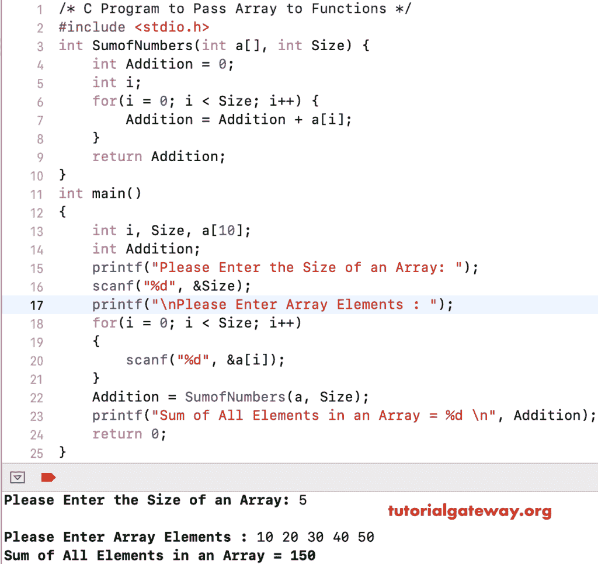

# 将数组传递给 C 语言中的函数

> 原文:[https://www . tutorialgateway . org/pass-array-to-functions-in-c/](https://www.tutorialgateway.org/pass-array-to-functions-in-c/)

写一个 C 程序将数组传递给函数。或者用一个实际例子说明如何在 C 语言中将数组传递给函数。

## 在 C 示例中将数组传递给函数

在这个将数组传递给函数的程序中，我们创建了一个接受整数变量的函数，并将该变量作为输出输出。在主程序中，我们使用`for`循环来迭代数组，并将每个元素传递给我们之前创建的函数。

```
#include<stdio.h>

void PrintArray(int a)
{
    printf("Item = %d \n", a);
}

int main()
{
    int array[] = {1, 2, 3, 4, 5, 6};

    for (int i = 0; i < 6; i++)
    {
        PrintArray(array[i]);
    }
    return 0;
}
```

输出。有关循环的文章，请参考函数[按值调用和引用调用](https://www.tutorialgateway.org/call-by-value-and-call-by-reference-in-c/)和[。](https://www.tutorialgateway.org/for-loop-in-c-programming/)

```
Item = 1 
Item = 2 
Item = 3 
Item = 4 
Item = 5 
Item = 6 
```

不用传递单个[数组](https://www.tutorialgateway.org/array-in-c/)元素，可以直接将数组传递给[函数](https://www.tutorialgateway.org/functions-in-c/)。请参考 [C 程序寻找元素之和](https://www.tutorialgateway.org/c-program-to-find-sum-of-elements-in-an-array/)文章，了解这个程序背后的逻辑。

```
#include<stdio.h>

int SumofNumbers(int a[], int Size)
{
    int Addition = 0;
    int i;
    for(i = 0; i < Size; i++)
    {
        Addition = Addition + a[i];
    }
    return Addition;
}
int main()
{
    int i, Size, a[10];
    int Addition;

    printf("Please Enter the Size of an Array: ");
    scanf("%d", &Size);

    printf("\nPlease Enter Array Elements\n");
    for(i = 0; i < Size; i++)
    {
        scanf("%d", &a[i]);
    }
    Addition = SumofNumbers(a, Size);
    printf("Sum of All Elements in an Array = %d \n", Addition);
    return 0;
}
```



## 将数组传递给函数示例 3

您可以传递数组元素的引用，而不是传递数组元素。我是说，直接引用数组调用。

请参考 [C 程序打印元素](https://www.tutorialgateway.org/c-program-to-print-elements-in-an-array/)了解这个 [C](https://www.tutorialgateway.org/c-programming/) 程序背后的逻辑。

```
#include<stdio.h>

void PrintArray(int *a, int Size)
{
    int i;

    printf("\n **** Elemenst in this Array are : ****\n");
    for (i = 0; i < Size; i++)
    {
        printf(" Element at Array[%d] = %d \n", i, a[i]);
    }
}
int main()
{
    int Array[50], i, Number;

    printf("\nPlease Enter Number of elements in an array  :  ");
    scanf("%d", &Number);

    printf("Please Enter %d elements of an Array :  ", Number);
    for (i = 0; i < Number; i++)
    {
        scanf("%d", &Array[i]);
    }

    PrintArray(Array, Number);

    return 0;
}
```

```
Please Enter Number of elements in an array  :  5
Please Enter 5 elements of an Array :  10 12 14 23 56

 **** Elemenst in this Array are : ****
 Element at Array[0] = 10 
 Element at Array[1] = 12 
 Element at Array[2] = 14 
 Element at Array[3] = 23 
 Element at Array[4] = 56 
```

## 将数组传递给函数的程序示例 4

这个[程序](https://www.tutorialgateway.org/c-programming-examples/)告诉你如何将[多维](https://www.tutorialgateway.org/multi-dimensional-array-in-c/)传递给函数。我建议你参考 [C 程序，找出一个矩阵](https://www.tutorialgateway.org/c-program-to-find-sum-of-each-row-in-a-matrix/)文章中每行的和，知道这个程序背后的逻辑。

```
#include<stdio.h>

void AddRows(int arr[10][10], int i, int j)
{
    int rows, columns;
    for(rows = 0; rows < i; rows++)
    {
        int Sum = 0;
        for(columns = 0; columns < j; columns++)
        {
            Sum = Sum + arr[rows][columns];
        }
        printf("The Sum of Elements of a Rows in a Matrix =  %d \n", Sum );
    }
}
int main()
{
    int i, j, rows, columns, a[10][10];

    printf("Please Enter Number of rows and columns  :  ");
    scanf("%d %d", &i, &j);

    printf("Please Enter the Matrix Elements \n");
    for(rows = 0; rows < i; rows++)
    {
        for(columns = 0; columns < j; columns++)
        {
            scanf("%d", &a[rows][columns]);
        }
    }

    AddRows(a, i, j);

    return 0;
}
```

```
Please Enter Number of rows and columns  :  3 3
Please Enter the Matrix Elements 
10 20 30
40 50 60
70 80 90
The Sum of Elements of a Rows in a Matrix =  60 
The Sum of Elements of a Rows in a Matrix =  150 
The Sum of Elements of a Rows in a Matrix =  240 
```