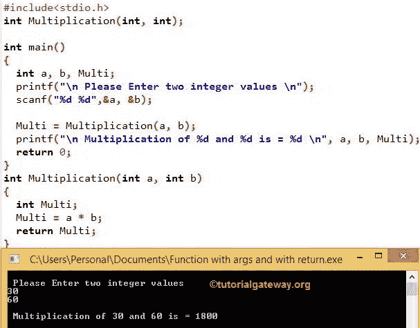

# C 语言中函数的类型

> 原文：<https://www.tutorialgateway.org/types-of-functions-in-c/>

在实时中，C 语言中的函数可以定义参数，也可以不定义参数，函数可以返回值，也可以不返回值。这完全取决于用户需求。在 C 语言中，根据我们的要求，我们可以用多种方式定义用户定义的函数。以下是 C 语言中可用函数类型的列表

1.  没有参数和返回值的函数
2.  不带参数，带返回值
3.  带参数且无返回值
4.  带参数和返回值

从上面可以看出，当我们调用 1 和 3 类型时，它们不返回值。因此，我们在定义它们时使用了 void 返回类型。

当我们调用 2 和 4 类型时，它们会返回一些值。这就是为什么我们必须使用适当的数据类型(int、float、double 等)。)作为返回类型。当我们从 main()或任何子函数调用时，我们在其中使用 return 关键字来返回值。

## C 语言函数类型

以下示例将向您解释 C 语言中可用的函数类型。

### 无参数无返回值的 C 函数

在这个方法中，我们不会在定义、声明或调用函数时向函数传递任何参数。当我们从 main()或任何子函数调用[函数](https://www.tutorialgateway.org/functions-in-c/)时，C 中的这类函数不会返回值。当我们不期望任何返回值，但是我们需要一些语句作为输出打印时。然后，这种类型的函数在 C 语言中非常有用。

#### 无参数无返回值的 C 函数示例

在 C 程序中的这些类型的函数中，我们将计算 2 个整数值的和，并打印 udfs 本身的输出。

```c
#include<stdio.h>

// Declaration
void Addition();        

void main()
{
  printf("\n ............. \n");

  Addition();                      
}

void Addition()
{
  int Sum, a = 10, b = 20;  
  Sum = a + b;

  printf("\n Sum of a = %d and b = %d is = %d", a, b, Sum);
}
```

```c
 ............. 

 Sum of a = 10 and b = 20 is = 30
```

在 C 示例中的这些类型的函数中，如果您观察 main()，我们没有向加法()传递任何参数/参数

在加法函数中，我们声明了和 a，b 的整数变量，并给 a 赋值 10，给 b 赋值 20。在接下来的 [C 语言](https://www.tutorialgateway.org/c-programming/)行中，我们使用[算术运算符](https://www.tutorialgateway.org/arithmetic-operators-in-c/ "ARITHMETIC OPERATORS IN C") ( +)计算和

```c
Sum = a + b
    = 10 + 20
    = 30
```

下面的 printf 语句用于打印输出。

```c
printf("\n Sum of a = %d and b = %d is = %d", a, b, Sum);
```

每当我们调用加法()时，它将打印相同的输出，因为 a 和 b 的值在 <font color="# 000000">uff</font> 块中是固定的。

### 没有参数且有返回值的函数

在这个方法中，我们不会在定义、声明或调用函数时传递任何参数。当我们从 main()或任何子函数调用这种类型的函数时，它将返回一些值。

返回值的数据类型将取决于函数声明的返回类型。例如，如果返回类型是 int，那么返回值将是 int。

在这个程序中，我们将使用不带参数的 udf 和 return 关键字来计算 2 个整数的乘法。

```c
#include<stdio.h>

int Multiplication();        

int main()
{
  int Multi;

  Multi = Multiplication();
  printf("\n Multiplication of a and b is = %d \n", Multi );        

  return 0;            
}

int Multiplication()
{
  int Multi, a = 20, b = 40;  

  Multi = a * b;

  return Multi;
}
```

```c
 Multiplication of a and b is = 800 
```

如果观察 main()，我们声明了整数变量 Multi。我们将其赋给乘法的返回值()。因为 UDFs 也只返回整数值。

```c
Multi = Multiplication();
```

我们没有向乘法()传递任何参数

在下一行中，printf 语句将打印输出

```c
printf("\n Multiplication of a and b is = %d \n", Multi);
```

每当我们调用乘法()，它都会打印出上面的语句。

在乘法()中，我们声明了整数变量 Multi，a，b，并且我们给 a 指定了 20，给 b 指定了 40。

在下一行中，我们使用[算术运算符](https://www.tutorialgateway.org/arithmetic-operators-in-c/ "ARITHMETIC OPERATORS IN C") ( *)将 a 和 b 相乘

```c
Multi = a * b
      = 20 * 40
      = 800
```

每当我们调用乘法()时，它都会输出相同的输出，因为 a 和 b 的值在函数体内是相同的。

### 带参数且无返回值的 C 函数

如果你观察以上两种方法，无论你执行多少次，它都会给出相同的输出。我们无法控制变量 a 和 b 的值，因为它们是固定值。

在实时中，我们主要处理动态数据，这意味着我们必须允许用户输入自己的值，而不是固定的值。

这个方法允许我们在调用函数时将参数传递给函数。但是，当我们从 main()或任何子函数调用函数时，这种类型的函数不会返回值。

如果我们希望允许用户将他的数据传递给函数参数，但是我们不期望任何返回值，这种类型的函数非常有用。

这些类型的函数在 C 程序中允许用户输入 2 个整数。接下来，我们将把这些值传递给用户定义的函数来计算总和。

```c
#include<stdio.h>

void Addition(int, int);        

void main()
{
  int a, b;

  printf("\n Please Enter two integer values \n");
  scanf("%d %d",&a, &b);

  //Calling with dynamic values
  Addition(a, b);
}

void Addition(int a, int b)
{
  int Sum;  

  Sum = a + b;

  printf("\n Additiontion of %d and %d is = %d \n", a, b, Sum);
}
```

```c
 Please Enter two integer values 
40
90

 Additiontion of 40 and 90 is = 130 
```

如果观察 main()，我们声明了整数变量 a 和 b。这个程序允许用户输入 2 个整数作为 a 和 b

```c
printf("\n Please Enter two integer values \n");
scanf("%d %d",&a, &b);
```

在下一行中，我们使用用户输入的按值调用加法(int a，int b)

```c
Addition(a, b);
```

在加法(int a，int b)中，

我们声明了 Sum 的整数变量，并且我们在函数中有整数(a，b)参数。这意味着这将允许用户传递 2 个整数。

接下来，我们使用[算术运算符](https://www.tutorialgateway.org/arithmetic-operators-in-c/ "ARITHMETIC OPERATORS IN C") ( +)添加了 a 和 b。在下一行中，printf 语句将打印输出

```c
printf("\n Additiontion of %d and %d is = %d \n", a, b, Sum);
```

### 带参数和返回值的 C 函数

这个方法允许我们在调用函数时将参数传递给函数。当我们从 main()或任何子函数调用这种类型的函数时，它将返回一些值。返回的数据类型将取决于函数声明的返回类型。例如，如果返回类型是 int，那么返回值将是 int。

这种类型的用户定义函数称为完全动态函数，它为最终用户提供了最大程度的控制。

C 程序中的这类函数允许用户输入 2 个整数。然后，我们将把这些值传递给 UDF，将它们相乘，并使用 return 关键字返回输出。

```c
#include<stdio.h>

int Multiplication(int, int);        

int main()
{
  int a, b, Multi;

  printf("\n Please Enter two integer values \n");
  scanf("%d %d",&a, &b);

  //Calling the with dynamic values
  Multi = Multiplication(a, b);

  printf("\n Multiplication of %d and %d is = %d \n", a, b, Multi);        
  return 0;            
}

int Multiplication(int a, int b)
{
  int Multi;  

  Multi = a * b;

  return Multi;
}
```



如果观察 main()，我们声明了整数变量 Multi、a 和 b。这个程序允许用户输入 2 个整数作为 a 和 b

```c
printf("\n Please Enter two integer values \n");
scanf("%d %d",&a, &b);
```

在下一行中，我们将乘法的返回值(int a，int b)赋给了 Multi 整数。这是因为用户定义的函数也只返回整数。

```c
Multi = Multiplication(a, b);
```

我们将用户输入作为参数传递给乘法(int a，int b)。在下一行中，printf 语句打印输出

```c
printf("\n Multiplication of a and b is = %d \n", Multi);
```

在乘法()中，我们声明了 Multi 的整数变量，并且我们还有两个整数(a，b)参数。这意味着这将允许用户传递两个整数。在下一行中，我们使用[算术运算符](https://www.tutorialgateway.org/arithmetic-operators-in-c/ "ARITHMETIC OPERATORS IN C") ( *)将 a 和 b 相乘