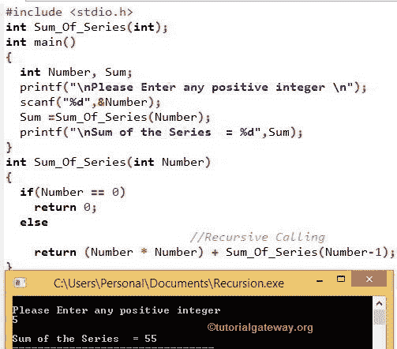

# C 语言中的递归

> 原文:[https://www.tutorialgateway.org/recursion-in-c/](https://www.tutorialgateway.org/recursion-in-c/)

C 程序设计中的递归意味着函数调用自己。为了简单而优雅的编码，C 程序设计引入了一种新技术，叫做 C 语言中的递归

在本文中，我们将通过一个实际的例子向您展示如何在 C 编程中使用递归来编写程序。让我们考虑一个众所周知的叫做阶乘的简单例子来理解 C 编程中的递归。

5! = 5 * 4 * 3 * 2 * 1

我们可以用下面的公式计算任意给定数的阶乘

n！= (n) * (n-1) * (n-2) * …..* 1

在 C 语言编程中，我们可以通过多种方式实现输出，如 For 循环、While 循环等。但是如果你观察上面的模式，它是重复的行为，这意味着用 C 语言编写递归程序。所以我们可以用 C 语言递归来编写函数，而不是编写循环。

```
long Calculate_Factorial(int Num)
{
  if (Num == 0 || Num == 1)

      return 1;

else

      return Num * Calculate_Factorial (Num -1);
}
```

当我们从 main()调用 C 递归函数时，如果给定的数字是 0 或 1，那么函数将返回 1，否则它将返回

```
Number*Calculate_Factorial(Num -1);
```

让我们来计算 5！
5！= Num * Calculate _ 阶乘(Num-1)；
= 5 *计算 _ 阶乘(5 -1)
= 5 *计算 _ 阶乘(4)//调用上述函数
= 5 * 4 *计算 _ 阶乘(4 -1)
= 5 * 4 *计算 _ 阶乘(3)
= 5 * 4 * 3 *计算 _ 阶乘(3 -1)
= 5 * 4 * 3 *计算 _ 阶乘(2)
= 5 * 4 * 3 * 2 *计算 _ 阶乘(2 -1)

## 求数列 1 +2 +3 +的和…..使用递归

C 程序中的递归允许用户输入 n 的值。然后，它将使用递归找到级数的和。

```
#include <stdio.h> 

int Sum_Of_Series(int);

int main()
{
  int Number, Sum;

  printf("\nPlease Enter any positive integer \n");
  scanf("%d",&Number);

  Sum=Sum_Of_Series(Number);

  printf("\nSum of the Series  = %d",Sum);
}

int Sum_Of_Series(int Number)
{
  if(Number == 0)
    return 0;

  else      
    return (Number*Number) + Sum_Of_Series(Number-1);  
}

```



在这个 C 语言的递归例子中，程序的第一行是[用户定义函数](https://www.tutorialgateway.org/functions-in-c/ "FUNCTIONS")的声明。在 [C 编程](https://www.tutorialgateway.org/c-programming/)主()函数中，我们声明了 2 个整数变量。

下一个 printf 语句将要求用户输入任何整数值。下面的 scanf 语句将把用户整数值赋给变量名 Number

在下一行中，我们调用了用户定义的函数 Sum_Of_Series()，并将其分配给整数变量 Sum。当编译器到达函数调用时，它将跳转到用于计算的函数定义。

c 定义中的递归函数

在数列和(数)函数中，我们使用了这个 C 递归。如果用户输入的数字是 0，那么函数将返回 0，否则将返回。它在 C 程序设计中被称为函数递归

```
(Number*Number) + Sum_Of_Series (Number-1);
```

为了更好的理解，让我们把上面的 C 递归表达式分开

(数字*数字)=乘以数字

数列的和(数-1) =用 1 减去数调用同一个函数

在这个 C 语言递归示例程序中，用户输入的值是 5:

c 递归 1
数= 5，大于 0
和=(数*数)+数列之和(数-1)
和= (5 * 5) +数列之和(5–1)
和= 25 +数列之和(4)

递归 2
数= 4，大于 0 且和为 25
和= (4 * 4) +和 _ Of _ Series(4–1)
和= 16 +和 _Of_Series (3)
和值为:25 +16 = 41

c 递归 3
数= 3，大于 0 且和为 41
和= (3 * 3) +和 _ Of _ Series(3–1)
和= 9 +和 _Of_Series (2) = > 41 + 9 = 50

递归 4
数= 2，大于 0 且和为 50
和= (2 * 2) +和 _ Of _ Series(2–1)
和= 4 + 50 = 54

递归 5
数= 1，大于 0 且和为 54
和= (1 * 1) +和 _ Of _ Series(1–1)
和= 1 +和 _Of_Series (0)
和值为:54 + 1 = 55

递归 6: Number = 0，这意味着首先如果条件为 True，那么它将退出 c 中的递归函数。最终值为 55

这个 C 递归程序的最终输出= 55。我们必须使用某种排序条件来退出 C 递归函数调用。如果忘记了条件，函数将执行无限次。循环和[同时循环](https://www.tutorialgateway.org/while-loop-in-c/)的文章请参考[。](https://www.tutorialgateway.org/for-loop-in-c-programming/)