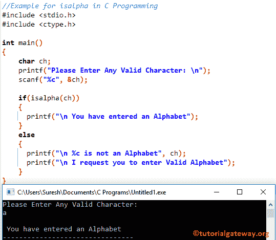

# C 语言中的`isalpha()`

> 原文：<https://www.tutorialgateway.org/isalpha-in-c-programming/>

C isalpha 函数是标准库函数之一，用于检查给定字符是否是字母表。C 语言中 isalpha 的语法如下所示。下面的 isalpha 函数接受单个字符作为参数，并检查给定的字符是否是字母表。

```
isalpha(char)
```

## C 语言示例中的 isalpha

用于查找给定字符的 isalpha 方法是否是字母表。该[程序](https://www.tutorialgateway.org/c-programming-examples/)允许用户输入任何字符。接下来，它使用 isalpha 函数检查给定的一个是在 A 到 Z 之间，还是 A 到 Z 之间。

首先，我们声明了一个名为 ch 的字符变量。以下 [C 语言](https://www.tutorialgateway.org/c-programming/) printf 语句会要求用户输入。然后，我们使用 scanf 将用户输入的 1 分配给 ch 变量

在下一行中，我们添加了 [`if`语句](https://www.tutorialgateway.org/if-statement-in-c/)来使用 C isalpha 函数检查字符是否在‘A’和‘Z’之间。如果条件为真，则将打印 If 块中的 printf 语句

如果上述条件为假，那么给定的字符不是字母。因此，它将打印 else 块语句。

```
//Example for isalpha in C Programming
#include <stdio.h>
#include <ctype.h>

int main()
{
    char ch;
    printf("Please Enter Any Valid Character: \n");
    scanf("%c", &ch);

    if(isalpha(ch))
    {
      printf("\n You have entered an Alphabet");         
    }
    else
    {
      printf("\n %c is not an Alphabet", ch);
      printf("\n I request you to enter Valid Alphabet");	
    }
}
```



让我输入大写字母

```
Please Enter Any Valid Character: 
H

 You have entered an Alphabet
```

上面的代码肯定会检查给定的字符是否是字母，但是如果我们输入数值呢。请参考 [C 程序检查是否是字母](https://www.tutorialgateway.org/c-program-to-check-whether-the-character-is-alphabet-or-not/)了解如何在不使用 isalpha 功能的情况下检查是否是字母

```
Please Enter Any Valid Character: 
9

 9 is not an Alphabet
 I request you to enter Valid Alphabet
```