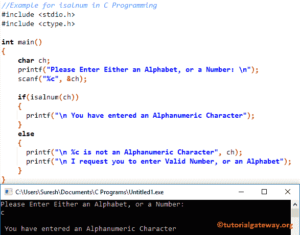

# C 语言`isalnum()`函数

> 原文：<https://www.tutorialgateway.org/isalnum-c-programming/>

C`isalnum()`函数是 C 语言中可用的标准库函数之一，用于检查给定的字符是字母还是数值。C 语言中 isalnum 的语法是

下面的 c`isalnum()`函数将接受单个字符作为参数，并检查给定的字符是数字还是字母。

```c
isalnum(char)
```

## C 语言编程示例中的信息

用于查找给定字符的 isalnum 方法(字母数字)是字母或数字。这个 C 程序允许用户输入任何字符。接下来，它使用`isalnum()`函数检查字符是在 A 到 Z 之间，还是在 A 到 Z 之间，或者是一个数值。

```c
//Example for isalnum in C Programming
#include <stdio.h>
#include <ctype.h>

int main()
{
    char ch;
    printf("Please Enter Either an Alphabet, or a Number: \n");
    scanf("%c", &ch);

    if(isalnum(ch))
    {
      printf("\n You have entered an Alphanumeric Character");         
    }
    else
    {
      printf("\n %c is not an Alphanumeric Character", ch);
      printf("\n I request you to enter Valid Number, or an Alphabet");	
    }
}
```



让我输入大写字母

```c
Please Enter Either an Alphabet, or a Number: 
K

 You have entered an Alphanumeric Character
```

让我输入数值

```c
Please Enter Either an Alphabet, or a Number: 
9

 You have entered an Alphanumeric Character
```

在这个 c 程序中，首先，我们声明了一个名为 ch 的字符变量。以下 [C 语言](https://www.tutorialgateway.org/c-programming/)语句将要求用户输入任意字符。然后我们使用 scanf 将用户输入的字符分配给 ch 变量

```c
printf("Please Enter Either an Alphabet, or a Number: \n");
scanf("%c", &ch);
```

在下一行中，我们添加了 [`if`语句](https://www.tutorialgateway.org/if-statement-in-c/)来检查字符是在“A”到“Z”之间，还是在“A”到“Z”之间，或者是使用`isalnum()`函数的数字。如果条件为真，将打印以下语句

```c
printf("\n You have entered an Alphanumeric Character");
```

如果上述条件为假，那么给定的字符不是字母或数字。所以，这个 [C 程序](https://www.tutorialgateway.org/c-programming-examples/)会打印下面的语句

```c
printf("\n %c is not an Alphanumeric Character", ch);
printf("\n I request you to enter Valid Number, or an Alphabet");
```

上面的 c isalnum 代码完美地检查了给定的字符是字母还是数字。但是如果我们输入符号

```c
Please Enter Either an Alphabet, or a Number: 
*

 * is not an Alphanumeric Character
 I request you to enter Valid Number, or an Alphabet
```

让我试试空格字符

```c
Please Enter Either an Alphabet, or a Number: 

   is not an Alphanumeric Character
 I request you to enter Valid Number, or an Alphabet
```