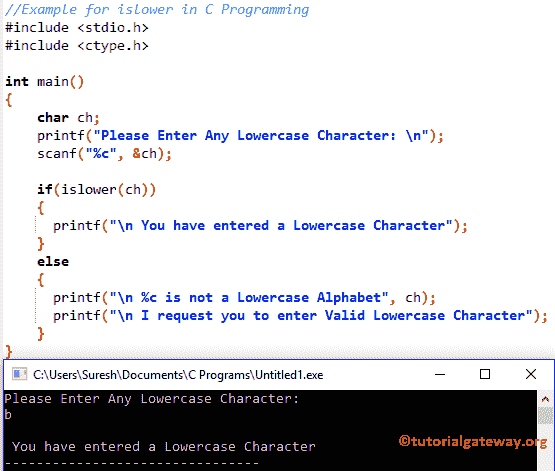

# C 语言中的`islower()`

> 原文：<https://www.tutorialgateway.org/islower-in-c-programming/>

C 语言函数是这种 C 语言中可用的标准库函数之一。这个函数用来检查给定的字符是否是小写字母。让我们通过例子来看看如何在 C 语言中使用 islower。

## 函数语法

C 语言是头文件中的一个内置函数，用于检查字符是否是小写字母。函数的语法是。

```
islower(char)
```

上面的 is low 函数将接受单个字符作为参数，并检查给定的字符是否为小写。islower 函数将返回一个整数值作为输出。

*   如果 islower 函数中的字符是小写的，那么它将返回非零值
*   如果 islower 函数中的字符不是小写的，它将返回 0

### C 语言编程示例中的功耗

C islower 方法用于查找给定字符是否是小写字符。

该 [C 程序](https://www.tutorialgateway.org/c-programming-examples/)允许用户输入任意字符，并使用 islower 功能检查字符是否在 a 到 z 之间。

```
//Example for islower in C Programming
#include <stdio.h>
#include <ctype.h>

int main()
{
    char ch;
    printf("Please Enter Any Lowercase Character: \n");
    scanf("%c", &ch);

    if(islower(ch))
    {
      printf("\n You have entered a Lowercase Character");         
    }
    else
    {
      printf("\n %c is not a Lowercase Alphabet", ch);
      printf("\n I request you to enter Valid Lowercase Character");	
    }
}
```



让我输入大写字母

```
Please Enter Any Lowercase Character: 
T

 T is not a Lowercase Alphabet
 I request you to enter Valid Lowercase Character
```

首先，我们声明了一个名为 ch 的字符变量

```
char ch;
```

以下语句将要求用户输入任何字符。然后我们使用 [C 语言](https://www.tutorialgateway.org/c-programming/)扫描将用户输入的字符分配给 ch 变量

```
printf("Please Enter Any Lowercase Character: \n");
scanf("%c", &ch);
```

在下一行中，我们添加了 [`if`语句](https://www.tutorialgateway.org/if-statement-in-c/)来检查字符是否在“a”和“z”之间，是否使用了 C islower 函数。如果条件为真，将打印以下语句

```
printf("\n You have entered a Lowercase Character");
```

如果上述条件为假，则给定字符不是小写字母。因此，它将打印以下语句

```
printf("\n %c is not a Lowercase Alphabet", ch);
printf("\n I request you to enter Valid Lowercase Character");
```

上面的代码肯定会检查给定的字符是否是小写字符，但是如果我们输入数值呢。请参考 [C 程序检查字符是否小写](https://www.tutorialgateway.org/c-program-to-check-whether-character-is-lowercase-or-not/)一文。它帮助您了解如何在不使用 islower 函数的情况下检查字符是否为小写

```
Please Enter Any Lowercase Character: 
8

 8 is not a Lowercase Alphabet
 I request you to enter Valid Lowercase Character
```