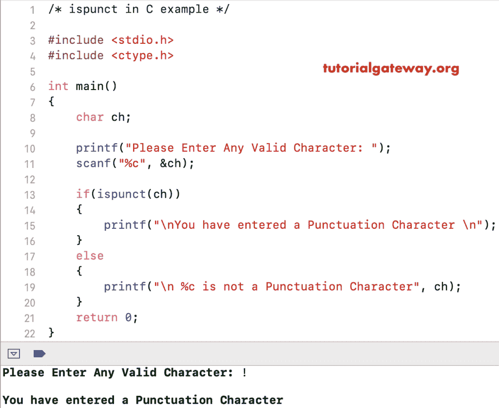

# c 中的点缀

> 原文:[https://www.tutorialgateway.org/ispunct-in-c/](https://www.tutorialgateway.org/ispunct-in-c/)

函数的作用是检查给定的字符是否是标点符号。下面是 C 程序设计中的标点符号函数，接受一个字符作为参数，并找出它是否是标点符号。

```
ispunct(char)
```

## C 程序设计示例中的 ispunct

ispunct 函数查找用户给定的字符是否是标点符号。

```
#include <stdio.h>
#include <ctype.h>

int main()
{
    char ch = '!';

    if(ispunct(ch))
    {
        printf("\nYou have entered a Punctuation Character \n");
    }
    else
    {
        printf("\n %c is not a Punctuation", ch);
    }
    return 0;
}
```

```
You have entered a Punctuation
```

## c 是标点符号示例 2

该[程序](https://www.tutorialgateway.org/c-programming-examples/)允许用户输入任何字母。并使用 [C 语言](https://www.tutorialgateway.org/c-programming/)is punt 功能检查给定字符是否为标点符号。

```
#include <stdio.h>
#include <ctype.h>

int main()
{
    char ch;

    printf("Please Enter Any Valid Character: ");
    scanf("%c", &ch);

    if(ispunct(ch))
    {
        printf("\nYou have entered a Punctuation Character \n");
    }
    else
    {
        printf("\n %c is not a Punctuation Character \n", ch);
    }
    return 0;
}
```



让我输入另一个字符

```
Please Enter Any Valid Character: i

 i is not a Punctuation Character 
```