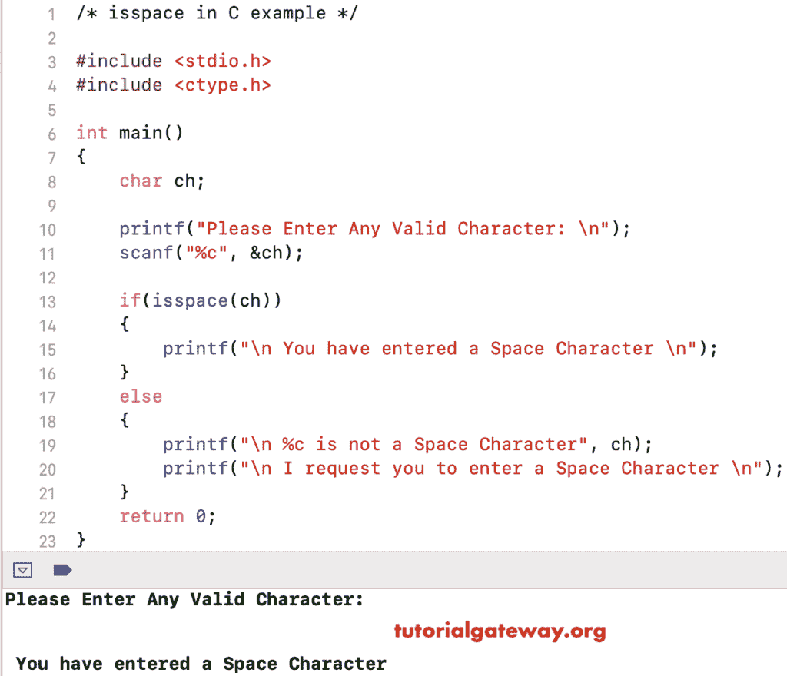

# C 语言中的`isspace()`

> 原文：<https://www.tutorialgateway.org/isspace-in-c-programming/>

C`isspace()`函数是 C 语言中可用的标准库函数之一，它有助于检查给定的字符是否是空格。C 语言中 isspace 的基本语法如下所示。

下面的 C`isspace()`函数函数将接受单个字符作为参数，并查找给定的字符是否是空格。

```
isspace(char)
```

## C 语言示例 1 中的 isspace

ISS`space()`函数用于查找给定字符是否是空格字符。

```
//Example for isspace in C Programming
# include <stdio.h>
# include <ctype.h>

int main()
{
    char ch = ' ';

    if(isspace(ch))
    {
        printf("The Character ch is a Space Character \n");
    }
    else
    {
        printf("The Character ch is Not a Space Character \n");
    }
    return 0;
}
```

```
The Character ch is a Space Character 
```

## C 语言示例 2 中的 isspace

该 [C 程序](https://www.tutorialgateway.org/c-programming-examples/)允许用户输入任意字符，并使用 is`space()`函数检查字符是否为空格。

```
//Example for isspace in C Programming
# include <stdio.h>
# include <ctype.h>

int main()
{
    char ch;
    printf("Please Enter Any Valid Character : \n");
    scanf("%c", &ch);

    if(isspace(ch))
    {
      printf("\n You have entered a Space Character");         
    }
    else
    {
      printf("\n %c is not a Space Character", ch);
      printf("\n I request you to enter Space Character");	
    }
}

```



让我输入大写字母

```
Please Enter Any Valid Character : 
T

 T is not a Space Character
 I request you to enter Space Character
```

首先，我们声明了一个名为 ch 的字符变量。

```
char ch;
```

第一个 [C 语言](https://www.tutorialgateway.org/c-programming/)语句会要求用户输入任意字符。然后我们使用 scanf 将用户输入的字符分配给 ch 变量

```
printf("Please Enter Any Valid Character : \n");
scanf("%c", &ch);
```

接下来，我们使用 [`if`语句](https://www.tutorialgateway.org/if-statement-in-c/)来检查字符是否为空格，是否使用 is`space()`函数。如果条件为真，将打印以下语句

```
printf("\n You have entered a Space Character");
```

如果上述条件为假，则给定字符不是空格。因此，它将打印以下语句

```
printf("\n %c is not a Space Character", ch);
printf("\n I request you to enter Space Character");
```

## 不使用 isspace 示例

该 [C 程序](https://www.tutorialgateway.org/c-programming-examples/)允许用户输入任意字符，并使用 [ASCII 表](https://www.tutorialgateway.org/ascii-table/)检查字符是否为空格。这里我们不使用内置函数 isspace。

```
//Example for isspace in C Programming
# include <stdio.h>
# include <ctype.h>

int main()
{
    char ch;
    printf("Please Enter Any Valid Character : \n");
    scanf("%c", &ch);

    if(ch == 32)
    {
      printf("\n You have entered a Space Character");         
    }
    else
    {
      printf("\n %c is not a Space Character", ch);
      printf("\n I request you to enter Space Character");	
    }
}
```

```
Please Enter Any Valid Character : 

 You have entered a Space Character
```

因为 32 是空间的 ASCII 值，所以我们用 32 代替了 C`isspace()`函数。我建议你对照一下 [ASCII 表](https://www.tutorialgateway.org/ascii-table/)。让我试试另一个值

```
Please Enter Any Valid Character : 
m

 m is not a Space Character
 I request you to enter Space Character
```