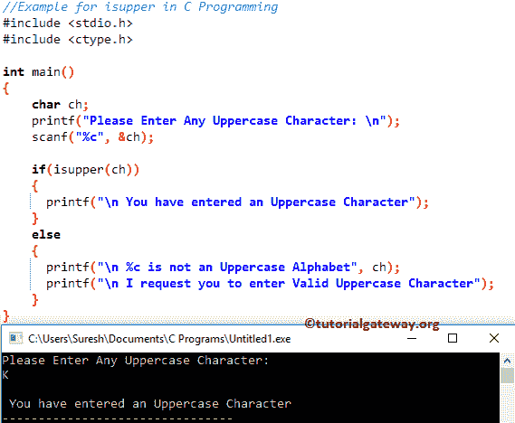

# C 语言中的`isupper()`

> 原文：<https://www.tutorialgateway.org/isupper-in-c-programming/>

C 函数是 C 语言中可用的标准库函数之一。`isupper()`函数检查给定的字符是否是大写字母。

## 函数语法

下面的函数将接受单个字符作为参数，并查找给定字符是否为大写。

```
isupper(char)
```

C 语言映射器是<ctype.h>头文件中的内置函数，用于检查字符是否是大写字母。函数的语法是</ctype.h>

```
isupper (<character>);
```

`isupper()`函数将返回一个整数值作为输出。

*   如果`isupper()`函数中的字符是大写的，那么它将返回非零值
*   如果字符不是大写，它将返回 0

## C 语言示例中的一个映射

`isupper()`函数用于查找给定字符是否是大写字符。该 [C 程序](https://www.tutorialgateway.org/c-programming-examples/)允许用户输入任意字符，并使用`isupper()`函数检查字符是否在 A 到 Z 之间。

```
//Example for isupper in C Programming
# include <stdio.h>
# include <ctype.h>

int main()
{
    char ch;
    printf("Please Enter Any Uppercase Character: \n");
    scanf("%c", &ch);

    if(isupper(ch))
    {
      printf("\n You have entered an Uppercase Character");         
    }
    else
    {
      printf("\n %c is not an Uppercase Alphabet", ch);
      printf("\n I request you to enter Valid Uppercase Character");	
    }
}
```



让我输入小写字母

```
Please Enter Any Uppercase Character: 
b

 b is not an Uppercase Alphabet
 I request you to enter Valid Uppercase Character
```

首先，我们声明了一个名为 ch 的字符变量。以下 [C 语言](https://www.tutorialgateway.org/c-programming/)语句将要求用户输入任意字符。然后，我们使用 scanf 将用户输入的字符分配给 ch 变量

```
printf("Please Enter Any Uppercase Character: \n");
scanf("%c", &ch);
```

接下来，我们使用 [`if`语句](https://www.tutorialgateway.org/if-statement-in-c/)使用 C`isupper()`函数检查字符是否在“A”和“Z”之间。如果条件为真，将打印以下语句

```
printf("\n You have entered an Uppercase Character");
```

如果上述条件为假，则给定字符不是小写字母。因此，它将打印以下语句

```
printf("\n %c is not an Uppercase Alphabet", ch);
printf("\n I request you to enter Valid Uppercase Character");
```

上面的代码将检查给定的字符是否是大写字符，但是如果我们输入数值呢。

```
Please Enter Any Uppercase Character: 
7

 7 is not an Uppercase Alphabet
 I request you to enter Valid Uppercase Character
```

请参考 [C 程序检查字符是否大写](https://www.tutorialgateway.org/c-program-to-check-whether-character-is-uppercase-or-not/)文章。它帮助您理解，如何在不使用`isupper()`函数的情况下检查字符是否是大写字母