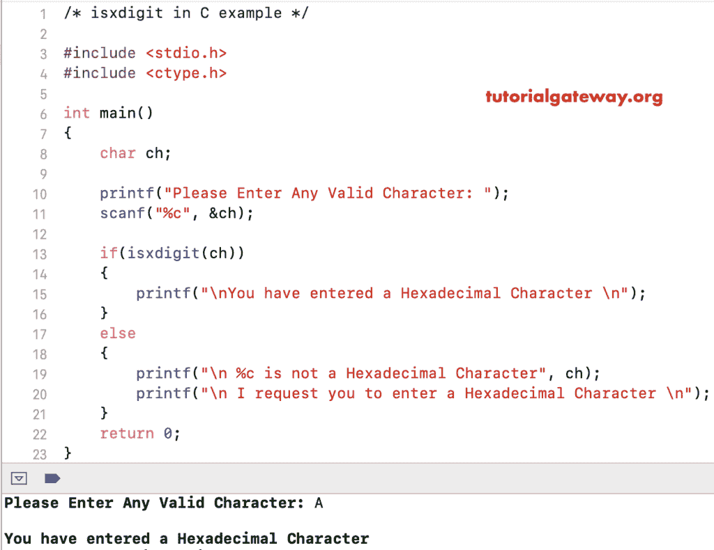

# isdigit in c

> 原文：<https://www.tutorialgateway.org/isxdigit-in-c/>

函数的作用是检查给定的字符是否是十六进制的。下面的 isxdigit 函数接受一个字符作为参数，并查找它是否是十六进制的。

```
isxdigit(char)
```

## C 语言示例中的 isdigit

isxdigit 函数查找用户给定的字符是否为十六进制。

```
#include <stdio.h>
#include <ctype.h>

int main()
{
    char ch = '5';

    if(isxdigit(ch))
    {
        printf("\nYou have entered a Hexadecimal \n");
    }
    else
    {
        printf("\n %c is not a Hexadecimal", ch);
    }
    return 0;
}
```

```
You have entered a Hexadecimal
```

## c 是 x 位数示例 2

该[程序](https://www.tutorialgateway.org/c-programming-examples/)允许用户输入任何字母。接下来，使用 [C 语言](https://www.tutorialgateway.org/c-programming/) isxdigit 函数检查给定字符是否为十六进制。

```
#include <stdio.h>
#include <ctype.h>

int main()
{
    char ch;

    printf("Please Enter Any Valid Character: ");
    scanf("%c", &ch);

    if(isxdigit(ch))
    {
        printf("\nYou have entered a Hexadecimal Character \n");
    }
    else
    {
        printf("\n %c is not a Hexadecimal Character", ch);
        printf("\n I request you to enter a Hexadecimal Character \n");
    }
    return 0;
}
```



让我输入另一个字符

```
Please Enter Any Valid Character: #

 # is not a Hexadecimal Character
 I request you to enter a Hexadecimal Character 
```