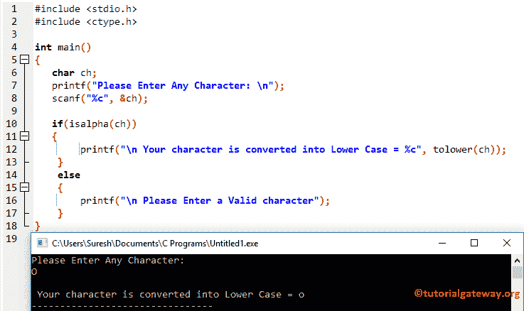

# C 语言中的低功耗

> 原文:[https://www.tutorialgateway.org/tolower-in-c-programming/](https://www.tutorialgateway.org/tolower-in-c-programming/)

tolower 函数是 C 语言中可用的标准库函数之一，用于将用户指定的字符转换为小写字符。C 语言中 tolower 的语法是

下面的函数将接受字符作为参数，并使用 c 语言中的 tolower 将给定字符转换为小写

```
tolower(chars)
```

## C 语言示例中的 tolower

用于将给定字符转换为小写的 tolower 方法。这个 C 程序允许用户输入任何字母，并使用 tolower 函数将该字符转换为小写。

```
//Example for C tolower
#include <stdio.h>
#include <ctype.h>

int main()
{
   char ch;
   printf("Please Enter Any Character: \n");
   scanf("%c", &ch);

   printf("\nLower Case = %c", tolower(ch));         
}
```

```
Please Enter Any Character: 
M

Lower Case = m
```

首先，我们声明了一个字符变量 ch。下一个 [C 语言](https://www.tutorialgateway.org/c-programming/) printf 语句会要求输入任意字母。然后我们将用户输入的 1 分配给 ch 变量

接下来，我们直接在 printf 语句中使用 tolower()函数来打印输出。下面的语句将把 ch 变量中的字母转换成小写

```
printf("\nLower Case = %c", tolower(ch));
```

上面的代码将把给定的字母转换成小写，但是如果我们输入数值呢

```
Please Enter Any Character: 
8

Lower Case = 8
```

它没有抛出任何错误，这在实时性上并不好。

## C 语言示例 2 中的 tolower

上述 [C 程序](https://www.tutorialgateway.org/c-programming-examples/)的更好方法

这里我们增加了 [`if`语句](https://www.tutorialgateway.org/if-statement-in-c/)来检查字符是否在‘A’和‘Z’之间。如果条件为真，它会将给定的字母转换为小写。

如果上述条件为假，则给定的字母不是 Alphabet，它将打印 else block 语句。

请参考 [C 程序转换小写](https://www.tutorialgateway.org/c-program-to-convert-character-to-lowercase/)一文。它帮助您理解如何在不使用 tolower 函数的情况下将字符转换为小写。

```
//Example for C tolower
#include <stdio.h>
#include <ctype.h>

int main()
{
   char ch;
   printf("Please Enter Any Character: \n");
   scanf("%c", &ch);

   if(isalpha(ch))
   {
      printf("\n Your character is converted into Lower Case = %c", tolower(ch));         
   }
   else
   {
      printf("\n Please Enter a Valid character"); 
   }
}
```



让我输入数值

```
Please Enter Any Character: 
9

 Please Enter a Valid character
```