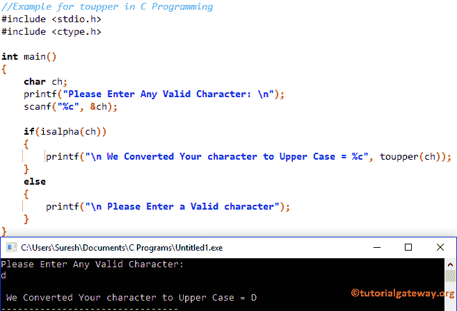

# C 语言中的`toupper()`

> 原文：<https://www.tutorialgateway.org/toupper-in-c-programming/>

C`toupper()`函数是 C 语言中可用的标准库函数之一，用于将给定字符转换为大写字符。C 语言语言中函数的语法是

下面的函数接受单个字符作为参数，并使用 c 语言中的 toupper 将给定字符转换为大写。

```
toupper(char)
```

## C 语言示例中的 toupper

`toupper()`函数用于将给定字符转换为大写。这个 C 程序允许用户输入任何字符，并使用`toupper()`函数将该字符转换为大写。

```
//Example for toupper in C Programming
# include <stdio.h>
# include <ctype.h>

int main()
{
   char ch;
   printf("Please Enter Any Valid Character: \n");
   scanf("%c", &ch);

   printf("\n We Converted to Upper Case = %c", toupper(ch));         

}
```

```
Please Enter Any Valid Character: 
g

 We Converted to Upper Case = G
```

首先，我们声明了一个名为 ch 的字符变量

```
char ch;
```

以下 [C 语言](https://www.tutorialgateway.org/c-programming/)语句将要求用户输入任意字符。然后，我们使用 scanf 将用户输入的字符分配给 ch 变量

```
printf("Please Enter Any Valid Character: \n");
scanf("%c", &ch);
```

接下来，我们直接在 printf 语句中使用`toupper()`函数来打印输出。下面的语句将把 ch 变量中的字符转换成大写

```
printf("\n We Converted to Upper Case = %c", toupper(ch));
```

上面的代码肯定会将给定的字符转换成大写，但是如果我们输入数值呢

```
Please Enter Any Valid Character: 
6

 We Converted Your character to Upper Case = 6
```

如您所见，它没有抛出任何错误，这可能不擅长实时性。

## C 语言示例 2 中的 toupper

在这个图珀的例子中，我们将向您展示一种更好的方法来处理上面提到的[程序](https://www.tutorialgateway.org/c-programming-examples/)。

```
//Example for toupper in C Programming
# include <stdio.h>
# include <ctype.h>

int main()
{
    char ch;
    printf("Please Enter Any Valid Character: \n");
    scanf("%c", &ch);

    if(isalpha(ch))
    {
      printf("\n We Converted Your character to Upper Case = %c", toupper(ch));         
    }
    else
    {
      printf("\n Please Enter a Valid character"); 
    }
}
```



在这个 toupper 代码片段中，我们添加了 [`if`语句](https://www.tutorialgateway.org/if-statement-in-c/)来使用`isalpha()`函数检查字符是否在“A”和“Z”之间。如果条件为真，它将使用下面的语句将给定字符转换为大写

```
printf("\n We Converted Your character to Upper Case = %c", toupper(ch));
```

如果上述条件为假，那么给定的字符不是字母 So，它将打印下面的语句

```
printf("\n Please Enter a Valid character");
```

让我输入数值作为输入

```
Please Enter Any Valid Character: 
5

 Please Enter a Valid character
```

提示:请参考 [C 程序将字符转换为大写](https://www.tutorialgateway.org/c-program-to-convert-character-to-uppercase/)一文。这对于理解如何在不使用`toupper()`函数的情况下将字符转换为小写非常有用。