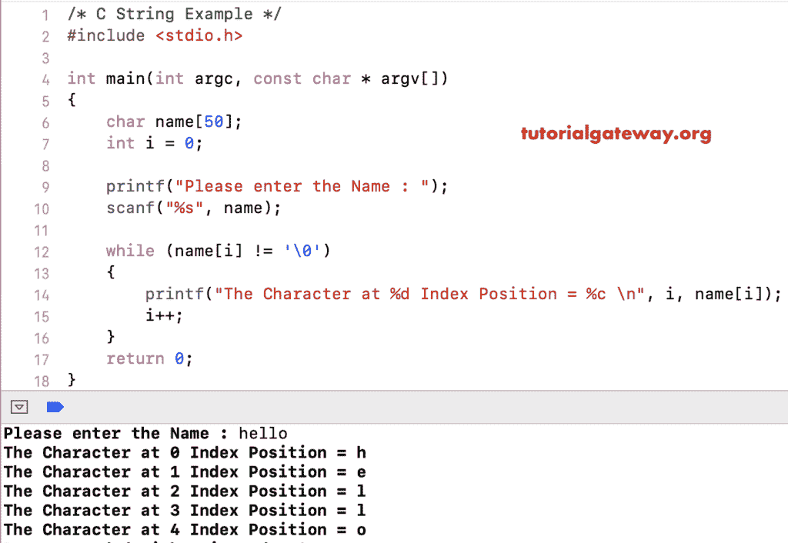

# C 语言字符串

> 原文：<https://www.tutorialgateway.org/c-string/>

一维字符数组，后面跟一个空字符\0，在 C 语言中称为字符串。让我们看看如何声明 C 字符串数组，访问元素或字符，打印字符串字符的例子。

## 字符串声明或语法

C 语言中字符串的语法如下:

```
char Name [Size];
```

*   名称:请指定名称。例如全名、雇员名等
*   大小:此加一所需的字符数(\0)。例如，Size =10，那么它可以容纳 9 个字符。

例如，char full _ name[50]；。这里，全名是名称，大小等于 50。这意味着，最多允许 49 个字符

## 字符串初始化

初始化字符串有多种方法

字符名称[] =“教程网关”；//无大小声明

字符名称[50] =“教程网关”；//用大小声明

声明字符数组

char name[] = {'T '，' u '，' T '，' o '，' r '，' I '，' a '，' l '，' G '，' a '，' T '，' e '，' w '，' a '，' y '，' \ 0 ' }；
char name[16] = {'T '，' u '，' T '，' o '，' r '，' I '，' a '，' l '，' G '，' a '，' T '，' e '，' w '，' a '，' y '，' 0 ' }；

也可以使用[指针](https://www.tutorialgateway.org/pointers-in-c/)来声明

char * str
char * name = " hello world "；

### 声明和打印字符串的 c 程序

在这个程序中，我们以可能的方式声明字符串。接下来，我们使用 printf 语句来打印 char 数组。我建议你参考 C 文章中的[数组。](https://www.tutorialgateway.org/array-in-c/)

您必须使用%s 将字符串显示为输出。或者你用 [C 语言](https://www.tutorialgateway.org/c-programming/)放功能。

```
# include  <stdio.h>

int main(int argc, const char * argv[]) {
    // Without Size
    char name1[] = "Tutorial Gateway";

    // With Size
    char name2[50] = "Tutorial Gateway";

    // Declare Characters Array
    char name3[] = {'T','u','t','o','r','i','a','l','G','a','t','e','w','a','y', '\0'};

    char name4[16] = {'T','u','t','o','r','i','a','l','G','a','t','e','w','a','y', '\0'};

    printf("Name1: %s \n", name1);
    printf("Name2: %s \n", name2);
    printf("Name3: %s \n", name3);
    printf("Name4: %s \n", name4);
    return 0;
}
```

```
Name1: Tutorial Gateway 
Name2: Tutorial Gateway 
Name3: TutorialGateway 
Name4: TutorialGateway 
```

### 允许用户从命令行输入字符串

在这个程序中，我们允许用户输入自己的文本。接下来，我们打印用户给出的句子作为输出。

```
# include  <stdio.h>

int main(int argc, const char * argv[])
{
    char name1[50];
    printf("Please enter the Name : ");
    scanf("%s", name1);

    printf("Name: %s \n", name1);
    return 0;
}
```

```
Please enter the Name : TutorialGateway
Name: TutorialGateway 
```

## 在 C 语言中访问字符串的元素

您可以使用索引来访问单个字母。这样，您可以在任何给定的位置插入、删除或更新任何字符。

```
# include  <stdio.h>

int main(int argc, const char * argv[])
{
    char name[50];
    int i = 0;

    printf("Please enter the Name : ");
    scanf("%s", name);

    while (name[i] != '\0')
    {
        printf("The Character at %d Index Position = %c \n", i, name[i]);
        i++;
    }
    return 0;
}
```



迭代中 C 字符串数组的分析如下所示

第一次迭代:while (name[i]！= '\0')
这里，I 值为 0。意思是，名称[0] = h 所以，条件为真
它将打印该字母以及索引位置。
接下来，我看重的将是增量

第二次迭代:while(名称[1]！= '\0')
while (e！= ' \ 0 ')–条件为真

第三次迭代:while(名称[2]！= '\0')
while (l！= ' \ 0 ')–表示条件为真

第四次迭代:while(名称[3]！= '\0')
while (l！= ' \ 0 ')–条件为真

第五个 Iter: while(名称[4]！= '\0')
while (0！= ' \ 0 ')–此条件为真

第六次迭代:while(名称[5]！= '\0')
while (\0！= ' \ 0 ')–条件为假。因此，编译器将退出 [`while`循环](https://www.tutorialgateway.org/while-loop-in-c/)

## 字符串长度

在这个[程序](https://www.tutorialgateway.org/c-programming-examples/)中，我们使用内置函数 [strlen](https://www.tutorialgateway.org/c-program-to-find-length-of-a-string/) 来查找字符串或字符数组的长度。

```
# include  <stdio.h>
# include  <string.h>

int main(int argc, const char * argv[])
{
    char nam[50];

    printf("Enter the Name : ");
    scanf("%s", nam);

    float len;
    len = strlen(name);
    printf("The Length = %.f \n", len);

    return 0;
}
```

```
Enter the Name : sample
Length = 6 
```

## 字符串函数

以下是 C 语言中可用字符串函数的列表

1.  [memchr](https://www.tutorialgateway.org/memchr-in-c-language/) :找到一个字符的第一次出现，并返回一个指向它的指针。
2.  [连接或结合](https://www.tutorialgateway.org/strcat-in-c-programming/)
3.  [strncat](https://www.tutorialgateway.org/strncat-in-c-language/) :这个和上面一样。但是，您可以限制要添加的字符。它在末尾追加用户指定的字符。
4.  [strcmp](https://www.tutorialgateway.org/c-strcmp-function/) :用于比较两个，检查是否相等。
5.  [strncmp](https://www.tutorialgateway.org/strncmp-in-c-language/) :这个 C 串功能和 strcmp 一样。但是，您可以限制要比较的字符总数。
6.  [strcpy](https://www.tutorialgateway.org/strcpy-in-c-programming/) :用于浅复制
7.  [strncpy](https://www.tutorialgateway.org/strncpy-in-c-language/) :这个和 strcpy 一样。但是，您可以限制要复制的字符数。
8.  [str colll](https://www.tutorialgateway.org/strcoll-in-c-language/):使用 LC_COLLATE 设置，会比较两个
9.  [strlen](https://www.tutorialgateway.org/c-program-to-find-length-of-a-string/) :查找字符总数或长度。
10.  [strwr](https://www.tutorialgateway.org/strlwr-in-c-programming/):转换为小写
11.  [strpbrk](https://www.tutorialgateway.org/strpbrk-c-in-language/) :它找到第一个字符中的第一个字符，与第二个字符中的任何字符相匹配。
12.  [strrev](https://www.tutorialgateway.org/strrev-in-c-programming/) :用这个反转。
13.  [strupr](https://www.tutorialgateway.org/strupr-in-c-programming/) :转换为大写