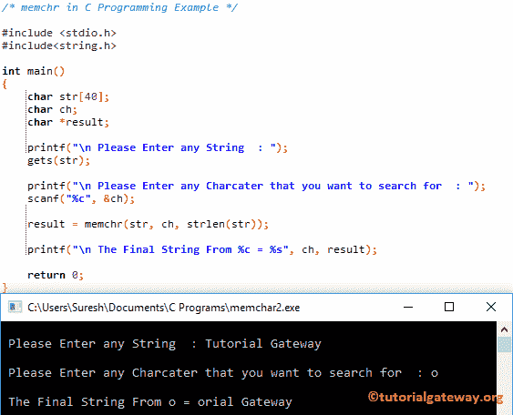

# C 语言中的记忆

> 原文:[https://www.tutorialgateway.org/memchr-in-c-language/](https://www.tutorialgateway.org/memchr-in-c-language/)

C memchr 函数是一个字符串函数，它会找到第一个出现的字符，并返回指向它的指针。该函数使用其第三个参数来限制搜索。

C 编程语言中 memchr 的基本语法如下所示。

```
void *memchr(const void *str, int c, size_t n);
```

*   字符串:有效的字符串
*   要在字符串中搜索的值
*   n:要在搜索对象字符串中搜索的字符数。

## C 语言示例中的内存

memchr 函数用于在用户指定的字符串中进行搜索。这个程序将通过多个例子帮助你理解 memchr。

在使用这个记忆[字符串函数](https://www.tutorialgateway.org/c-string/)之前，你必须包含#include <string.h>标题</string.h>

```
/* memchr in C Programming Example */

#include <stdio.h> 
#include<string.h>

int main()
{  
   	char str[] = "C Programming Language";
   	char ch = 'L';
   	char *result;
   	char *result2;

   	result = memchr(str, ch, strlen(str));

   	printf("\n The Final String From %c = %s", ch, result);

   	result2 = memchr("Tutorial Gateway", 'G', strlen(str));

   	printf("\n The Final String From %c = %s", ch, result2);

   	return 0;
}
```

```
 The Final String From L = Language
 The Final String From L = Gateway
```

## 实施例 2 中的记忆

这个[程序](https://www.tutorialgateway.org/c-programming-examples/)允许用户输入他/她的字符串和他们想看的字符。接下来，它将使用 [C 编程](https://www.tutorialgateway.org/c-programming/)中的 memchr 函数返回字符串中从使用指定字符开始的部分。

```
/* memchr in C Programming Example */

#include <stdio.h> 
#include<string.h>

int main()
{  
   	char str[40];
   	char ch;
   	char *result;

   	printf("\n Please Enter any String  : ");
	gets(str);	

	printf("\n Please Enter any Charcater that you want to search for  : ");
	scanf("%c", &ch);

   	result = memchr(str, ch, strlen(str));

   	printf("\n The Final String From %c = %s", ch, result);

	return 0;

}
```



这次我们将寻找不存在的角色

```
 Please Enter any String  : Tutorial Gateway

 Please Enter any Charcater that you want to search for  : m

 The Final String From m = (null)
```

虽然给定字符存在于字符串中，但它返回空值。这是因为我们将搜索限制在前 5 个字符，前 5 个字符中不存在 G。结果= memchar(str，ch，5)

```
 Please Enter any String  : Tutorial Gateway

 Please Enter any Charcater that you want to search for  : G

 The Final String From G = (null)
```