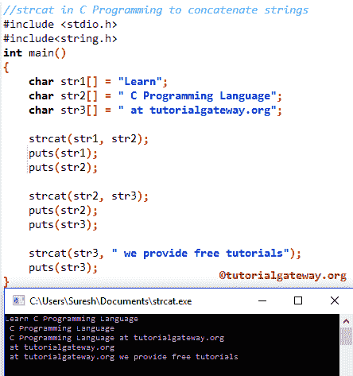

# C 程序设计中的技巧

> 原文:[https://www.tutorialgateway.org/strcat-in-c-programming/](https://www.tutorialgateway.org/strcat-in-c-programming/)

C Strcat 函数是 String 函数之一，用于将用户指定的字符串连接到现有字符串的末尾，并将结果存储在我们指定的第一个字符串中。

C 语言中 strcat 的基本语法如下所示。以下函数接受字符数组作为参数 1 和参数 2。接下来，它将使用内置函数 strcat 连接或联接第一个字符串之后的第二个字符串。

```
strcat(string1, string2);
```

返回值:strcat 函数将连接两个字符串，并将数据存储在第一个参数(string1)中。

## C 语言程序设计示例

strcat 函数用于连接两个字符串。这个 C 程序将通过例子帮助你理解字符串。

提示:在使用任何字符串函数之前，您必须包含#include <string.h>头。</string.h>

```
// strcat in C Programming to concatenate strings  
#include <stdio.h> 
#include<string.h>
int main()
{
   char str1[] = "Learn";
   char str2[] = " C Programming Language";
   char str3[] = " at tutorialgateway.org";

   strcat(str1, str2);		
   puts(str1);
   puts(str2);

   strcat(str2, str3);
   puts(str2);
   puts(str3);	

   strcat(str3, " we provide free tutorials");
   puts(str3);
}
```



在这个 [C 程序](https://www.tutorialgateway.org/c-programming-examples/)中，首先，我们声明了三个字符数组 str1、str2、str3，并通过使用前三个语句。接下来，我们将文本数据(一组字符)分配给每个字符数组

下面的 C strcat 语句将把 str2 连接到 str1 的末尾，结果将存储在 str1 中。

```
strcat(str1, str2);
```

下面的 [C 语言](https://www.tutorialgateway.org/c-programming/)语句将 str3 连接到 str2 的末尾，结果将存储在 str2 中。

```
strcat(str2, str3);
```

接下来，我们直接在函数内部使用文本。

```
strcat(str3, " we provide free tutorials");
```