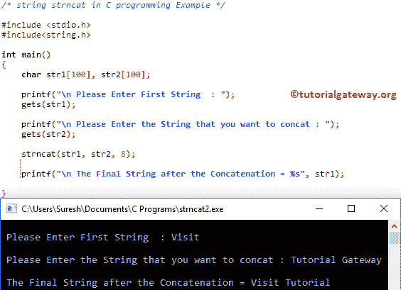

# C 语言中的字符串

> 原文：<https://www.tutorialgateway.org/strncat-in-c-language/>

C strncat 函数是一个字符串函数，用于将用户指定字符串中的 n 个字符追加到现有字符串的末尾。C 语言语言中的语法是

```
char *strncat(char *destination, char *source, size_t n);
```

或者我们可以简单地写为:

```
strncat(str1, str2, string_size);
```

*   来源:要附加到目标的有效字符串
*   目标:这是函数将从源追加字符的地方。
*   n:要从源追加的字符数。

## C 语言示例

strncat 函数用于将用户指定的字符串追加到现有字符串中。这个程序将通过多个例子帮助你理解 strncat。

提示:在使用这个字符串函数之前，你必须包含#include <string.h>头。</string.h>

```
/* strncat in C Programming to concatenate strings */

#include <stdio.h> 
#include<string.h>

int main()
{
   	char str1[] = "Learn";
   	char str2[] = "Learn";

   	char str3[] = " C Programming Language";
   	char str4[] = " at tutorialgateway.org";

   	strncat(str1, str3, 40);		
   	printf("\n The Final String after the Concatenation = %s", str1);

   	strncat(str2, str3, 10);
   	printf("\n The Final String after the Concatenation = %s", str2);

   	strncat(str3, str4, 19);
   	printf("\n The Final String after the Concatenation = %s", str3);

	getch();
	return 0;
}
```

```
 The Final String after the Concatenation = Learn C Programming Language
 The Final String after the Concatenation = Learn C Program
 The Final String after the Concatenation = C Programming Language at tutorialgateway.org
```

该语句将 str3 中的所有字符追加到 str1 中，因为 [C 语言](https://www.tutorialgateway.org/c-programming/)语言的长度小于给定的大小 40。

```
strncat(str1, str3, 40);
```

这个 C strncat 函数将把 str3 中的前 10 个字符追加到 str1 中，因为我们将大小限制为 10。

```
strncat(str2, str3, 10);
```

## C 示例 2 中的字符串

该[程序](https://www.tutorialgateway.org/c-programming-examples/)允许用户输入源字符串和目的字符串。接下来，它将使用 strncat 函数联系他们。

```
/* string strncat in C programming Example */

#include <stdio.h> 
#include<string.h>

int main()
{
	char str1[100], str2[100];

	printf("\n Please Enter First String  : ");
	gets(str1);	

	printf("\n Please Enter the String that you want to concat : ");
	gets(str2);	

	strncat(str1, str2, 8);

 	printf("\n The Final String after the Concatenation = %s", str1);

}
```

虽然给定的字符串是一个有效的字符串，但 C strncat 函数只追加到教程中。这是因为我们将连接函数限制在前 8 个字符。



让我将“大小”值更改为 16，然后查看

```
 Please Enter First String  : Visit

 Please Enter the String that you want to concat : Tutorial Gateway

 The Final String after the Concatenation = Visit Tutorial Gateway
```