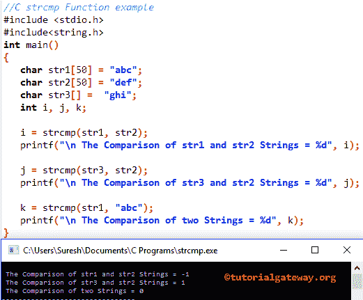

# C 语言`strcmp()`函数

> 原文：<https://www.tutorialgateway.org/c-strcmp-function/>

C`Strcmp()`函数是 String Functions 之一，有助于比较两个字符串，检查那两个字符串(一组字符)是否相等？。

C strcmp 方法将基于给定的字符串执行字符串比较，并返回以下三个值中的任何一个:

*   如果 str1 小于 str2 中的数据，它将返回-1
*   如果 str1 大于 str2 中的数据，则返回+1
*   并且，如果 str1 和 str2 相等，它将返回 0

## C strcmp 语法

C 语言中 strcmp 的基本语法如下所示。下面的函数将接受两个字符数组作为参数。并且，它将比较两个数组中的字符串数据，并使用内置的`string()`函数 strcmp 返回整数输出。

```c
int strcmp(const char *str1, const char *str2);
```

或者我们可以简单地写为:

```c
int strcmp(str1, str2);
```

*   str1:此参数是必需的。请指定有效的字符串来执行比较。
*   str2:这个参数是必需的。请指定执行比较的有效文本。该参数将与 str1 进行比较

### C`strcmp()`函数示例

在使用这个 C strcmp 字符串函数之前，你必须包含#include <string.h>头。`strcmp()`函数用于比较两个字符串(字符数组)并返回整数输出。这个[程序](https://www.tutorialgateway.org/c-programming-examples/)会用例子帮助你理解字符串比较)。</string.h>

在这个 C`strcmp()`函数示例中，首先，我们声明了三个字符数组 str1、str2、str3，并分配了一些随机字符串数据(一组字符)。

下面的 I 的 [C Programming](https://www.tutorialgateway.org/c-programming/) 语句是使用一个`strcmp()`函数来比较 str1 和 str2 中的字符数组并返回整数值。我们将返回值赋给之前声明的 I 变量。众所周知，“abc”将出现在“def”之前，这就是它返回-1(负 1)的原因

下一个 C strcmp 语句将比较 str2 和 str3 中的字符数组。众所周知，“ghi”将出现在“def”之后，这就是它返回 1(正 1)的原因

在最后一行，我们直接在`strcmp()`函数中使用了示例文本。意思是，(“abc”、“abc”)。

```c
//C strcmp Function example  
#include <stdio.h> 
#include<string.h>

int main()
{
   char str1[50] = "abc";
   char str2[50] = "def";
   char str3[] =  "ghi";
   int i, j, k;

   i = strcmp(str1, str2);		
   printf("\n The Comparison of str1 and str2 Strings = %d", i);

   j = strcmp(str3, str2);		
   printf("\n The Comparison of str3 and str2 Strings = %d", j);

   k = strcmp(str1, "abc");		
   printf("\n The Comparison of two Strings = %d", k);
}
```

