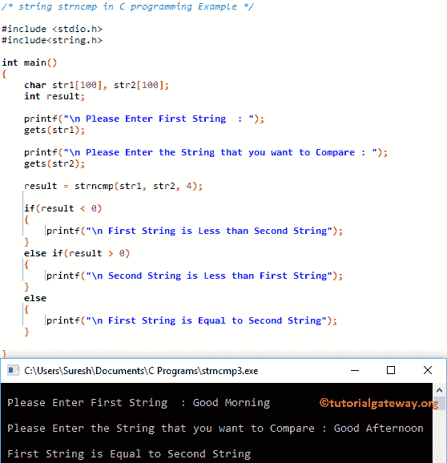

# C 语言中的`strncmp()`

> 原文：<https://www.tutorialgateway.org/strncmp-in-c-language/>

`strncmp()`函数是一个字符串函数，用于比较两个字符串。或者，它检查这两个字符串是否相等。`strncmp()`函数使用第三个参数来限制比较。这意味着，您可以比较前四个字符或五个字符等，而不是比较整个字符串。C 语言中的 strncmp 方法返回以下三个值中的任何一个:

*   如果 str1 小于 str2，它将返回-1
*   如果 str1 大于 str2，则返回+1
*   如果 str1 和 str2 相等，函数将返回 0

## C strncmp 语法

C 语言中 strncmp 的基本语法如下所示。

```
char *strncmp(char *str1, char *str2, size_t n);
```

或者我们可以简单地把这个 strncmp 写成如下所示:

```
strncmp(str1, str2, string_length);
```

*   n:要比较的最大字符数。

## C 语言示例

`strncmp()`函数用于将用户指定的字符串与现有字符串进行 n 个字符的比较。这个程序将通过多个例子帮助你理解 strncmp。

提示:在使用这个字符串函数之前，你必须包含# include <string.h>头。</string.h>

```
/* C strncmp Function example  */

# include <stdio.h> 
# include<string.h>

int main()
{
   char str1[50] = "abcdef";
   char str2[50] = "abcd";
   char str3[] =  "ghi";
   int i, j, k;

   i = strncmp(str1, str2, 4);		
   printf("\n The Comparison of str1 and str2 Strings = %d", i);

   j = strncmp(str1, str2, 6);		
   printf("\n The Comparison of str1 and str2 Strings = %d", j);

   k = strncmp(str1, str3, 3);		
   printf("\n The Comparison of str1 and str3 = %d", k);
}
```

```
 The Comparison of str1 and str2 Strings = 0
 The Comparison of str1 and str2 Strings = 1
 The Comparison of str1 and str3 = -1
```

它比较前四个字符，因为第三个参数是 4。

```
i = strncmp(str1, str2, 4); // abcd = abcd
```

这个 [C 语言](https://www.tutorialgateway.org/c-programming/)语句将比较前六个字符，因为第三个参数是 6。

```
j = strncmp(str1, str2, 6); // abcdef = abcd
```

## 实施例 2 中的步骤

结果不是打印 0、1 和-1，这个 strncmp [程序](https://www.tutorialgateway.org/c-programming-examples/)将使用[`else if`语句](https://www.tutorialgateway.org/else-if-statement-in-c/)打印一条有意义的消息

```
/* C strncmp Function example  */

# include <stdio.h> 
# include<string.h>

int main()
{
   	char str1[50] = "abcdefgh";
   	char str2[50] = "ABC";
   	int result;

   	result = strncmp(str1, str2, 3);

   	if(result < 0)
   	{
   		printf("\n str1 is Less than str2");
	}
	else if(result > 0)
   	{
   		printf("\n str2 is Less than str1");
	}
	else
   	{
   		printf("\n str1 is Equal to str2");
	}
	return 0;
}
```

```
 str2 is Less than str1
```

## 示例 3

这个 [C 程序](https://www.tutorialgateway.org/c-programming-examples/)允许用户输入两个字符串。接下来，它将使用 C 语言中的`strncmp()`函数来比较这两个字符串。

```
/* string strncmp in C programming Example */

# include <stdio.h> 
# include<string.h>

int main()
{
	char str1[100], str2[100];
	int result;

	printf("\n Please Enter First String  : ");
	gets(str1);	

	printf("\n Please Enter the String that you want to Compare : ");
	gets(str2);	

	result = strncmp(str1, str2, 4);

 	if(result < 0)
   	{
   		printf("\n First String is Less than Second String");
	}
	else if(result > 0)
   	{
   		printf("\n Second String is Less than First String");
	}
	else
   	{
   		printf("\n First String is Equal to Second String");
	}

}
```



让我将“大小”值从 4 更改为 12，然后查看结果

```
 Please Enter First String  : Good Morning

 Please Enter the String that you want to Compare : Good Afternoon

 Second String is Less than First String
```