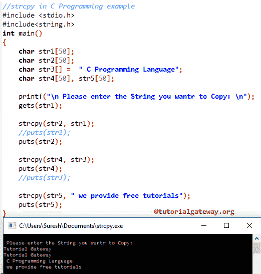

# C 语言`strcpy()`函数

> 原文：<https://www.tutorialgateway.org/strcpy-in-c-programming/>

C`Strcpy()`函数是字符串函数之一，它有助于将用户指定的字符串或内容(一组字符)从一个字符串复制到另一个字符串。C 语言中 strcpy 的语法如下所示。

下面的函数将接受两个字符数组作为参数。并且它使用内置函数 strcpy 将字符串数据从源复制到目标。

```
strcpy(destination, source);
```

## C 语言示例中的 strcpy

`strcpy()`函数用于将内容从源字符串复制到目标字符串。这个程序将通过一个例子帮助你理解字符串拷贝。

提示:在使用这个`strcpy()`函数之前，你必须包含# include <string.h>头。</string.h>

```
//strcpy in C Programming example  
# include <stdio.h> 
# include<string.h>
int main()
{
   char str1[50];
   char str2[50];
   char str3[] =  " C Programming Language";
   char str4[50], str5[50];

   printf("\n Please enter the String you want to Copy: \n");
   gets(str1);

   strcpy(str2, str1); 
   //puts(str1);
   puts(str2);

   strcpy(str4, str3);
   puts(str4);
   //puts(str3); 

   strcpy(str5, " we provide free tutorials");
   puts(str5);
}
```



在这个[程序](https://www.tutorialgateway.org/c-programming-examples/)中，首先，我们声明了三个字符数组 str1、str2、str3、str4、str5，并且我们给 str3 分配了文本数据。前两个语句将要求用户输入他/她想要复制的文本。接下来，我们使用[获取函数](https://www.tutorialgateway.org/gets-in-c-programming/)为 str1 赋值

下面的 C strcpy 语句将把字符串数据从 str1 复制到 str2。

```
strcpy(str2, str1);
```

下面的 [C 语言](https://www.tutorialgateway.org/c-programming/)语句将把字符数组从 str3 复制到 str4。

```
strcpy(str4, str3);
```

接下来，我们直接在函数内部使用文本

```
strcpy(str5, " we provide free tutorials");
```