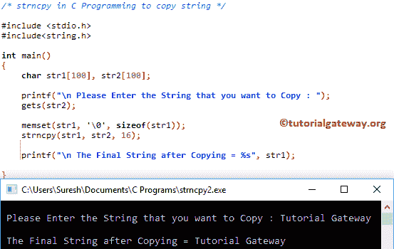

# C 语言中的`strncpy()`

> 原文：<https://www.tutorialgateway.org/strncpy-in-c-language/>

C strncpy 函数是一个字符串函数，用于将 n 个字符从一个字符串复制到另一个字符串。C 语言中 strncpy 的语法是

```
char *strncpy(char *destination, char *source, size_t n);
```

或者我们可以简单地写为:

```
strncpy(str1, str2, size);
```

*   来源:有效字符串
*   目标:这是函数将字符从源字符串复制到目标字符串的地方。
*   n:要从源中复制的字符数。

## C 示例中的字符串

strncpy 函数用于复制用户指定的字符串。这个程序将通过多个例子帮助你理解 c strncpy。

提示:在使用此 strncpy [功能](https://www.tutorialgateway.org/c-string/)之前，您必须包含#include <string.h>标题。</string.h>

```
#include <stdio.h> 
#include<string.h>

int main()
{
   	char str1[50], str2[50], str4[50];

   	char str3[] = "C Programming Language ";

   	strncpy(str1, str3, 40);		
   	printf("\n The Final String after Copying = %s", str1);

   	strncpy(str2, str3, 9);
   	printf("\n The Final String after Copying = %s", str2);

 	memset(str4, '\0', sizeof(str4));
   	strncpy(str4, "Tutorial Gateway", 16);
   	printf("\n The Final String after Copying = %s", str4);

}
```

```
 The Final String after Copying = C Programming Language 
 The Final String after Copying = C Program
 The Final String after Copying = Tutorial Gateway
```

它会将 str3 中的所有字符复制到 str1 中，因为 [C 语言](https://www.tutorialgateway.org/c-programming/)语言的长度小于给定的大小 40。

```
strncpy(str1, str3, 40);
```

它会将 str3 中的前 9 个字符复制到 str1，因为我们将大小限制为 9。

```
strncpy(str2, str3, 9);
```

## 实施例 2 中的步骤

该[程序](https://www.tutorialgateway.org/c-programming-examples/)允许用户输入自己的字符数组。接下来，它将使用 strncpy 函数复制用户指定的字符串。

```
#include <stdio.h> 
#include<string.h>

int main()
{
	char str1[100], str2[100];

	printf("\n Please Enter the String that you want to Copy : ");
	gets(str2);	

	//memset(str1, '\0', sizeof(str1));
	strncpy(str1, str2, 7);

 	printf("\n The Final String after Copying = %s", str1);

}
```

虽然给定的字符串是一个有效的字符串，但这个函数只是复制的。这是因为我们将复制功能限制为前 7 个字符(包括空格)。

```
 Please Enter the String that you want to Copy : Learn C Programming

 The Final String after Copying = Learn C
```

让我更改大小值，查看

