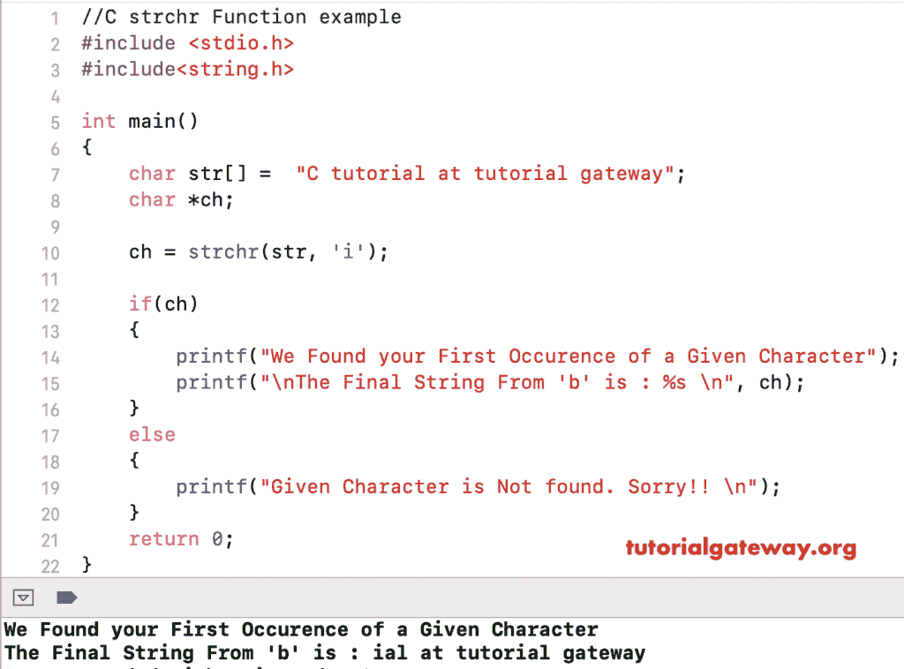

# C `strchr()`函数

> 原文：<https://www.tutorialgateway.org/c-strchr-function/>

函数是一个字符串函数，它返回一个指向给定字符串中第一个字符的指针。C 语言中的语法是

```
void *strchr(const char *str, const char *chr_to_look);
```

*   字符串:有效的字符串
*   chr_to_look:要在字符串中搜索的字符值

## C 语言示例中的结构函数

strchr 函数用于在用户指定的字符串中搜索第一个出现的字符。这个[程序](https://www.tutorialgateway.org/c-programming-examples/)会用多个例子帮助你理解 strchr。

提示:在使用此[字符串函数](https://www.tutorialgateway.org/c-string/)之前，您必须包含 [C 语言](https://www.tutorialgateway.org/c-programming/)#包含<字符串. h >标题。

```

#include <stdio.h> 
#include<string.h>

int main()
{
    char str[] =  "C tutorial at tutorial gateway";
    char *ch;

    ch = strchr(str, 'i');

    if(ch)
    {
        printf("We Found your First Occurence of a Given Character");
        printf("\nThe Final String From 'b' is : %s \n", ch);
    }
    else
    {
        printf("Given Character is Not found. Sorry!! \n");
    }
    return 0;
}
```

