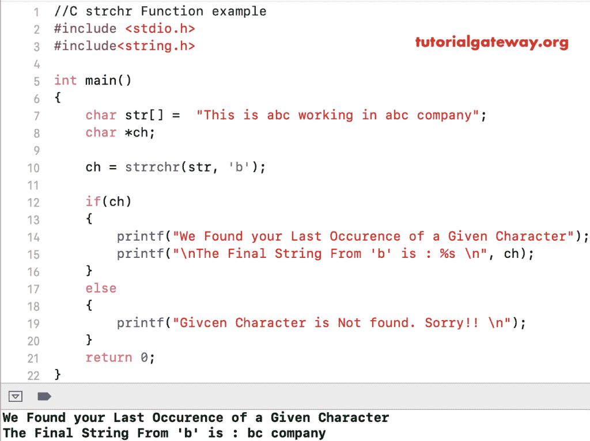

# 功能

> 原文：<https://www.tutorialgateway.org/c-strrchr-function/>

C strrchr 函数是一个 String 方法，它返回一个指向给定字符串中最后一个字符的指针。C 语言中 strrchr 的语法是

```
void *strrchr(const char *str, const char *chr_to_look);
```

*   字符串:有效的字符串
*   chr_to_look:要在字符串内部查找的字符值

## C 语言示例

strrchr 函数用于查找用户指定字符串中最后出现的字符。在使用此方法之前，您必须包含#include <string.h>标题。</string.h>

这个[程序](https://www.tutorialgateway.org/c-programming-examples/)会用多个 [C 语言](https://www.tutorialgateway.org/c-programming/)的例子帮助你理解 strchr[字符串函数](https://www.tutorialgateway.org/c-string/)。

```

#include <stdio.h> 
#include<string.h>

int main()
{
    char str[] =  "This is abc working in abc company";
    char *ch;

    ch = strrchr(str, 'b');

    if(ch)
    {
        printf("We Found your Last Occurence of a Given Character");
        printf("\nThe Final String From 'b' is : %s \n", ch);
    }
    else
    {
        printf("Given Character is Not found. Sorry!! \n");
    }
    return 0;
}
```

