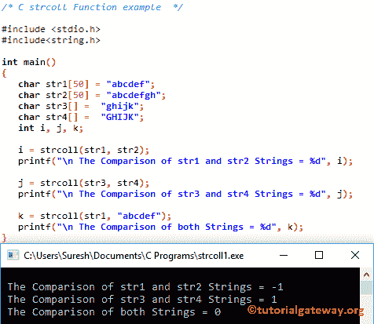

# C 语言中的`strcoll()`

> 原文：<https://www.tutorialgateway.org/strcoll-in-c-language/>

函数是一个字符串函数，用来比较两个字符串。该功能的结果取决于 LC_COLLATE 设置。strcoll 方法返回以下任何值:

*   如果 str1 小于 str2，它将返回-1
*   如果 str1 大于 str2，则返回+1
*   如果 str1 和 str2 相等，该函数将返回 0

## C strcoll 语法

C 语言中 strcoll 的基本语法如下所示。

```
char *strcoll(const char *str1, const char *str2);
```

或者我们可以简单地写为:

```
strcoll(str1, str2);
```

## C 语言示例

strcoll 函数用于根据位置设置比较两个字符串。这个程序将通过多个例子帮助你理解语法。

提示:在使用这个字符串函数之前，你必须包含#include <string.h>头。</string.h>

```
/* C strcoll Function example  */

#include <stdio.h> 
#include<string.h>

int main()
{
   char str1[50] = "abcdef";
   char str2[50] = "abcdefgh";
   char str3[] =  "ghijk";
   char str4[] =  "GHIJK";
   int i, j, k;

   i = strcoll(str1, str2);		
   printf("\n The Comparison of str1 and str2 Strings = %d", i);

   j = strcoll(str3, str4);		
   printf("\n The Comparison of str3 and str4 Strings = %d", j);

   k = strcoll(str1, "abcdef");		
   printf("\n The Comparison of both Strings = %d", k);
}
```



## 字符串列表示例 2

这个 C 程序将使用[`else if`语句](https://www.tutorialgateway.org/else-if-statement-in-c/)打印一条有意义的消息，而不是打印 0、1 和-1 作为输出

```
/* C strcoll Function example  */

#include <stdio.h> 
#include<string.h>

int main()
{
   	char str1[50] = "abcdefgh";
   	char str2[50] = "ABCDEFGH";
   	int result;

   	result = strcoll(str1, str2);

   	if(result < 0)
   	{
   		printf("\n str1 is Less than str2");
	}
	else if(result > 0)
   	{
   		printf("\n str2 is Less than str1");
	}
	else
   	{
   		printf("\n str1 is Equal to str2");
	}
	return 0;
}
```

```
 str2 is Less than str1
```

## strcoll 函数示例 3

这个 [C 程序](https://www.tutorialgateway.org/c-programming/)允许用户输入两个字符串。接下来，它将使用 strcoll 函数比较这两个字符串。

```
/* C strcoll Function example  */

#include <stdio.h> 
#include<string.h>

int main()
{
	char str1[100], str2[100];
	int result;

	printf("\n Please Enter First String  : ");
	gets(str1);	

	printf("\n Please Enter the String that you want to Compare : ");
	gets(str2);	

	result = strcoll(str1, str2);

 	if(result < 0)
   	{
   		printf("\n First String is Less than Second String");
	}
	else if(result > 0)
   	{
   		printf("\n Second String is Less than First String");
	}
	else
   	{
   		printf("\n First String is Equal to Second String");
	}
}
```

```
 Please Enter First String  : abcd

 Please Enter the String that you want to Compare : aBCD

 Second String is Less than First String
```