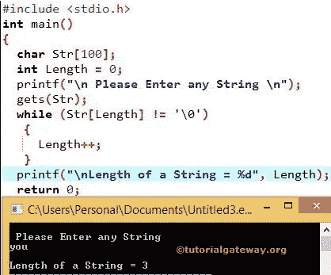

# 求字符串长度的 c 程序

> 原文:[https://www . tutorialgateway . org/c-program-to-find-length-a-string/](https://www.tutorialgateway.org/c-program-to-find-length-of-a-string/)

如何用 strlen 和不用 strlen 函数写 C 程序求字符串长度？我们可以使用内置的字符串函数来计算字符串长度，也可以不使用 C 语言中的库函数

## C strlen 函数

strlen 函数是 C 语言中内置的 strlen 字符串函数，求字符串长度很有用。strlen 函数的语法是:

```
strlen(<string name>)
```

C strlen 函数将对字符串中的字符数进行计数，直到它达到空值(\0)，并将该整数值作为输出返回。

### 计算字符串长度的 c 程序

这个程序允许用户输入任何字符串或字符数组。接下来，它将使用 C 语言中一个名为 strlen 的内置字符串函数来查找字符串的长度。

```
#include <stdio.h>
#include <string.h>

int main()
{
  char Str[100];
  int lg;

  printf("\n Please Enter any String \n");
  gets (Str);

  lg = strlen(Str);

  printf("Length = %d\n", lg);

  return 0;
}
```

```
 Please Enter any String 
Tutorial Gateway
Length = 16
```

在这个 c strlen 示例程序中，我们将大小为 100 的字符数组变量和名称声明为 Str，并且还声明了一个整数变量 Length。

下面的 printf 语句要求用户输入他们想要找到长度的任何单词。

```
printf("\n Please Enter any String \n");
```

该[程序](https://www.tutorialgateway.org/c-programming-examples/)中的以下语句将用户输入的字符串分配给 Str 变量。

```
gets (Str);
```

在下一行，我们有 c strlen，

```
lg = strlen(Str);
```

我们正在使用 C strlen 函数查找字符串的长度，并为 length 变量赋值。

在[下方，C 语言](https://www.tutorialgateway.org/c-programming/) printf 语句将打印长度(表示字符串长度)内的值

```
printf(" Length = %d \n", lg);
```

从上面的截图可以观察到，我们输入了字符串“Tutorial Gateway”，字符串的长度= 16(包括两个单词之间的空格)

## 不用 strlen 求字符串长度的 c 程序

我们可以通过多种方式达到同样的效果，但是我们将讨论两种称为 [For Loop](https://www.tutorialgateway.org/for-loop-in-c-programming/) 和 [While Loop](https://www.tutorialgateway.org/while-loop-in-c/) 的方法

### 用`while`循环求字符串长度的 c 程序

这个程序允许用户输入任何字符串或字符数组，它将在不使用 c 语言中 strlen 函数的情况下找到字符串的长度。

```
#include <stdio.h>
#include <string.h>

int main()
{
  char Str[100];
  int Length = 0;

  printf("\n Please Enter any String \n");
  gets(Str);

  while (Str[Length] != '\0')
   {   
     Length++;
   }

  printf("\nLength of a String = %d", Length);
  return 0;
}
```



如果你看看这个 C 程序中的`while`循环的字符串长度，

```
while (Str[Length] != '\0')
 {   
     Length++;
 }
```

每个字符串都以空字符“\0”结尾。所以`while`循环内的条件(Str[Length]！=“\0”)将在字符串到达“\ 0”位置时失败。

在`while`循环中，我们使用增量运算符将长度值增加 1。

在这个例子中，我们没有使用 c strlen，用户输入字符串“你”
最初长度值将为 0。

第一次迭代
最初，长度值为 0。
(Str[0]！= '\0 ')条件为真，因为 Str[0] = y
所以长度增加到 1

第二次迭代
现在，长度的值是 1
(Str[1]！= '\0 ')条件为真，因为字符串[1]= 0。因此，长度增加 1

第三次迭代
长度值为 2
(Str[2]！= '\0 ')条件为真，因为字符串[2] = u。因此，长度增加 1

第四次迭代
长度= 3，While 条件(Str[3]！= '\0 ')为 FALSE，因为 Str[3] = \0。因此，这个 c strlen 例子中的循环将终止。

最终的 printf 语句将打印 Length 变量中的值(表示字符串的长度)

```
printf("\n Length of the String is : %d", Length);
```

最终输出为
s 字符串长度= 3

### 用`for`循环求字符串长度的 c 程序

这个程序允许用户输入任何字符串或字符数组，它会在不使用 c 语言中 strlen 函数的情况下找到字符串的长度。

```
#include <stdio.h>
#include <string.h>

int main()
{
  char Str[100];
  int i;

  printf("\n Please Enter any Sentence \n");
  gets(Str);

  for (i = 0; Str[i]!='\0'; i++);

  printf("Length = %d\n", i);
  return 0;
}
```

在这个例子中，我们没有做任何特别的事情。我们刚刚将上面 c strlen 代码中的`while`循环改为`for`循环。如果您对`for`循环有任何疑问。请参考此处循环文章:[循环](https://www.tutorialgateway.org/for-loop-in-c-programming/)。

```
 Please Enter any Sentence 
Tutorial
Length = 8
```