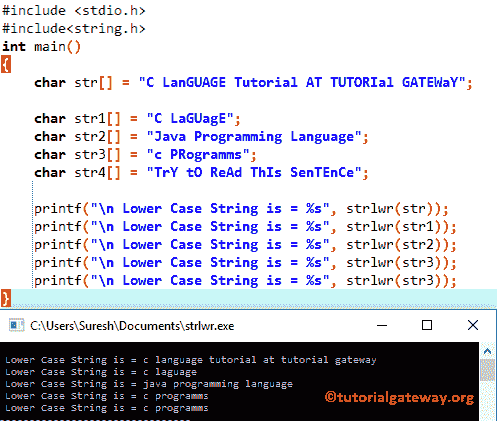

# C 语言中的`strlwr()`

> 原文：<https://www.tutorialgateway.org/strlwr-in-c-programming/>

函数是一个字符串函数，用于将用户指定的字符或字符串转换成小写字母。下面的 C 语言 strlwr 函数将接受字符作为参数，并使用内置的 string 函数 Strlwr 将字符串中的所有字符转换为小写。

```
strlwr(chars)
```

## C 语言示例

函数的作用是:将给定字符串中的所有字符转换成小写。这个程序会帮助你理解同样的事情。

注意:在使用任何 [C 字符串函数](https://www.tutorialgateway.org/c-string/)之前，您必须包含#include <string.h>标题。</string.h>

```
//strlwr in C Programming
#include <stdio.h> 
#include<string.h>

int main()
{
	char str[] = "C LanGUAGE Tutorial AT TUTORIal GATEWaY";

	char str1[] = "C LaGUagE";
	char str2[] = "Java Programming Language";
	char str3[] = "c PRogramms";
	char str4[] = "TrY tO ReAd ThIs SenTEnCe";

 	printf("\n Lower Case String is = %s", strlwr(str));
 	printf("\n Lower Case String is = %s", strlwr(str1));
 	printf("\n Lower Case String is = %s", strlwr(str2));
 	printf("\n Lower Case String is = %s", strlwr(str3)); 	
  	printf("\n Lower Case String is = %s", strlwr(str3)); 		
}
```



在这个 C strlwr 函数示例中，首先，我们声明了五个字符数组 str、str1、str2、str3、str5，并使用下面的语句为每个字符数组分配了字符

```
char str[] = "C LanGUAGE Tutorial AT TUTORIal GATEWaY";
char str1[] = "C LaGUagE";
char str2[] = "Java Programming Language";
char str3[] = "c PRogramms";
char str4[] = "TrY tO ReAd ThIs SenTEnCe";
```

接下来，我们直接在 printf 语句中使用 C strlwr 方法来打印输出。以下 [C 语言](https://www.tutorialgateway.org/c-programming/)语句将把之前声明的字符串数据转换成小写。

```
printf("\n Lower Case String is = %s", strlwr(str));
printf("\n Lower Case String is = %s", strlwr(str1));
printf("\n Lower Case String is = %s", strlwr(str2));
printf("\n Lower Case String is = %s", strlwr(str3)); 	
printf("\n Lower Case String is = %s", strlwr(str3));
```

## 不用 Strupr 把字符串转换成小写的 c 程序

这个[程序](https://www.tutorialgateway.org/c-programming-examples/)将帮助你了解如何编写一个 C 程序，在不使用内置字符串函数 strlwr 的情况下，将给定的字符串转换成小写。

```
#include <stdio.h> 
void String_Lower(char []);

int main()
{
	char str[100]; 
	printf("\n Please Enter a string to convert it into Lowercase\n");
	gets(str);

	String_Lower(str); 
	printf("\n Lower Case String is = %s", str); 
	return 0;
}

void String_Lower(char string[]) 
{
	int i = 0; 
	while (string[i] != '\0') 
	{
    	if (string[i] >= 'A' && string[i] <= 'Z') {
        	string[i] = string[i] + 32;
    	}
      	i++;
	}
}
```

```
 Please Enter a string to convert it into Lowercase
HELLO C PROGRAMMING WORld

 Lower Case String is = hello c programming world
```

在这个没有 strlwr 函数的 C 语言中，First printf 语句将要求用户输入任何名称或字符串。并且用户指定的字符串将被分配给字符数组字符串[100]。

```
printf("\n Please Enter a string to convert it into Lowercase\n");
gets(str);
```

以下语句将调用函数 void String_Lower(字符字符串[])

```
String_Lower(str);
```

对于每个字符串，特殊字符\0 会自动添加到末尾，并作为字符串结束的标记。所以在`while`循环中，我们检查相同的:

```
while (string[i] != '\0')
```

*  `while`循环将继续迭代，直到到达特殊字符\0。一旦到达那时，循环将终止。
*   在下一行，我们使用 [`if`语句](https://www.tutorialgateway.org/if-statement-in-c/)来检查字符是否在‘A’和‘Z’之间。如果条件为真，我们将向现有的 ASCII 值添加 32。因为 A 的 ASCII 值是 65，A 是 97。为了把 A 转换成 A，我们要加 32。
*   下一行，我们增加 I 的值，请参考 [ASCII 表](https://www.tutorialgateway.org/ascii-table/)一文，了解 ASCII 字符及其十进制、十六进制和八进制数的列表。