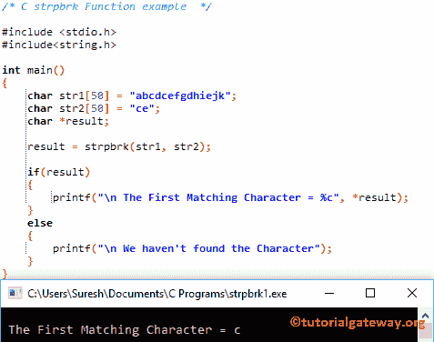

# C 语言`strpbrk()`函数

> 原文：<https://www.tutorialgateway.org/strpbrk-c-in-language/>

C`strpbrk()`函数是一个字符串函数，用于查找第一个字符串中与第二个字符串中任何字符相匹配的第一个字符。C 语言中 strpbrk 的语法是

```c
char *strpbrk(const char *str1, const char *str2);
```

或者我们可以简单地将 strpbrk 写成:

```c
strpbrk(str1, str2);
```

## C 语言示例

这个程序将通过多个例子帮助你理解 strpbrk。

在使用这个字符串函数之前，你必须包含#include <string.h>头。</string.h>

```c
/* C strpbrk Function example  */

#include <stdio.h> 
#include<string.h>

int main()
{
   	char str1[50] = "abcdcefgdhiejk";
   	char str2[50] = "ce";
   	char *result;

   	result = strpbrk(str1, str2);

   	if(result)
   	{
   		printf("\n The First Matching Character = %c", *result);	
	}
	else
	{
		printf("\n We haven't found the Character");	
	}
}
```



## C 示例 2 中的 strpbrk

这个 [C 程序](https://www.tutorialgateway.org/c-programming-examples/)允许用户输入字符串 1 和字符串 2，而不是预定义这两个字符串。接下来， [C 程序](https://www.tutorialgateway.org/c-programming/)将从字符串 1 中找到与字符串 2 中任何字符匹配的第一条记录

```c
/* C strpbrk Function example  */

#include <stdio.h> 
#include<string.h>

int main()
{
   	char str1[50], str2[50];
   	char *result;

	printf("\n Please Enter any String  : ");
	gets(str1);	

	printf("\n Please Enter the String that you want to Match : ");
	gets(str2);	

   	result = strpbrk(str1, str2);

   	if(result)
   	{
   		printf("\n The First Matching Character = %c", *result);	
	}
	else
	{
		printf("\n We haven't found the Character");	
	}
}
```

```c
 Please Enter any String  : tutorial gateway inside

 Please Enter the String that you want to Match : dyle

 The First Matching Character = l
```

虽然第二个字符串中的所有四个字符都存在于 str1 中，但它返回的输出是 l。这是因为与 e y d 相比，l 是字符串 1 中的第一个出现字母