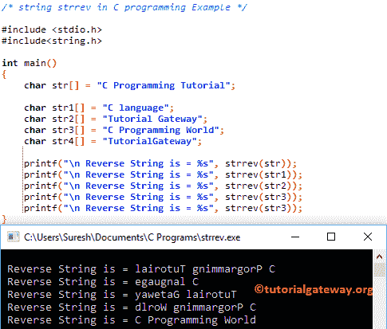

# C 语言中的 strrev

> 原文：<https://www.tutorialgateway.org/strrev-in-c-programming/>

函数是一个字符串函数，用于反转给定的字符串。strrev 的语法是

```
char *strrev(char *str1);
```

或者我们可以将这个字符串反函数写成:

```
strrev(str1);
```

## C 示例中的 strrev

string strrev 函数用于反转用户指定的字符串。这个程序将通过多个例子帮助你理解字符串 strrev。

提示:在使用此 strrev [功能](https://www.tutorialgateway.org/c-string/)之前，您必须包含[编程](https://www.tutorialgateway.org/c-programming/)#包含<字符串。h >标题。

```
/* string strrev in C programming Example */

#include <stdio.h> 
#include<string.h>

int main()
{
	char str[] = "C Programming Tutorial";

	char str1[] = "C language";
	char str2[] = "Tutorial Gateway";
	char str3[] = "C Programming World";
	char str4[] = "TutorialGateway";

 	printf("\n Reverse String is = %s", strrev(str));
 	printf("\n Reverse String is = %s", strrev(str1));
 	printf("\n Reverse String is = %s", strrev(str2));
 	printf("\n Reverse String is = %s", strrev(str3)); 	
  	printf("\n Reverse String is = %s", strrev(str3)); 		
}
```



这个[程序](https://www.tutorialgateway.org/c-programming-examples/)允许用户输入他们的字符数组。接下来，它将使用 strrev 函数来反转用户指定的字符串。

```
/* string strrev in C programming Example */

#include <stdio.h> 
#include<string.h>

int main()
{
	char str[100];

	printf("\n Please Enter any String to Reverse  : ");
	gets(str);	

 	printf("\n Reverse = %s", strrev(str));

}
```

```
Please Enter any String to Reverse  : Tutorial Gateway

Reverse = yawetaG lairotuT
```