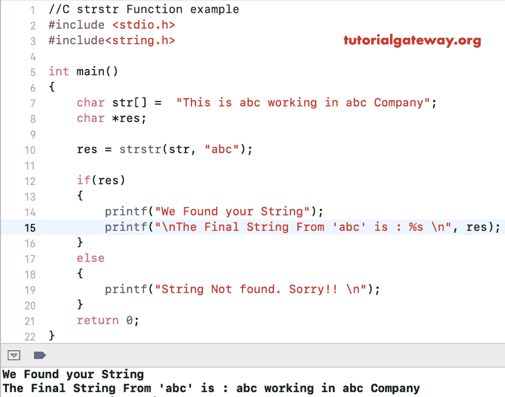

# 函数

> 原文:[https://www.tutorialgateway.org/c-strstr-function/](https://www.tutorialgateway.org/c-strstr-function/)

函数是一个字符串函数，它返回一个指向给定字符串中第一个出现的字符串的指针。C 语言中 strstr 的语法是

```
void *strstr(const char *str, const char *str_to_look);
```

*   字符串:有效的字符串
*   字符串到外观:要在字符串中搜索的文本

## C 语言示例中的 strstr

strstr 函数用于在用户指定的字符串中搜索第一个出现的子字符串。

在使用此[功能](https://www.tutorialgateway.org/c-string/)之前，您必须包含#include <string.h>标题。这个[程序](https://www.tutorialgateway.org/c-programming-examples/)将通过使用`if-else`语句的多个例子来帮助您理解 strstr。这里，如果找到一个指向给定子串的指针，那么 if 块中的语句将被打印，否则 else 块语句将被 [C 语言](https://www.tutorialgateway.org/c-programming/)打印。</string.h>

```

#include <stdio.h> 
#include<string.h>

int main()
{
    char str[] =  "This is abc working in abc Company";
    char *res;

    res = strstr(str, "abc");

    if(res)
    {
        printf("We Found your String");
        printf("\nThe Final String From 'abc' is : %s \n", res);
    }
    else
    {
        printf("String Not found. Sorry!! \n");
    }
    return 0;
}
```

