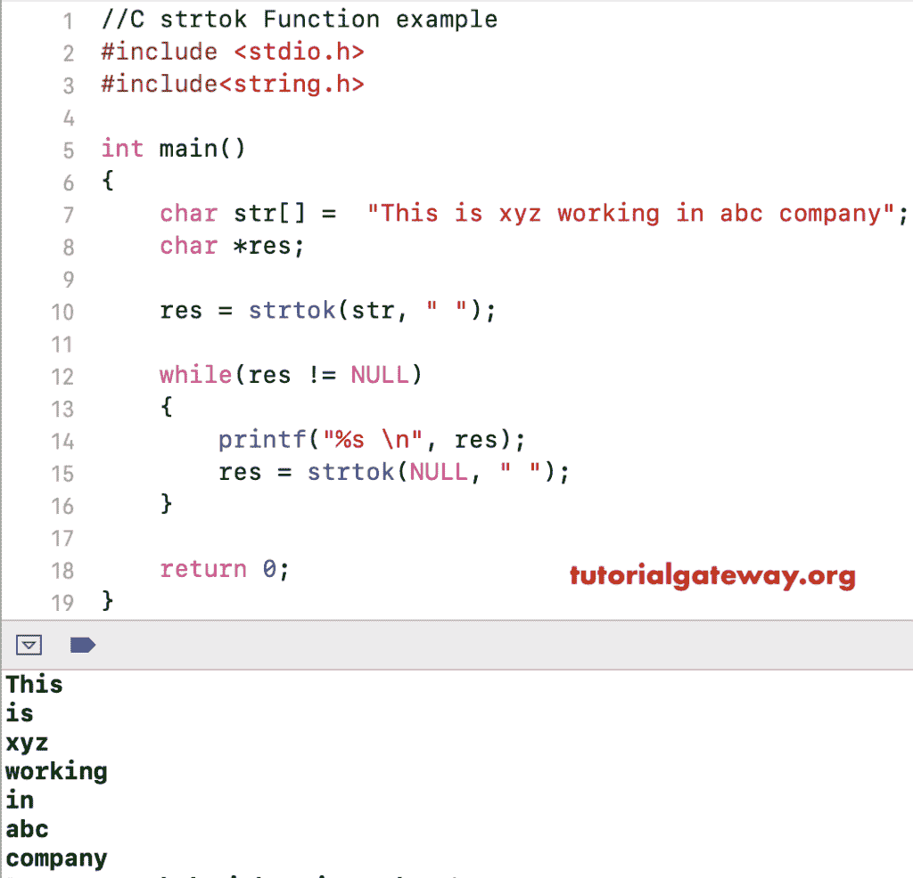

# C 语言`strtok()`函数

> 原文：<https://www.tutorialgateway.org/c-strtok-function/>

C 语言中的`strtok()`函数是一个 String 方法，它使用分隔符解析给定的字符串或对其进行标记。在 C 语言中，这个 strtok 的语法是

```
void *strtok(char *str, const char *delimiter);
```

## C 语言示例中的 strtok

`strtok()`函数用于根据我们给出的分隔符标记给定的字符串。这个程序通过使用`while`循环的多个例子帮助你理解这个方法。

提示:在使用此 strtok [字符串函数](https://www.tutorialgateway.org/c-string/)之前，您必须在[程序](https://www.tutorialgateway.org/c-programming-examples/)中包含 [C 语言](https://www.tutorialgateway.org/c-programming/)# 包含<字符串. h >标题。

```

# include <stdio.h> 
# include<string.h>

int main()
{
    char str[] =  "This is xyz working in abc company";
    char *res;

    res = strtok(str, " ");

    while(res != NULL)
    {
        printf("%s \n", res);
        res = strtok(NULL, " ");
    }

    return 0;
}
```

