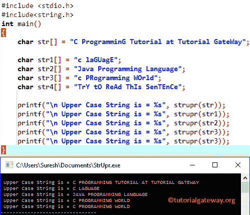

# C 程序设计中的结构

> 原文:[https://www.tutorialgateway.org/strupr-in-c-programming/](https://www.tutorialgateway.org/strupr-in-c-programming/)

函数是一个字符串函数，用于将给定的字符或字符串转换成大写字母。C 语言中 Strupr 函数的语法是

```
strupr(chars);
```

上面的函数将接受字符作为参数，并使用 C 语言中的内置函数 Strupr 将字符串中的所有字符转换为大写。请记住，在使用任何字符串函数之前，您必须包含#include <string.h>头。</string.h>

## C 程序设计实例中的结构

strupr 函数将给定字符串中的所有字符转换为大写。这个程序会帮助你理解同样的事情。

```
#include <stdio.h> 
#include<string.h>
int main()
{
	char str[] = "C ProgramminG Tutorial at Tutorial GateWay";

	char str1[] = "c laGUagE";
	char str2[] = "Java Programming Language";
	char str3[] = "c PRogramming WOrld";
	char str4[] = "TrY tO ReAd ThIs SenTEnCe";

 	printf("\n Upper Case String is = %s", strupr(str));
 	printf("\n Upper Case String is = %s", strupr(str1));
 	printf("\n Upper Case String is = %s", strupr(str2));
 	printf("\n Upper Case String is = %s", strupr(str3)); 	
  	printf("\n Upper Case String is = %s", strupr(str3)); 		
}
```



在 c 程序的这个 strupr 中，首先，我们声明了五个字符的数组 str，str1，str2，str3，str5。通过使用下面的语句，我们为每个字符数组分配了一组字符

```
char str[] = "C ProgramminG Tutorial at Tutorial GateWay";
char str1[] = "c laGUagE";
char str2[] = "Java Programming Language";
char str3[] = "c PRogramming WOrld";
char str4[] = "TrY tO ReAd ThIs SenTEnCe";
```

接下来，我们直接在 printf 语句中使用 C strupr 方法来打印输出。以下 [C 语言](https://www.tutorialgateway.org/c-programming/)语句将把先前声明的字符串转换成大写

```
printf("\n Upper Case String is = %s", strupr(str));
printf("\n Upper Case String is = %s", strupr(str1));
printf("\n Upper Case String is = %s", strupr(str2));
printf("\n Upper Case String is = %s", strupr(str3)); 	
printf("\n Upper Case String is = %s", strupr(str3));
```

## 不用 Strupr 把字符串转换成大写的 c 程序

这个结构[程序](https://www.tutorialgateway.org/c-programming-examples/)将帮助你理解如何编写一个 C 程序，在不使用内置的[字符串函数](https://www.tutorialgateway.org/c-string/)结构的情况下，将给定的字符串转换成大写。

```
#include <stdio.h> 
void String_Upper(char []);

int main()
{
	char str[100];

	printf("\n Please Enter a string to convert it into Uppercase\n");
	gets(str);

	String_Upper(str);

	printf("\n Upper Case String is = %s", str);

	return 0;
}

void String_Upper(char string[]) 
{
	int i = 0;

	while (string[i] != '\0') 
	{
    	if (string[i] >= 'a' && string[i] <= 'z') {
        	string[i] = string[i] - 32;
    	}
      	i++;
	}
}
```

大写输出

```
 Please Enter a string to convert it into Uppercase
hello C Programming Language

 Upper Case String is = HELLO C PROGRAMMING LANGUAGE
```

在这个 C strupr 示例中，第一个 printf 语句将要求用户输入任何名称或字符串。接下来，用户指定的字符串将分配给字符数组字符串[100]。

```
printf("\n Please Enter a string to convert it into Uppercase\n");
gets(str);
```

以下语句将调用函数 void String_Upper(字符字符串[])

```
String_Upper(str);
```

对于每个字符串，在末尾添加特殊字符\0 来标记它的结束位置。因此，在`while`循环中，我们检查相同的:

```
while (string[i] != '\0')
```

*   虽然循环将继续迭代，直到到达特殊字符\0，但一旦到达，循环将终止。
*   在下一行，我们使用 [`if`语句](https://www.tutorialgateway.org/if-statement-in-c/)来检查字符是否在‘a’和‘z’之间。如果条件为真，我们将从 ASCII 值中减去 32。因为 A 的 ASCII 值是 97，A 是 65。所以，要把 A 转换成 A，我们要从中减去 32。请参考 [ASCII 表](https://www.tutorialgateway.org/ascii-table/)文章，了解 ASCII 字符及其十进制、十六进制和八进制数字的列表
*   下一行，我们增加 I 的值。